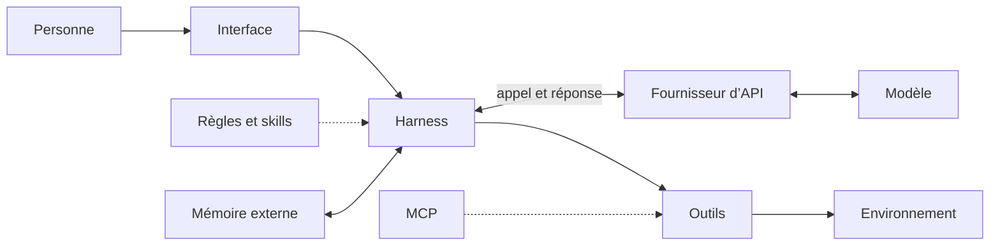

# Les harnesses de code

Claude Code, Cursor, OpenCode, Cline et Goose se présentent différemment, mais ils partagent la même architecture. Ce chapitre donne d’abord les couches communes, puis classe les outils selon l’endroit où ils vivent : une application graphique, un IDE ou un terminal.

## Quatre couches

Le terme *harness* n’a pas encore de frontière unique. Dans ce cours, il désigne le programme qui prépare le contexte, appelle le modèle, interprète sa réponse, applique les règles d’accès, exécute les outils et conserve l’état de la boucle.

[Anthropic distingue quatre couches](https://www.anthropic.com/research/trustworthy-agents) :

- le **modèle** propose une prochaine action ou une réponse
- le **harness** orchestre la boucle et applique les règles
- les **outils** exposent des actions précises, comme lire un fichier ou appeler une API
- l’**environnement** détermine les ressources accessibles : le dépôt local, un conteneur, une machine distante.

```text
système agentique = modèle + harness + outils + environnement
```

L’interface (chat, IDE, terminal) n’est pas une couche technique en plus. Elle permet de donner l’objectif et de suivre le travail. Le fournisseur d’API donne accès au modèle. Les règles de projet, les skills, MCP et la mémoire s’ajoutent au harness sans former une pile obligatoire.



Une image aide à retenir la répartition. Le modèle ressemble au logiciel de décision d’un robot. Le harness est son système de contrôle : permissions, mémoire, boucle, câblage vers les capteurs et les moteurs. Les outils sont les capteurs et les moteurs. L’environnement est la pièce dans laquelle le robot se déplace. Sans harness, la décision du modèle reste du texte.

Un modèle plus capable ne corrige pas un outil ambigu, des permissions trop larges ou un contexte mal construit. Un meilleur harness ne donne pas au modèle un raisonnement qu’il n’a pas.

Question de contrôle : OpenCode est-il le modèle ? Non. OpenCode est le produit agent. Son harness orchestre les outils et appelle un modèle, par exemple Claude ou Qwen, par l’intermédiaire d’un fournisseur comme OpenRouter.

## Où vit l’agent

Les outils ci-dessous ont été vérifiés en septembre 2026. Plusieurs existent sous plusieurs formes : Claude Code a un CLI, une application de bureau, une version web et des extensions d’IDE.

### Dans le terminal (CLI et TUI)

Un TUI (*terminal user interface*) est une interface plein écran dans le terminal. Le terminal expose directement les fichiers, Git, les commandes et les logs. C’est la forme la plus proche de la boucle étudiée dans ce cours.

| Outil | Éditeur | Modèles | Particularité |
| --- | --- | --- | --- |
| [Claude Code](https://code.claude.com/) | Anthropic | Claude | Skills, sous-agents, hooks, MCP. Existe aussi en application de bureau et en extension d’IDE. |
| [Codex CLI](https://github.com/openai/codex) | OpenAI | GPT | Exécution dans un bac à sable configurable. Existe aussi en application et dans le cloud. |
| [OpenCode](https://opencode.ai/) | Anomaly, open source (MIT) | Plus de 75 fournisseurs | TUI, mode `opencode run` sans interface, application de bureau en bêta. Code TypeScript lisible. |
| [Pi](https://pi.dev/) | Mario Zechner, open source (MIT) | Multi-fournisseurs | Quatre outils de base : `read`, `write`, `edit`, `bash`. Le reste s’ajoute par extensions TypeScript et skills. |
| [Goose](https://github.com/aaif-goose/goose) | Agentic AI Foundation, open source (Apache 2.0) | Multi-fournisseurs, Ollama | CLI et application de bureau. Extensions par MCP. Conçu aussi pour des tâches hors code. |
| [Qwen Code](https://github.com/QwenLM/qwen-code) | Alibaba | Qwen | Harness du laboratoire qui entraîne le modèle. |

### Dans l’IDE

Un IDE agentique ou une extension gardent l’agent à côté de l’éditeur. Vous voyez les fichiers modifiés dans l’arborescence et relisez les diffs dans l’interface habituelle.

| Outil | Forme | Modèles | Particularité |
| --- | --- | --- | --- |
| [Cursor](https://cursor.com/) | IDE, dérivé de VS Code | Multi-fournisseurs | Autocomplétion, agent dans l’éditeur, agents en arrière-plan, CLI. |
| [Antigravity](https://antigravity.google/) | IDE | Gemini et autres | IDE de Google centré sur des agents qui travaillent en parallèle. |
| [Cline](https://cline.bot/) | Extension VS Code et JetBrains, open source (Apache 2.0) | Votre clé d’API, modèles locaux | Validation humaine à chaque étape par défaut. CLI en préversion. |
| [Kilo Code](https://kilo.ai/) | Extension VS Code, open source | Multi-fournisseurs, Ollama | Modes spécialisés, autocomplétion. |
| [Continue](https://docs.continue.dev/) | Extension VS Code et JetBrains, open source | Multi-fournisseurs, Ollama | Chat et autocomplétion avec des modèles locaux. |

### Dans une application graphique

Les applications de bureau et les interfaces web conviennent aux personnes qui ne veulent pas de terminal, ou qui lancent plusieurs tâches en parallèle et relisent les résultats plus tard.

| Outil | Particularité |
| --- | --- |
| Claude (application de bureau et web) | Claude Code dans une fenêtre, sessions locales ou dans le cloud. |
| ChatGPT et l’application Codex | Tâches lancées dans un environnement distant, résultat livré sous forme de diff ou de pull request. |
| Goose Desktop | Même harness que le CLI Goose, avec une interface graphique. |
| OpenCode Desktop | Même harness que le TUI, en bêta. |
| [OpenHands](https://www.openhands.dev/) | Agent dans un environnement isolé, interface web. |

## Choisir

Le meilleur outil dans l’absolu n’existe pas. Posez plutôt ces questions :

- Où vit l’agent : votre machine, un conteneur, le cloud ?
- Le modèle est-il imposé par l’éditeur ou choisi par vous ?
- Que peut-il faire sans vous demander, et comment le configurez-vous ?
- Le code du harness est-il lisible ? Pouvez-vous l’étendre ?
- Comment relisez-vous ce qu’il a fait : diff, trace, logs ?

Pour ce cours, OpenCode et Pi ont deux avantages. Ils acceptent des modèles gratuits via OpenRouter, et leur code est lisible. Pi montre aussi qu’un harness utile tient avec quatre outils.

## Deux familles

Les harnesses de développement travaillent sur un dépôt avec un shell, Git et des tests. Une autre famille regroupe les assistants généralistes, comme OpenClaw ou Hermes, qui agissent sur l’environnement numérique d’une personne : e-mails, calendrier, navigateur. La frontière n’est pas nette. Un agent de code peut envoyer une requête HTTP, et Goose se présente comme un agent pour tout type de tâche. La différence vient des outils fournis et de l’environnement pour lequel le harness a été conçu.

## Construire son propre harness

Un harness se programme en quelques centaines de lignes. Le mini-harness du cours en est un : une boucle, un appel à OpenRouter et sept outils. Le construire soi-même joue le même rôle qu’écrire un mini React pour comprendre React.

Pour un projet d’équipe, un SDK fournit une partie des briques : [Vercel AI SDK](https://ai-sdk.dev/), [OpenAI Agents SDK](https://openai.github.io/openai-agents-python/), [Claude Agent SDK](https://docs.claude.com/en/docs/agent-sdk/overview) ou [LangChain](https://www.langchain.com/). L’ancienne Assistants API d’OpenAI a été arrêtée en août 2026 au profit de la Responses API et de l’Agents SDK.

## Sources

- [Anthropic, « Trustworthy agents in practice »](https://www.anthropic.com/research/trustworthy-agents)
- [Liste d’agents harnesses maintenue par la communauté](https://github.com/RyanAlberts/best-of-Agent-Harnesses)
- [Learn Claude Code, ShareAI Lab](https://learn.shareai.run/en/)
