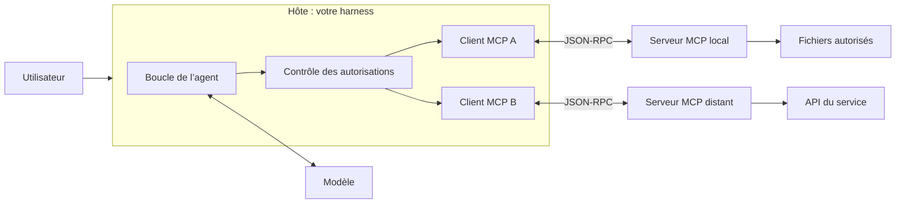
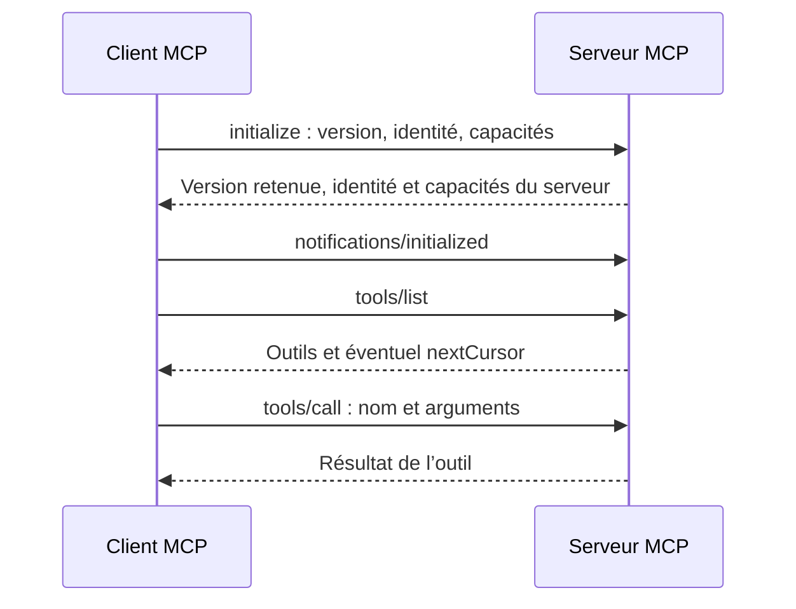

# MCP : Model Context Protocol

Le **Model Context Protocol** permet à une application d’IA de découvrir et d’utiliser les outils, les données et les modèles de prompts fournis par un serveur. Un harness peut ainsi appeler un outil de recherche documentaire sans connaître l’API du service qui se trouve derrière.

MCP définit les échanges avec le serveur. Le harness reste responsable de la boucle, des appels au modèle, du contexte et des autorisations.

Au moment de rédiger ce guide, en septembre 2026, la version courante du protocole est `2026-07-28`. L’exercice de ce chapitre utilise le SDK TypeScript **v1** et la révision **`2025-11-25`**. Le numéro du SDK et la date du protocole sont deux versions différentes.

## Pourquoi un protocole

Sans protocole commun, chaque application écrit son propre connecteur pour chaque service. Avec MCP, le service expose une interface que plusieurs applications savent utiliser. Avec 5 applications et 10 services, on passe en théorie de 50 adaptations à 15 : 5 côté applications, 10 côté services. Il faut toujours gérer les permissions, les versions et les particularités de chaque service.

MCP n’est pas obligatoire. Si le service a déjà une CLI, une API ou une bibliothèque simple, l’agent peut l’utiliser avec son shell. `gh pr list` ne demande aucun serveur MCP. MCP devient utile pour partager un connecteur entre plusieurs applications ou pour brancher un service qui n’a pas d’autre interface.

Chaque outil MCP a aussi un coût en contexte : son nom, sa description et son schéma sont envoyés à chaque appel. Une session Claude Code avec 126 outils MCP aurait occupé 62 500 tokens si tous les schémas avaient été chargés ([chapitre 5](../05-context-engineering/)).

## Hôte, client et serveur



| Composant | Responsabilité |
| --- | --- |
| Hôte (*host*) | Exécute l’application, choisit le contexte envoyé au modèle et applique les autorisations |
| Client MCP | Communique avec un serveur. Un hôte crée un client par serveur. |
| Serveur MCP | Expose ses capacités et exécute la logique d’accès au service |

Le modèle propose un appel d’outil. Le harness décide de l’exécuter, puis passe par le client MCP. La conversion entre le format des outils MCP et celui de l’API du modèle revient à l’application.

## Les trois primitives

| Primitive | Usage | Qui la déclenche | Méthodes |
| --- | --- | --- | --- |
| Outil (*tool*) | Exécuter un calcul, une recherche ou une action | Le modèle propose, l’hôte contrôle | `tools/list`, `tools/call` |
| Ressource (*resource*) | Fournir un contenu identifié par une URI | L’application choisit quoi charger | `resources/list`, `resources/read` |
| Prompt | Fournir un modèle de messages réutilisable | L’utilisateur le sélectionne | `prompts/list`, `prompts/get` |

Un outil expose un nom, une description et un `inputSchema` en JSON Schema, parfois un `outputSchema`. Son résultat contient des blocs dans `content` et, éventuellement, un `structuredContent` conforme au schéma de sortie :

```json
{
  "content": [{ "type": "text", "text": "{\"count\":3}" }],
  "structuredContent": { "count": 3 },
  "isError": false
}
```

Les annotations `readOnlyHint`, `destructiveHint`, `idempotentHint` et `openWorldHint` décrivent le comportement annoncé par le serveur. Elles ne prouvent pas qu’un outil est sûr et ne remplacent pas une autorisation.

Une ressource comme `file:///workspace/README.md` n’accorde pas un accès général au disque. Un prompt MCP ne s’exécute pas seul et ne devient pas une instruction système prioritaire.

## MCP dans la boucle

Le travail se fait en deux temps. Au démarrage, le harness découvre les outils du serveur une fois pour toutes. Le client MCP envoie `tools/list` au serveur, qui répond avec ses outils, ici `search` et `read_page`. Leurs descriptions et schémas, environ 450 tokens, entrent dans le contexte de chaque appel au modèle, avant même la première question.

Ensuite, à chaque tour, un appel MCP suit le même chemin qu’un outil local, avec un intermédiaire de plus :

```animated
sequenceDiagram
  accTitle: Un appel d’outil MCP
  accDescr: Le harness contrôle l’appel proposé par le modèle, le transmet au serveur par le client MCP et associe le résultat à l’identifiant de l’appel.
  participant U as Personne
  participant H as Harness
  participant M as Modèle
  participant C as Client MCP
  participant S as Serveur MCP
  %% ctx: system 1200 Prompt système
  %% ctx: tools 400 Outils locaux
  %% ctx: tools 450 Outils MCP : docs__search, docs__read_page
  U->>H: Que dit la documentation sur la pagination ?
  %% ctx: user 20 Que dit la documentation sur la pagination ?
  H->>M: messages[] + outils locaux et MCP
  M-->>H: tool_call docs__search("pagination")
  %% ctx: assistant 20 docs__search("pagination")
  H->>H: Vérifier les arguments et l’autorisation
  %% note: Le modèle a proposé l’appel. Le harness décide de l’exécuter.
  H->>C: Appel autorisé
  C->>S: tools/call search, query : pagination
  S-->>C: 3 résultats
  C-->>H: content et structuredContent
  %% ctx: tool 700 Résultat de docs__search
  %% note: Le harness associe le résultat à l’identifiant de l’appel du modèle, comme pour un outil local.
  H->>M: messages[]
  M-->>H: Réponse finale
  %% ctx: assistant 200 Réponse sur la pagination
  H-->>U: Réponse
```

L’intégration touche trois endroits du harness :

1. Au démarrage, connecter le client, découvrir les outils et convertir leurs schémas au format de l’API du modèle.
2. À l’exécution, router le nom de l’outil vers le bon client MCP ou vers une fonction locale.
3. Ajouter le résultat à l’historique avec l’identifiant de l’appel. Fermer les clients à la sortie, y compris en cas d’erreur.

Deux serveurs peuvent exposer un outil du même nom. Donnez un nom unique côté modèle et gardez une table de routage :

| Nom présenté au modèle | Client | Nom envoyé au serveur |
| --- | --- | --- |
| `docs__search` | Client documentation | `search` |
| `issues__search` | Client tickets | `search` |

Quand un serveur annonce `tools.listChanged`, rafraîchissez le catalogue et la table. N’ajoutez pas un nouvel outil aux permissions déjà accordées sans le vérifier.

## JSON-RPC

MCP utilise JSON-RPC 2.0. Une requête porte un `id` que sa réponse reprend. Une notification n’a pas d’`id` et n’attend pas de réponse.

```json
{ "jsonrpc": "2.0", "id": 2, "method": "tools/call",
  "params": { "name": "count_characters", "arguments": { "text": "Bonjour" } } }
```

```json
{ "jsonrpc": "2.0", "id": 2,
  "result": { "content": [{ "type": "text", "text": "{\"count\":7}" }], "structuredContent": { "count": 7 } } }
```

Trois sortes d’échec demandent trois traitements :

| Situation | Forme | Traitement |
| --- | --- | --- |
| Méthode inconnue ou requête invalide | Réponse JSON-RPC avec `error` | Signaler l’échec de l’appel |
| Échec pendant l’exécution de l’outil | `result` avec `isError: true` | Transmettre le résultat d’erreur au modèle |
| Serveur arrêté ou délai dépassé | Exception côté client | Arrêter l’attente et signaler l’échec |

Ne relancez pas automatiquement une écriture après un délai dépassé : elle a peut-être réussi.

## Initialisation selon la version

En `2025-11-25`, le client ouvre la connexion par une négociation :



La révision `2026-07-28` supprime cette négociation. Chaque requête porte sa version et les capacités du client dans `_meta`, et le serveur propose `server/discover`. Les abonnements passent par `subscriptions/listen` et les tâches longues deviennent une extension officielle. Changer la date dans un ancien exemple ne suffit pas : utilisez un SDK qui prend en charge la révision du serveur.

## Transports

**Stdio.** L’hôte lance le serveur comme un processus. Le client écrit sur son entrée standard et lit sa sortie standard. Réservez `stdout` au protocole et écrivez les diagnostics avec `console.error()`. Un serveur local a les permissions de son processus : MCP ne crée pas de sandbox.

**Streamable HTTP.** Le client envoie ses messages par `POST` sur un endpoint, souvent `/mcp`. La réponse est du JSON ou un flux SSE. Ce transport remplace l’ancien HTTP+SSE de `2024-11-05`.

## Exercice : un serveur et un client TypeScript

Le serveur expose un outil qui compte les points de code Unicode d’un texte. Il ne demande ni réseau, ni fichiers, ni clé de modèle. Exemples vérifiés avec `@modelcontextprotocol/sdk` 1.30.0, Zod 3.25.76 et Bun 1.3.11.

```bash
mkdir mcp-workshop && cd mcp-workshop
bun init -y
bun add @modelcontextprotocol/sdk@1 zod@3
```

`server.ts` :

```typescript
import { McpServer } from "@modelcontextprotocol/sdk/server/mcp.js";
import { StdioServerTransport } from "@modelcontextprotocol/sdk/server/stdio.js";
import { z } from "zod";

const server = new McpServer({ name: "workshop-tools", version: "1.0.0" });

server.registerTool(
  "count_characters",
  {
    description: "Compte les points de code Unicode d’un texte.",
    inputSchema: { text: z.string().max(10_000) },
    outputSchema: { count: z.number().int().nonnegative() },
    annotations: { readOnlyHint: true, idempotentHint: true, openWorldHint: false },
  },
  async ({ text }) => {
    const output = { count: Array.from(text).length };
    return {
      content: [{ type: "text", text: JSON.stringify(output) }],
      structuredContent: output,
    };
  },
);

await server.connect(new StdioServerTransport());
```

`client.ts` :

```typescript
import assert from "node:assert/strict";
import { fileURLToPath } from "node:url";
import { Client } from "@modelcontextprotocol/sdk/client/index.js";
import { StdioClientTransport } from "@modelcontextprotocol/sdk/client/stdio.js";

const client = new Client({ name: "workshop-harness", version: "1.0.0" });
const transport = new StdioClientTransport({
  command: process.execPath,
  args: ["run", fileURLToPath(new URL("./server.ts", import.meta.url))],
});

try {
  await client.connect(transport);

  const { tools } = await client.listTools();
  assert(tools.some((tool) => tool.name === "count_characters"));

  const result = await client.callTool({ name: "count_characters", arguments: { text: "Salut 🤖" } });
  assert(!result.isError);
  assert.deepEqual(result.structuredContent, { count: 7 });

  const invalid = await client.callTool({ name: "count_characters", arguments: { text: 42 } });
  assert.equal(invalid.isError, true);

  console.log("Vérification réussie : découverte, appel et validation.");
} finally {
  await client.close();
}
```

```bash
bun run client.ts
```

Le client démarre lui-même le serveur. Le SDK valide les arguments avant d’appeler la fonction, donc `text: 42` revient avec `isError: true`. Un point de code n’est pas toujours un caractère visible : un emoji composé en contient plusieurs, et le contrat de l’outil précise ce qu’il compte.

Pour explorer le serveur dans une interface, lancez [MCP Inspector](https://github.com/modelcontextprotocol/inspector) :

```bash
npx @modelcontextprotocol/inspector bun run server.ts
```

## Sécurité

La description d’un outil et ses résultats peuvent contenir des instructions malveillantes. Une page récupérée peut demander à l’agent de lire un secret et de l’envoyer ailleurs. Traitez ces contenus comme des données externes ([chapitre 10](../10-securite/)).

- Pour un serveur local, limitez les permissions du processus et les fichiers accessibles. Les `roots` annoncées par le client indiquent un périmètre, elles n’isolent rien.
- Pour un serveur HTTP, contrôlez l’origine des requêtes et appliquez une authentification. Ne retransmettez pas un jeton reçu pour un service à un autre service.
- Autorisez les actions selon leur portée réelle, surtout les écritures et les suppressions.
- Journalisez le nom de l’outil, la durée et l’issue de l’appel en masquant les secrets.
- Examinez la provenance et les permissions d’un serveur avant de le lancer.

## Diagnostiquer une intégration

| Symptôme | Vérification |
| --- | --- |
| Le serveur stdio ne répond pas | Chemin de l’exécutable, arguments, erreurs sur `stderr` |
| Le client reçoit du JSON invalide | Un log écrit sur `stdout` par le serveur |
| Aucun outil n’apparaît | Capacité `tools`, puis toutes les pages de `tools/list` |
| Le serveur refuse l’initialisation | Compatibilité des révisions et du SDK |
| Un appel retourne `isError: true` | Le contenu d’erreur de l’outil, même si le transport a réussi |
| L’agent ignore un résultat | Sa conversion et son association à l’identifiant de l’appel |

## Sources

- [Architecture officielle de MCP](https://modelcontextprotocol.io/docs/learn/architecture)
- [Spécification 2025-11-25](https://modelcontextprotocol.io/specification/2025-11-25) et [changements de la révision 2026-07-28](https://modelcontextprotocol.io/specification/2026-07-28/changelog)
- [SDK TypeScript v1](https://ts.sdk.modelcontextprotocol.io/)
- [Recommandations de sécurité](https://modelcontextprotocol.io/docs/2025-11-25/tutorials/security/security_best_practices)
- [Serveurs de référence](https://github.com/modelcontextprotocol/servers) et [MCP Registry](https://registry.modelcontextprotocol.io/)
