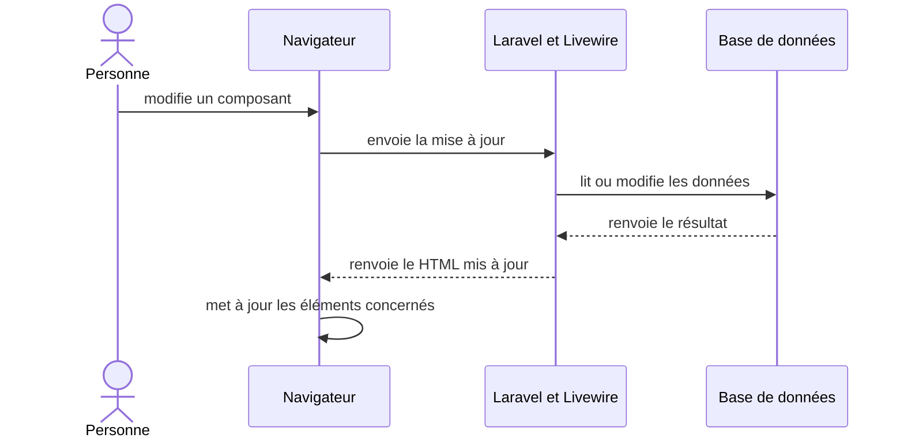

# Comprendre une stack technique

Une stack technique est l'ensemble des briques technologies utilisées pour construire, exécuter et livrer une application. Chaque technologie remplit un rôle dans une couche du système, par exemple l'interface, le backend, les données ou l'hébergement.

https://syndicode.com/blog/how-to-choose-tech-stack/

https://syndicode.com/blog/how-to-choose-tech-stack/

## Décrire le périmètre

Une stack peut contenir les couches suivantes :

| Couche | Rôle | Exemples de technologies |
| --- | --- | --- |
| interface | structure, présentation et interactions | HTML, CSS, Angular, React, Alpine.js |
| rendu web | production du HTML et chargement des données | Svelte dans le navigateur, Laravel et Livewire sur le serveur, générateur statique |
| backend | routes, autorisations et règles métier | Express, Laravel, Django, Spring |
| environnement d'exécution | exécution du code applicatif | Node.js, PHP, JVM, Python |
| données | persistance et requêtes | MongoDB, PostgreSQL, MySQL, SQLite |
| serveur web | réception des requêtes, terminaison TLS et distribution des fichiers | Apache, Nginx, Caddy |
| système et hébergement | exécution et livraison des services | Linux, conteneurs, machine virtuelle, plateforme gérée |

Une stack nomme les technologies qui structurent le développement, l'exécution ou le déploiement. **Une petite bibliothèque utilitaire n'y figure que si elle impose une contrainte** ou un mode de travail qui compte pour le projet.

## Stack et architecture répondent à des questions différentes

| Notion | Question |
| --- | --- |
| stack technique | quelles technologies le projet utilise-t-il ? |
| architecture | comment les parties sont-elles organisées, reliées et déployées ? |
| pattern ou style | quelle forme d'organisation récurrente répond au problème ? |
| stratégie de rendu | où et quand le HTML est-il produit ? |

Deux applications peuvent utiliser la même stack et avoir des architectures différentes. Une application Node.js peut être un monolithe modulaire ou un ensemble de services. À l'inverse, une architecture client-serveur peut utiliser Node.js et MongoDB, ou Laravel et PostgreSQL.

### Que signifie full stack ?

Une application dite _full stack_ comprend au moins une interface, un backend et un moyen de stocker les données. Une personne _full stack_ intervient sur plusieurs de ces couches. L'expression ne précise ni les technologies utilisées ni le niveau de maîtrise de chaque couche.

## Exemples de stacks

### La stack MEAN

**MEAN** regroupe quatre technologies :

**M**ongoDB base de données orientée documents

**E**xpress framework HTTP exécuté avec Node.js

**A**ngular framework d'interface web

**N**ode.js environnement d'exécution JavaScript côté serveur

Dans le navigateur, Angular envoie des requêtes HTTP à Express, qui tourne sur Node.js et interroge MongoDB.

Angular, Express et Node.js utilisent JavaScript ou TypeScript. MongoDB stocke des documents BSON et fournit un pilote pour Node.js. Cette proximité réduit le nombre de langages utilisés, mais elle ne supprime pas les contrats entre le frontend, l'API et la base.

Le nom **MEAN** ne précise ni l'hébergeur, ni le proxy inverse, ni les outils de test et de livraison. Il ne donne pas non plus les versions. Cette dernière information compte, car un ancien projet MEAN peut utiliser AngularJS tandis qu'un projet récent utilise Angular.

Une variante est **MERN**, on **A**ngular est remplacé par **R**eact.

### La stack TALL

**TALL** appartient à l'écosystème Laravel :

**T**ailwind CSS production des styles à partir de classes utilitaires

**A**lpine.js interactions locales dans le navigateur

**L**aravel framework PHP pour les routes, les règles métier et l'accès aux services

**L**ivewire composants PHP interactifs mis à jour par des requêtes au serveur

Livewire rend du HTML sur le serveur puis met à jour le document dans le navigateur. Alpine.js gère les interactions qui peuvent rester locales, comme ouvrir un menu. Cette répartition peut limiter le code JavaScript propre au projet. Elle ajoute des requêtes serveur pour les mises à jour Livewire et demande de définir quelles interactions restent dans Alpine.js.

TALL ne précise pas la base de données, le serveur web, le système d'exploitation ou l'hébergeur. Une description exploitable pourrait donc être : **TALL** avec PostgreSQL, Nginx et Linux, déployé sur une machine virtuelle.

## Deux autres exemples

**LAMP** désigne couramment Linux, Apache, MySQL et PHP. Son périmètre part du système d'exploitation et va jusqu'au langage du backend. Selon les sources, le P peut aussi désigner Perl ou Python. LAMP ne précise pas le framework PHP ni l'organisation du frontend.

Une stack n'a pas besoin d'un acronyme. Un projet peut annoncer simplement : Vue pour l'interface, Laravel pour l'API, PostgreSQL pour les données, Nginx sur Linux pour le déploiement.

## Documenter la stack d'un projet

| Couche ou besoin | Technologie et version | Rôle dans le projet | Raison ou preuve | Condition de réexamen |
| --- | --- | --- | --- | --- |
| interface |     |     |     |     |
| rendu |     |     |     |     |
| backend |     |     |     |     |
| données |     |     |     |     |
| déploiement |     |     |     |     |

Ressources

- MongoDB, [What Is the MEAN Stack?](https://www.mongodb.com/resources/languages/mean-stack), distinction entre MEAN, MERN et MEVN.
- TALL stack, [Reactive Laravel Apps with the TALL stack](https://tallstack.dev/), composition de l'acronyme.
- Laravel Livewire, [Hydration](https://livewire.laravel.com/docs/4.x/quickstart), échanges entre les composants PHP et le navigateur.
- Ubuntu Server, [How to install Apache2](https://ubuntu.com/server/docs/how-to/web-services/install-apache2/), composition courante de LAMP.
