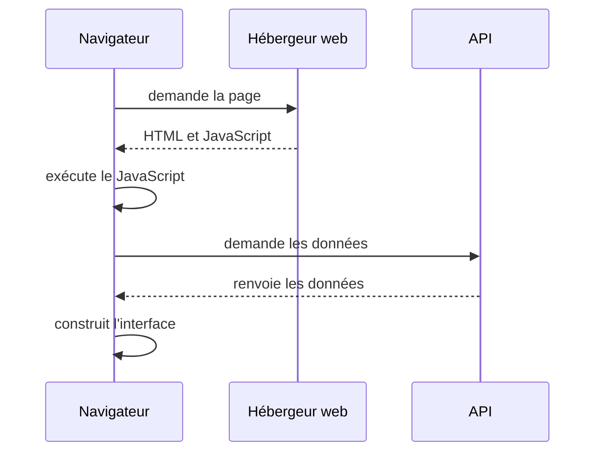
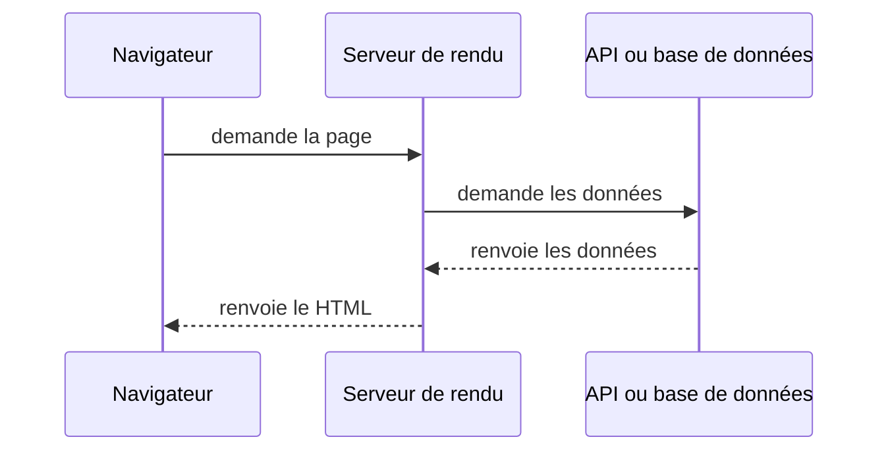

# Frontend, backend et stratégies de rendu

Une application web répartit le travail entre le navigateur et un ou plusieurs serveurs. La stratégie de rendu indique où et quand le HTML d'une page est produit.

## Frontend

Le frontend est la partie du système avec laquelle la personne interagit. Son HTML peut être produit pendant le build, sur un serveur ou dans le navigateur. Le code interactif envoyé au navigateur affiche l'interface, traite les interactions locales et appelle les services dont il dépend.

Le frontend peut masquer un bouton, mais le backend doit encore refuser l'opération si la personne n'a pas le droit de l'exécuter.

## Backend

Le backend s'exécute dans un environnement contrôlé par l'équipe ou son hébergeur. Il applique les règles métier qui doivent être partagées ou protégées, vérifie les autorisations, accède aux données persistantes et appelle les services qui nécessitent des secrets.

Le backend n'est pas la base de données. Il contient le code qui décide comment lire et modifier les données. La base les stocke et garantit les contraintes définies dans son schéma et ses transactions.

Le frontend envoie une requête HTTPS au backend. Le backend interroge la base avec une requête paramétrée, puis renvoie la réponse au frontend.

Frontend et backend peuvent vivre dans le même dépôt et être livrés ensemble. Ils peuvent aussi être séparés en plusieurs applications.

## CSR : rendu côté client

Avec le client-side rendering, le serveur envoie un document HTML initial, souvent minimal, puis le navigateur charge le JavaScript. Ce code demande les données et construit l'interface.

Le **CSR** convient aux interfaces très interactives dont les personnes sont déjà authentifiées, comme un outil interne. Il permet d'héberger les fichiers du frontend sur un service statique et d'utiliser directement les API du navigateur. Le premier affichage dépend toutefois du téléchargement, de l'analyse et de l'exécution du JavaScript, puis des appels de données. L'application doit aussi gérer les états de chargement et d'erreur.

Un site rendu côté client peut être indexé par certains moteurs de recherche. Le HTML initial, les métadonnées et les aperçus de liens demandent néanmoins une vérification explicite pour chaque robot ou plateforme visée.

React, Vue et Angular peuvent produire une application rendue côté client. Leur nom ne suffit pas à identifier la stratégie, car ces outils disposent aussi d'API ou de frameworks pour le **rendu serveur** et **le prérendu**. Angular utilise le CSR par défaut. Une application Nuxt configurée avec `ssr: false` ou une application SvelteKit configurée sans SSR sont deux autres exemples.

## SSR : rendu côté serveur

Avec le server-side rendering, un serveur reçoit une requête pour une URL et produit le HTML de la page à ce moment-là. Il peut lire les données et personnaliser la réponse avant de l'envoyer au navigateur. La réponse contient le contenu nécessaire à l'affichage initial. Certaines données peuvent encore arriver plus tard, notamment lorsque le serveur diffuse le HTML progressivement ou que le navigateur lance d'autres requêtes.

Le navigateur reçoit du contenu avant d'exécuter le JavaScript de l'interface. Le SSR demande un environnement capable de produire les réponses qui ne sont pas déjà dans un cache. Sa latence dépend du calcul et des appels de données réalisés avant l'envoi du HTML. Le cache réduit ce coût pour les pages qui partagent le même contenu.

Le SSR peut vivre dans la même application que les règles métier ou appeler un backend séparé. _Produire du HTML sur un serveur ne rend pas automatiquement ce serveur responsable de toute la logique du produit._

Next.js, Nuxt, SvelteKit et Angular avec `@angular/ssr` prennent en charge le SSR. React et Vue fournissent aussi des API de rendu serveur que ces frameworks peuvent utiliser.

Le SSR est adapté à une page publique dont le contenu varie souvent ou dépend de la requête, par exemple une page d'actualité non mise en cache ou un catalogue personnalisé. Le HTML directement exploitable aide les moteurs de recherche et les aperçus de liens.

## SSG : génération statique

Avec la static site generation, les pages HTML sont produites pendant le build. L'hébergement distribue ensuite des fichiers déjà générés, souvent depuis un CDN.

Le SSG convient à une documentation, un blog, un portfolio ou des pages de présentation dont le contenu change moins souvent que les consultations. Le serveur n'a pas besoin de recalculer la page pour chaque visite. Les fichiers peuvent être distribués par un hébergement statique ou un CDN.

Une modification demande une nouvelle génération. Une page statique peut encore appeler une API dans le navigateur pour afficher une partie dynamique ou personnalisée.

## Hydratation

Une page SSR ou SSG peut contenir du JavaScript interactif. L'hydratation relie ce JavaScript au HTML déjà présent dans le navigateur et attache les gestionnaires d'événements.

Une page visible n'est pas forcément encore interactive. Si l'hydratation charge et exécute beaucoup de JavaScript, un bouton peut apparaître avant de répondre aux clics.

## SPA : navigation sans rechargement complet

Une single-page application intercepte les **changements de route dans le navigateur**. Après le chargement initial, le routeur JavaScript remplace la vue et met à jour l'URL sans demander au navigateur de charger un nouveau document HTML complet.

**SPA et CSR ne sont pas synonymes**. Une SPA entièrement CSR construit son premier écran dans le navigateur. Une application SSR ou SSG peut envoyer un premier HTML complet, l'hydrater, puis utiliser une navigation SPA pour les routes suivantes. Next.js, Nuxt et SvelteKit peuvent suivre ce second fonctionnement.

À l’inverse, une application multipage, ou **MPA**, laisse le navigateur demander un nouveau document HTML à chaque changement de page. Ce fonctionnement peut être rendu sur le serveur ou servi depuis des fichiers statiques.

## Rendu hybride

Une application peut choisir une stratégie par route ou par fragment de page. Un site de réservation peut générer ses pages de présentation au build, rendre le catalogue sur le serveur et laisser le tableau de bord utiliser le CSR après authentification.

Cette combinaison adapte le rendu au besoin de chaque page. Elle ajoute aussi plusieurs politiques de cache, de chargement et de déploiement. Documente la stratégie choisie pour chaque groupe de routes afin qu'une page ne change pas de comportement par défaut lors d'une mise à jour du framework.

Un site d'actualité n'a donc pas besoin de rendre toutes ses pages sur le serveur à chaque requête. Il peut générer les articles, les régénérer après une publication, mettre en cache la page d'accueil et réserver le SSR aux pages personnalisées.

## Exemples de frameworks et d'outils

| Outil | Capacités illustrées | Précision |
| --- | --- | --- |
| Next.js | rendu serveur, rendu statique, rendu client et régénération | le mode dépend des composants, des données et du cache |
| Nuxt | rendu universel, CSR, prérendu et rendu hybride | des règles peuvent être définies par route |
| Angular avec `@angular/ssr` | CSR, SSR et prérendu | Angular Universal est l'ancien nom rencontré dans certains projets |
| SvelteKit | SSR, prérendu, CSR et SPA | les options peuvent être choisies par page ou groupe de pages |

## Avantages et limites

| Question | CSR | SSR | SSG |
| --- | --- | --- | --- |
| Moment du rendu initial | dans le navigateur | lors de la requête si la réponse n'est pas déjà en cache | pendant le build |
| Infrastructure pour le HTML | hébergement de fichiers | serveur de rendu | hébergement de fichiers ou CDN |
| Données personnalisées dans le HTML initial | généralement chargées après | possibles à chaque requête | possibles pour les variantes connues au build |
| Fraîcheur du contenu | au moment de l'appel API | au moment de la requête | au dernier build ou à la dernière régénération |
| Cas fréquent | tableau de bord ou outil interne | contenu public dynamique ou personnalisé | documentation, portfolio ou pages de présentation |
| Avantage principal | hébergement simple et logique interactive dans le navigateur | HTML calculé avec les données de la requête | fichiers précalculés faciles à mettre en cache |
| Limite à mesurer | temps avant affichage, volume de JavaScript et indexation | latence, charge serveur, cache et coût d'exploitation | durée du build, fraîcheur et nombre de pages |

## Questions de décision

- Le contenu est-il public, personnalisé ou protégé ?
- À quelle fréquence change-t-il ?
- Quelle partie doit être visible avant l'exécution du JavaScript ?
- Quel délai de mise à jour du contenu est acceptable ?
- L'équipe peut-elle exploiter un serveur de rendu ?
- Comment la page se comporte-t-elle si JavaScript ou une API tarde à répondre ?
- Quelles mesures valideront le choix sur les appareils et réseaux ciblés ?

## Ressources

- MDN, [Server-side rendering](https://developer.mozilla.org/en-US/docs/Glossary/SSR).
- MDN, [SPA](https://developer.mozilla.org/en-US/docs/Glossary/SPA), définition et compromis d'une application monopage.
- web.dev, [Rendering on the Web](https://web.dev/articles/rendering-on-the-web).
- Angular, [Server-side and hybrid rendering](https://angular.dev/guide/ssr).
- Nuxt, [Rendering Modes](https://nuxt.com/docs/3.x/guide/concepts/rendering).
- SvelteKit, [Page options](https://svelte.dev/docs/kit/page-options).
- SvelteKit, [Single-page apps](https://svelte.dev/docs/kit/single-page-apps).
- Next.js, [Static and Dynamic Rendering](https://nextjs.org/learn/dashboard-app/static-and-dynamic-rendering).
- React, [Server React DOM APIs](https://react.dev/reference/react-dom/server).
- React, `hydrateRoot`, attachement de React à un HTML produit sur le serveur.
- Vue, [Server-Side Rendering](https://vuejs.org/guide/scaling-up/ssr).
