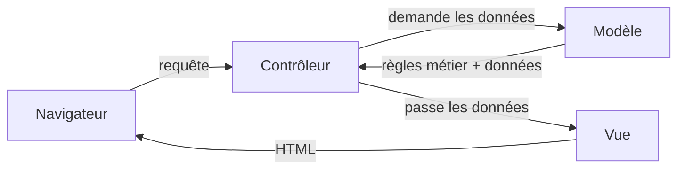

# Patterns, styles et abstractions

### Client-serveur et séparation frontend/backend

Dans une architecture client-serveur web, le navigateur envoie des requêtes à un serveur. La séparation frontend/backend place l'interface et l'API dans deux applications. Le back expose les données, le front les consomme et les affiche. Les deux applications se déploient, se versionnent et se testent séparément.

Le front, une application JavaScript, envoie des requêtes HTTP à l’API REST du back et reçoit du JSON. Seul le back accède à la base de données. Un projet peut ranger ces applications dans des dossiers `client/` et `server/`, ou dans deux dépôts distincts.

Deux applications demandent deux chaînes de livraison et un moyen de synchroniser les contrats de données. Une configuration CORS est nécessaire si elles utilisent des origines différentes. Cette séparation convient lorsqu'une même API alimente plusieurs clients, par exemple web et mobile, ou lorsque les équipes front et back livrent à des rythmes différents. Pour un site vitrine, un monolithe ou un générateur statique demande généralement moins d'exploitation. La fiche [Frontend, backend et stratégies de rendu](https://docmost.ludique.dev/share/bcfabao2nc/p/frontend-backend-et-strategies-de-rendu-kgZb1oxgoQ) détaille les responsabilités et les options de rendu.

### Monolithe modulaire

Un monolithe est livré comme une seule unité. Chaque module regroupe une capacité métier, expose une interface et garde ses détails privés.

Cette organisation évite la coordination réseau entre modules et permet des transactions locales. Elle demande toutefois des règles de dépendance vérifiées par les tests ou les outils de build. Sans ces règles, les modules finissent par accéder directement aux données et au code interne des autres.

## Organisation interne d'une application

### Architecture en couches

Une architecture en couches sépare par exemple la présentation, les cas d'usage, le domaine et l'infrastructure. Chaque couche a une responsabilité et des dépendances autorisées. La règle choisie doit être explicite afin d'éviter les appels circulaires et les accès directs à la base depuis l'interface.

Ce découpage aide lorsqu'une même règle métier est utilisée par plusieurs interfaces. Il ajoute des passages entre couches et peut disperser une petite fonctionnalité dans plusieurs fichiers.

## MVC (Modèle, Vue, Contrôleur)

---

MVC sépare trois responsabilités : les données et règles métier dans le modèle, leur affichage dans la vue et le traitement des actions dans le contrôleur. Cette séparation permet de modifier l'affichage sans réécrire les règles métier, tant que les interfaces entre les trois parties restent stables.

Laravel, Rails, Django et Symfony proposent des organisations inspirées de MVC. Des dossiers `models/`, `views/` et `controllers/` en sont un indice, même si leur présence ne garantit pas que les responsabilités sont bien séparées.

Cette séparation ajoute de l'indirection : suivre une requête demande de passer par plusieurs fichiers. Sur un petit script, ce découpage peut coûter plus de temps qu'il n'en fait gagner. Il devient utile lorsque les règles métier, les entrées et les affichages évoluent indépendamment.

## Style d'interface

### REST

REST est un style d'architecture fondé notamment sur des ressources, une interface uniforme et des requêtes qui contiennent les informations nécessaires à leur traitement. Dans une API HTTP, une URL peut identifier une ressource comme `/users/42`. Les méthodes expriment l'opération demandée : GET lit une représentation, POST soumet ou crée une ressource selon l'API, PUT la remplace et DELETE la supprime. Les codes de statut, comme 200, 404 ou 500, décrivent le résultat de la requête.

De nombreuses API publiques et applications web qui échangent du JSON suivent ces conventions. Un appel comme `fetch("/api/cart")` peut demander la représentation de la ressource panier.

Le modèle par ressources représente moins bien certaines opérations, comme recalculer un itinéraire ou valider un tour de jeu. Les transformer artificiellement en ressources rend parfois l'API moins lisible. Choisis une convention cohérente avec le domaine et documente les exceptions.

## Accès aux données

### ORM (Object-Relational Mapping)

Un ORM traduit entre les objets du langage et les tables SQL. Le code accède par exemple à `user.favorites`, puis l'ORM génère la requête correspondante. Prisma, Sequelize, Eloquent, Hibernate et Doctrine appartiennent à cette famille.

L'abstraction peut masquer le coût des requêtes générées. Un N+1 charge une liste, puis exécute une requête supplémentaire pour chaque élément au lieu de regrouper le chargement. Il reste invisible tant que l'équipe n'inspecte pas les requêtes ou leurs mesures. L'ORM ajoute aussi une API à apprendre. En échange, il automatise la conversion entre objets et tables et fournit généralement des requêtes paramétrées. Celles-ci réduisent le risque d'injection SQL lorsque l'application n'insère pas de fragments SQL non contrôlés.

Le niveau évite de comparer des solutions qui ne répondent pas à la même question. Un monolithe peut utiliser MVC, exposer une API REST et accéder aux données avec un ORM. Ces choix se combinent et chacun demande sa propre justification.

---

La liste continue avec les SPA, le rendu côté serveur, Jamstack, client-serveur, backend for frontend et microservices.

Chaque pattern répond à un problème et ajoute ses propres contraintes. Le nom du pattern donne un point de départ, mais la décision doit encore décrire le contexte dans lequel il est appliqué.
