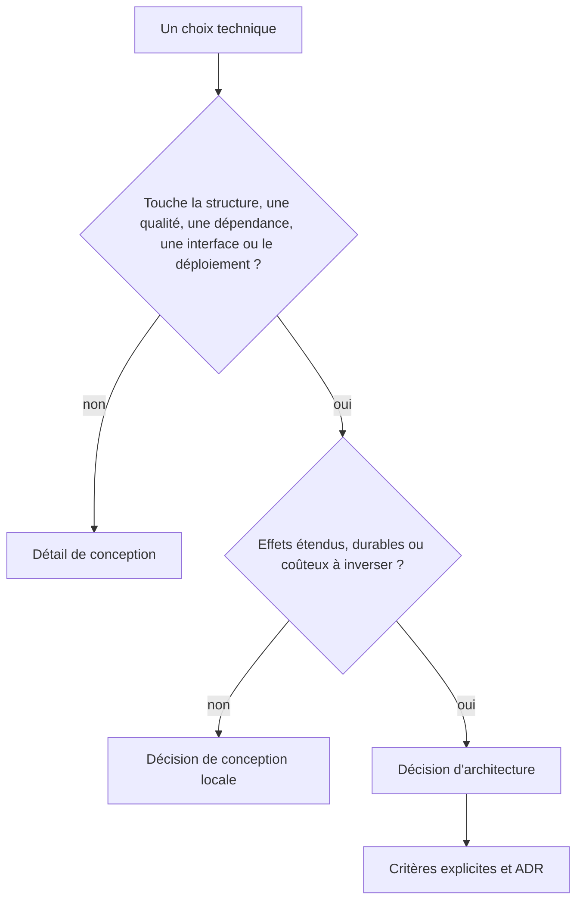

# Comment faire des choix

_Tout choix comporte un compromis. Si une option semble n’avoir aucun inconvénient, alors son coût n’a pas encore été identifié (Fundamentals of Software Architecture, 2020)._

Une décision d'architecture est un choix technique avec des conséquences qui structurent la vie du projet. Elle s'argumente : elle dit pourquoi une option répond mieux qu'une autre aux contraintes du projet. React ou Vue, PostgreSQL ou SQLite, Axios ou fetch, JWT ou session, Express ou Laravel : chacun de ces choix peut en être une.

[Michael Nygard](https://cognitect.com/blog/2011/11/15/documenting-architecture-decisions) considère comme des choix d’architecture les décisions qui touchent à la structure du système, ses caractéristiques de qualité, ses dépendances, ses interfaces ou la façon dont le projet est construit. La portée, le coût d’un retour en arrière et la durée de ses effets déterminent le niveau de documentation nécessaire. On ne documente pas tous les choix. Un choix qui change un seul fichier et se remplace sans migration **est un détail de conception**. Un choix qui touche plusieurs composants, impose un contrat entre équipes ou demande une migration mérite d’être documenté.

**Ce schéma aide à trier un choix à documenter d'un détail de conception :**

### Portée du changement

Remplacer une base de données peut demander de convertir les données, d'adapter les requêtes et de revoir le déploiement. Modifier une couleur isolée touche moins de composants. La différence vient du travail de migration et du nombre de contrats modifiés, pas du nom de la technologie.

### Choix qu'elle rend possibles

Choisir un framework front oriente la gestion de l'état, le routage et les tests. Le choix initial réduit ou augmente les options compatibles par la suite.

### Effets sur les qualités du système

Une décision qui modifie un objectif mesurable de performance, de sécurité, de disponibilité ou de maintenabilité touche l'architecture.

### Contrats partagés

Une interface publique, un format de message ou une stratégie d'authentification coordonne plusieurs parties du système. Sa modification demande d'identifier les consommateurs et d'organiser leur migration.

## Contraintes, critères, hypothèses et preuves

| Type | Rôle | Exemple pour un hébergement |
| --- | --- | --- |
| Contrainte | élimine les options incompatibles | le contrat impose un hébergement des données dans l'Union européenne |
| Critère | compare les options encore possibles | coût d'exploitation sur trois ans |
| Hypothèse | énonce une information non vérifiée | moins de 20 personnes utiliseront le service en même temps |
| Preuve | documente, mesure ou contredit une affirmation | les journaux des 90 derniers jours montrent un maximum de 12 sessions simultanées |

Traite les contraintes avant la comparaison. Marque les hypothèses comme telles et indique comment les vérifier.

## Une préférence peut devenir une décision

L'explicitation transforme une préférence en décision argumentée. « Je préfère SQLite » est une préférence. « Je choisis SQLite parce que la base restera sur la même machine que l'application et que les écritures observées sont brèves et peu fréquentes. La base ne demande pas de serveur séparé. Nous réexaminerons le choix si la contention provoque des erreurs ou si plusieurs serveurs doivent accéder aux mêmes données » est une décision. L'option reste la même, mais les critères, les observations et le seuil de réexamen sont visibles.

Le même raisonnement s'applique aux critères de valeur. « Je ne veux pas de produit Google » exprime une préférence. « Je choisis une solution qui permet au client d'héberger et d'exporter ses données, car cette autonomie est une exigence de la structure ESS » formule une décision argumentée. Les valeurs peuvent guider le choix si elles sont annoncées comme des critères et accompagnées de leurs conséquences.

## Documenter les raisons

La deuxième loi de Richards et Ford dit que le _pourquoi_ compte plus que le _comment_. Le code montre comment la solution fonctionne, mais il ne conserve pas les alternatives écartées ni les contraintes du moment. Un [ADR](/architecture-logicielle/06-adr/) enregistre ces raisons au moment de la décision.
