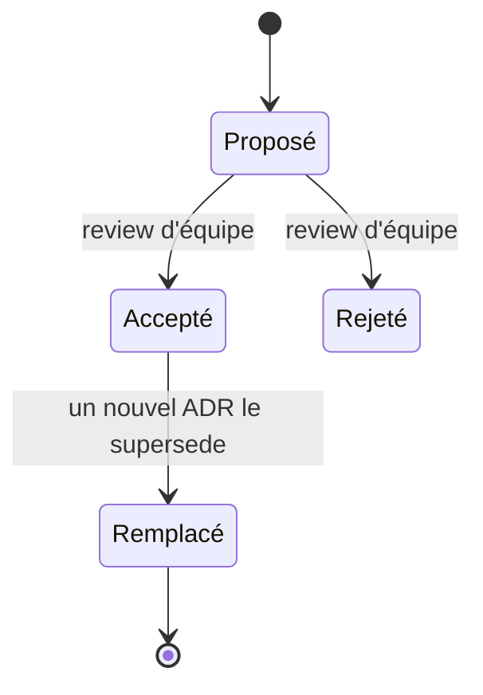

# ADR

## Documenter les décisions techniques

Michael Nygard a proposé les ADR (Architecture Decision Records) en 2011, dans un billet intitulé « [Documenting Architecture Decisions](https://cognitect.com/blog/2011/11/15/documenting-architecture-decisions) ». Son constat : les documents d'architecture volumineux sont difficiles à lire et à maintenir. Quand les raisons d'un choix ne sont pas écrites, une nouvelle équipe risque de le conserver ou de le remplacer sans connaître les contraintes auxquelles il répondait.

Nygard propose un fichier court par décision, stocké dans le dépôt avec le code. Le livre _Software Architecture: The Hard Parts_ (Ford, Richards, Sadalage, Dehghani, 2021) utilise aussi des ADR pour suivre les décisions prises au fil d'un projet.

## Format d'un ADR

```markdown
# ADR-007 : SQLite comme base de données
---
auteur: Théo
domaine : backend
status-validated : 2026-07-07
---

## Contexte
L'outil de gestion des membres de l'association est utilisé depuis un seul poste et contient environ 400 enregistrements. L'association n'a pas d'administrateur système et ne souhaite pas maintenir un serveur de base de données. L'équipe connaît SQL.

## Contraintes et critères
Contraintes : la base reste sur la même machine que l'application et la sauvegarde doit pouvoir être réalisée sans administration de serveur.
Critères : temps d'exploitation, facilité de sauvegarde, prise en charge des écritures observées et coût de migration.

## Hypothèses et preuves
L'association confirme qu'un seul poste utilise actuellement l'application. Le volume et la durée des écritures n'ont pas encore été mesurés. Le coût d'une migration vers PostgreSQL reste une hypothèse tant qu'un essai n'a pas validé le schéma et les requêtes.

## Décision
Nous utilisons SQLite. La base tient dans un fichier et ne demande aucun serveur de base de données à installer ni à maintenir.

## Alternatives considérées
PostgreSQL auto-hébergé : prend en charge davantage d'écritures concurrentes, mais ajoute un serveur à administrer.
Airtable ou autre SaaS : ne demande pas d'administration de serveur, mais stocke les données personnelles des membres chez un tiers. Cette option ne respecte pas la contrainte d'hébergement définie avec l'association.

## Conséquences
Le déploiement ne nécessite pas de serveur de base de données. Une sauvegarde consiste à copier le fichier SQLite lorsque l'application n'écrit pas dedans.

SQLite ne traite qu'une écriture à la fois par fichier. Des transactions courtes peuvent se succéder, mais une charge d'écriture soutenue peut produire de l'attente ou des erreurs de verrouillage.

## Réexamen
L'association et l'équipe conviennent de rouvrir la décision si l'application doit accéder directement au fichier depuis plusieurs machines, si elle doit fonctionner sur plusieurs serveurs, ou si les mesures montrent que plus de 1 % des écritures dépassent 500 ms ou échouent à cause d'un verrou sur une période de sept jours.
```

Le format de Nygard contient un titre, un statut, le contexte, la décision et ses conséquences. Les sections « alternatives considérées », « hypothèses et preuves » et « réexamen » n'en faisaient pas partie. Elles conservent les options écartées, l'incertitude restante et les conditions qui rendraient la décision caduque.

## Version minimale

Une petite décision peut tenir en quelques lignes.

```markdown
# ADR-003 : fetch natif plutôt qu'Axios

## Contexte
Application simple, navigateurs modernes uniquement.

## Décision
Utiliser fetch natif pour les appels HTTP.

## Conséquences
+ aucune dépendance supplémentaire à auditer et à mettre à jour
+ API fournie par les navigateurs ciblés
- gestion du JSON et des erreurs un peu plus verbeuse
```

Adapte le niveau de détail aux effets de la décision. Un choix de base de données peut demander une page. Un choix de bibliothèque peut tenir en dix lignes. Dans les deux cas, donne le contexte et au moins une conséquence négative.

> Plus de modèles : [modèles d'ADR en français](https://github.com/architecture-decision-record/architecture-decision-record/tree/main/locales/fr/mod%C3%A8les)

## Règles de rédaction et de suivi

### Remplacer un ADR sans effacer l'ancien

Ne réécris pas un ADR accepté lorsqu'une décision change. Rédige un nouvel ADR, marque l'ancien comme remplacé et ajoute une référence vers son successeur. L'historique montre alors dans quel contexte chaque décision s'appliquait.



### Décrire le contexte

SQLite répond ici à un usage depuis un seul poste, avec environ 400 enregistrements et sans administrateur système. Un service qui reçoit de nombreuses écritures simultanées et exige une haute disponibilité poserait d'autres contraintes. Sans volume, mode d'accès, compétences disponibles et exigences d'exploitation, le nom de la technologie ne suffit pas à juger le choix.

### Rester court

Nygard recommande une ou deux pages. Un format court réduit le temps de rédaction et permet de relire les décisions avec le code.

### Versionner les ADR avec le code

Range les fichiers Markdown dans un dossier comme `docs/adr/` et numérote-les (`001-`, `002-`). Le même historique relie alors une décision aux changements de code concernés.

### Nommer les conséquences négatives

Liste au moins un coût, une limite ou un risque. Si aucune conséquence négative n'apparaît, la comparaison des options est probablement incomplète.

### Rendre l'incertitude visible

Sépare les faits observés des hypothèses. Pour chaque hypothèse qui peut changer la décision, indique la mesure, le test ou la personne qui permettra de la vérifier. Une estimation sans décomposition ni essai reste une hypothèse.

L'équipe peut relire un ADR dans la même pull request que le code concerné. Les conventional comments s'appliquent aussi à ce document :

```plaintext
question: le seuil de 1 % sur sept jours vient-il d'un besoin validé ou d'une hypothèse de l'équipe ?

issue (blocking): aucune conséquence négative listée, or tout choix a un coût. Qu'est-ce qu'on perd avec cette option ?

praise: la section « Réexamen » donne des événements et une mesure observables.
```

Quand une revue de code soulève un choix structurant, par exemple « pourquoi un ORM ici ? », demande un ADR plutôt que de disperser la décision dans le fil de discussion de la pull request.

## Ressources

- Michael Nygard, « [Documenting Architecture Decisions](https://cognitect.com/blog/2011/11/15/documenting-architecture-decisions) » (2011) : le billet d'origine, très court.
- Ford, Richards, Sadalage, Dehghani, _Software Architecture: The Hard Parts_ (2021) : des ADR appliqués à un récit de projet.
- Clements et al., _Documenting Software Architectures_ (SEI) : une méthode plus détaillée pour documenter une architecture.
- [Architecture Decision Record](https://martinfowler.com/bliki/ArchitectureDecisionRecord.html) - Martin Fowler
- SQLite, [Appropriate Uses For SQLite](https://www.sqlite.org/whentouse.html) : limites liées aux accès réseau et aux écritures concurrentes.
