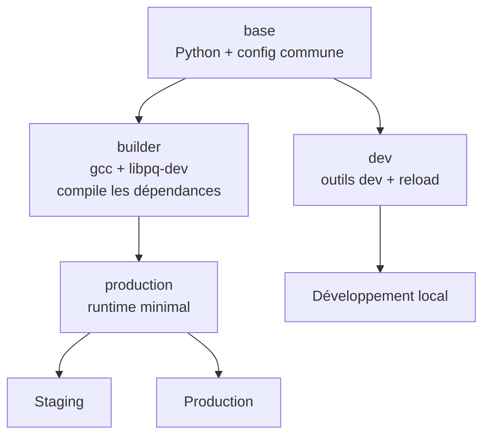
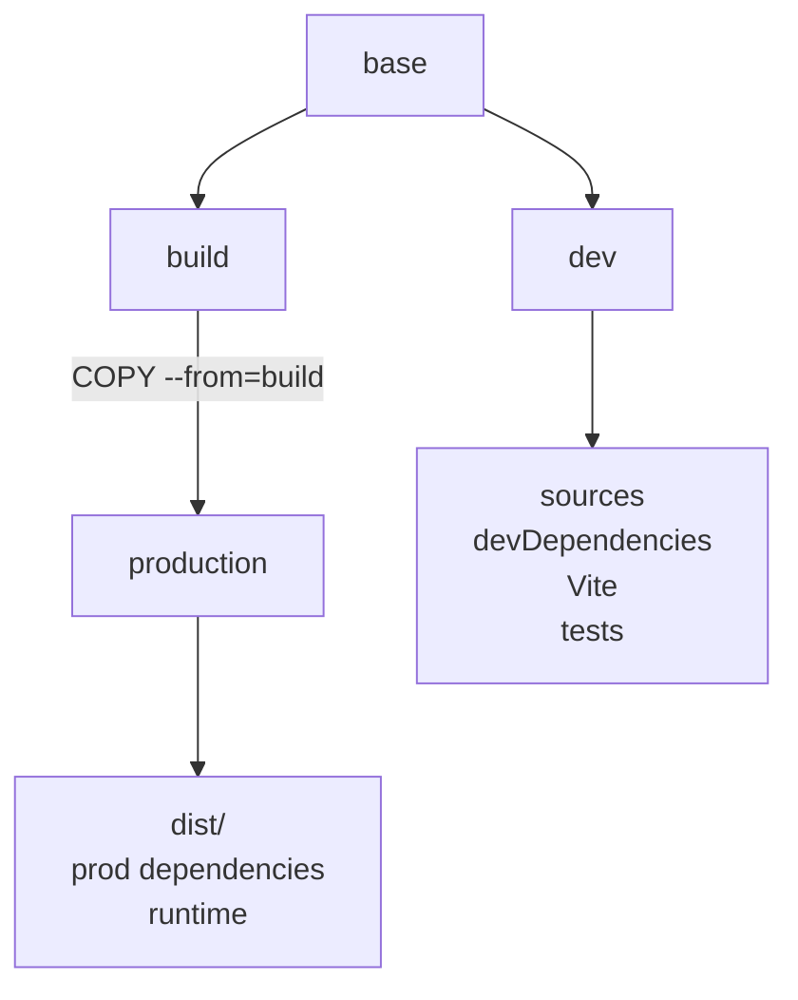

# Dockerfile multi-stage

Un Dockerfile contient différentes étapes selon les besoins et environnements de développement.  
Exemple pour une FastAPI python

```dockerfile
# ---------- Base commune ----------
FROM python:3.12-slim AS base
ENV PYTHONDONTWRITEBYTECODE=1
ENV PYTHONUNBUFFERED=1
WORKDIR /app


# ---------- Développement ----------
FROM base AS dev
RUN apt-get update && apt-get install -y \
    build-essential \
    libpq-dev \
    && rm -rf /var/lib/apt/lists/*

COPY requirements-dev.txt .
RUN pip install --no-cache-dir -r requirements-dev.txt
COPY . .
CMD ["uvicorn","app.main:app","--host","0.0.0.0","--port","8000","--reload"]


# ---------- Build des dépendances ----------
FROM base AS builder
RUN apt-get update && apt-get install -y \
    build-essential \
    libpq-dev \
    && rm -rf /var/lib/apt/lists/*
COPY requirements.txt .
RUN pip wheel \
    --no-cache-dir \
    --wheel-dir /wheels \
    -r requirements.txt


# ---------- Production ----------
FROM base AS production
COPY --from=builder /wheels /wheels
RUN pip install \
    --no-cache-dir \
    /wheels/* \
    && rm -rf /wheels

COPY . .
EXPOSE 8000
CMD ["uvicorn", "app.main:app", "--host", "0.0.0.0", "--port", "8000"]
```



`builder` n'est pas une image à déployer mais une étape intermédiaire utilisée pour fabriquer les dépendances.

En local, Compose peut demander explicitement :

```
services:
  api:
    build:
      context: .
      target: dev
```

Et docker construit jusqu’au stage `dev` ce qui donne `Uvicorn + --reload`

```dockerfile
FROM node:24
WORKDIR /app
COPY package.json package-lock.json ./
RUN npm install
COPY . .
RUN npm run build
CMD ["npm", "start"]
```

Cela fonctionne mais l’image finale contient potentiellement beaucoup de choses inutiles en production :

- TypeScript ;
- Vite ;
- ESLint ;
- Vitest ;
- fichiers source ;
- outils de build ;
- `devDependencies`.

Le multi-stage permet de créer plusieurs étapes spécialisées.

## Stage `base`

```dockerfile
FROM node:24-alpine AS base
WORKDIR /app
COPY package.json package-lock.json ./
```

`base` contient les éléments communs.

Base : Node.js, WORKDIR : package.json

## Stage `dev`

```dockerfile
FROM base AS dev
RUN npm install
COPY . .
CMD ["npm", "run", "dev"]
```

Cette image peut contenir :

- dépendances de développement ;
- TypeScript ;
- Vite ;
- hot reload ;
- code source ;
- outils de debug.

Compose peut explicitement sélectionner ce stage :

```dockerfile
build:
  context: .
  target: dev
```

## Stage `build`

```
FROM base AS build
RUN npm ci
COPY . .
RUN npm run build
```

Son seul rôle est de construire l’application : il compile les sources TypeScript dans `dist/`.

## Stage `production`

```dockerfile
FROM node:24-alpine AS production
WORKDIR /app
COPY package.json package-lock.json ./
RUN npm ci --omit=dev
COPY --from=build /app/dist ./dist
CMD ["node", "dist/server.js"]
```

La ligne importante est :

```dockerfile
COPY --from=build /app/dist ./dist
```

Elle récupère uniquement le résultat produit par le stage `build`.



L’image de production n’a donc pas besoin de contenir :

- les tests ;
- ESLint ;
- Vite ;
- TypeScript ;
- les outils de build ;
- les devDependencies.

Cela permet notamment :

- des images plus petites ;
- moins de surface d’attaque ;
- des démarrages et transferts plus rapides ;
- une séparation claire entre build et runtime.
