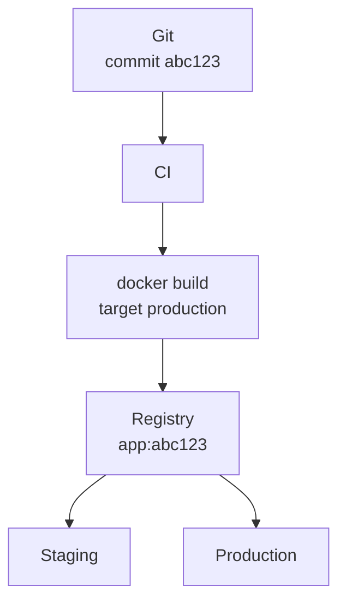

# Docker, Git et les environnements

Un projet a en général trois environnements :

- développement local ;
- staging / préproduction ;
- production.

Ils ne correspondent pas forcément à trois branches Git. Le modèle à retenir :



> **Build once, deploy many.**

La CI construit l’image une seule fois, puis cette même image part dans chaque environnement.

---

# Registry

Un registry est un serveur qui stocke des images Docker.

Exemples :

- Docker Hub ;
- GitHub Container Registry ;
- GitLab Container Registry ;
- Forgejo Container Registry ;
- registry privé.

GitHub ou Forgejo peuvent donc fournir deux services différents : un dépôt Git pour le code source et un Container Registry pour les images Docker.

Par exemple, `git.example.org/theo/monapp` peut stocker le code Git, et `git.example.org/theo/monapp:abc123` peut désigner une image dans le registry Forgejo.

## Push

Après un build avec `docker build -t git.example.org/theo/monapp:abc123 .`, envoyez l’image avec `docker push git.example.org/theo/monapp:abc123`.

## Pull

Un serveur récupère ensuite cette image précise : `docker pull git.example.org/theo/monapp:abc123`

---

# CI/CD

Un pipeline classique :

1. Le développeur fait `git push`.
2. Forgejo Actions ou GitHub Actions lance les tests, le lint et le typecheck.
3. La CI construit l’image avec `docker build`.
4. La CI pousse l’image dans le Container Registry, par exemple `app:abc123`.
5. Le staging déploie cette image.
6. Après validation, la production déploie la même image.

Les serveurs de staging et de production ne reconstruisent pas l’application. Ils récupèrent une image déjà construite.

---

# Développement local

En local, les besoins changent. On veut :

- hot reload ;
- bind mounts ;
- debug ;
- devDependencies ;
- données locales.

Docker Compose construit l’image au stage `dev` et lance deux conteneurs : l’API et PostgreSQL. Un bind mount place le code local dans le conteneur de l’API.

Un `docker compose up --build` suffit. Le registry n’intervient pas dans la boucle de développement quotidienne.

---

# Staging et production

Staging et production diffèrent par leur **configuration**. Le code est le même.

### Staging

```plaintext
APP_URL=https://staging.example.org
DATABASE_URL=...
BETTER_AUTH_SECRET=secret-staging
```

### Production

```plaintext
APP_URL=https://example.org
DATABASE_URL=...
BETTER_AUTH_SECRET=secret-production
```

L’image reste la même.

---

# Git et versions

Trois branches `develop -> staging -> production` ne sont pas nécessaires.

On peut garder `main` comme branche principale et identifier les déploiements par commit.

Par exemple, avec les commits `A`, `B`, `C`, `D` et `E` sur `main`, la production peut utiliser l’image `app:C` pendant que staging teste `app:E`.

Une fois `E` validé, la production passe à l’image `app:E`, celle que staging a testée.

---

# Tags

Pour les releases, on peut associer un tag Git à une image Docker.

```plaintext
Git tag
v1.4.0

Docker image
app:1.4.0
```

On peut aussi taguer par SHA : `app:a81f25d`.

Ne dépendez pas uniquement de `app:latest` : ce tag ne dit pas quelle version tourne.
