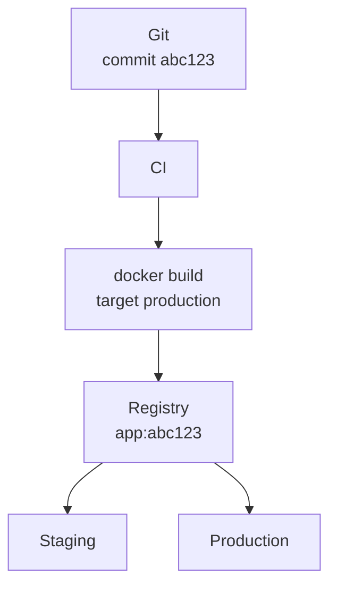

# Docker, Git et les environnements

On rencontre généralement plusieurs environnements :

- développement local ;
- staging / préproduction ;
- production.

Il ne faut pas nécessairement les associer à trois branches Git différentes.

Le modèle important est plutôt :



L’idée essentielle est :

> **Build once, deploy many.**

On construit l’image une seule fois puis on déploie exactement cette image dans plusieurs environnements.

---

# Registry

Un registry est un serveur qui stocke des images Docker.

Exemples :

- Docker Hub ;
- GitHub Container Registry ;
- GitLab Container Registry ;
- Forgejo Container Registry ;
- registry privé.

GitHub ou Forgejo peuvent donc fournir deux services différents : un dépôt Git pour le code source et un Container Registry pour les images Docker.

Par exemple, `git.example.org/theo/monapp` peut stocker le code Git, et `git.example.org/theo/monapp:abc123` peut désigner une image dans le registry Forgejo.

## Push

Après un build : `docker build -t git.example.org/theo/monapp:abc123` on peut envoyer l’image : `docker push git.example.org/theo/monapp:abc123`

## Pull

Un serveur peut ensuite récupérer exactement cette image : `docker pull git.example.org/theo/monapp:abc123`

---

# CI/CD

Un pipeline classique peut être :

1. Le développeur fait `git push`.
2. Forgejo Actions ou GitHub Actions lance les tests, le lint et le typecheck.
3. La CI construit l’image avec `docker build`.
4. La CI pousse l’image dans le Container Registry, par exemple `app:abc123`.
5. Le staging déploie cette image.
6. Après validation, la production déploie la même image.

Le serveur de staging et le serveur de production n’ont idéalement pas besoin de reconstruire l’application.

Ils récupèrent une image déjà construite.

---

# Développement local

Le développement local est différent.

On veut souvent :

- hot reload ;
- bind mounts ;
- debug ;
- devDependencies ;
- données locales.

Docker Compose construit l’image au stage `dev` et lance deux conteneurs : l’API et PostgreSQL. Un bind mount place le code local dans le conteneur de l’API.

On peut simplement faire : `docker compose up --build`

Le registry n’est donc pas forcément impliqué dans la boucle de développement quotidienne.

---

# Staging et production

La différence entre staging et production doit principalement venir de la **configuration**, pas du code.

Par exemple :

### Staging

```plaintext
APP_URL=https://staging.example.org
DATABASE_URL=...
BETTER_AUTH_SECRET=secret-staging
```

### Production

```plaintext
APP_URL=https://example.org
DATABASE_URL=...
BETTER_AUTH_SECRET=secret-production
```

L’image reste la même.

---

# Git et versions

Il n’est pas nécessaire d’avoir : `develop -> staging -> production` sous forme de trois branches.

On peut garder `main` comme branche principale et identifier les déploiements par commit.

Par exemple, avec les commits `A`, `B`, `C`, `D` et `E` sur `main`, la production peut utiliser l’image `app:C` pendant que staging teste `app:E`.

Lorsque `E` est validé, production utilise ensuite exactement l’image `E`.

---

# Tags

Pour les releases, on peut associer un tag Git à une image Docker.

```plaintext
Git tag
v1.4.0

Docker image
app:1.4.0
```

On peut également conserver le SHA : `app:a81f25d`

Éviter de dépendre uniquement de : `app:latest` car `latest` ne permet pas de savoir précisément quelle version est exécutée.
