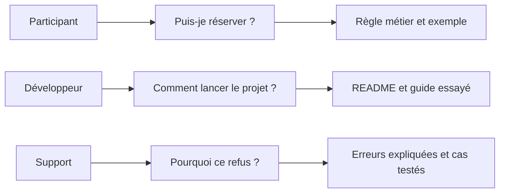

# Pourquoi documenter un projet ?

Une application s'exécute sur ton ordinateur. Tu connais la commande pour la démarrer, le compte de test et les raisons du choix de stockage. Pourtant, ces informations ne sont pas toujours évidentes pour quelqu'un qui découvre le dépôt.

Explique ce qu'il faut savoir pour utiliser ou reprendre le projet :

- comment le lancer,
- quels accès sont nécessaires,
- pourquoi certains choix techniques ont été faits.

## Rendre les règles compréhensibles

Prenons **Réserve ta place**, une application fictive pour réserver une place à un atelier de poterie. Une personne ne peut avoir qu'une réservation par atelier, même si elle l'annule ensuite.

Le code empêche les doublons, mais la raison de cette restriction peut manquer : l'association l'a-t-elle demandée ou s'agit-il d'une limite de la première version ? La réponse aide le prochain développeur à décider s'il peut autoriser une nouvelle réservation après annulation.

Documenter permet aussi de retrouver ton raisonnement après plusieurs mois et d'aider d'autres personnes à contribuer. Ce sont des usages décrits par [Write the Docs](https://www.writethedocs.org/guide/writing/beginners-guide-to-docs/).

Si tu ne connais plus la raison d'une règle, indique-le. Tu peux décrire le comportement actuel sans lui inventer une justification.

## Écrire pour une personne et une tâche

| Lecteur | Ce qu'il veut faire | Ce qu'il doit trouver |
| --- | --- | --- |
| Participant | Vérifier sa réservation | Où consulter son statut et qui contacter si elle manque |
| Développeur | Modifier une règle de réservation | Où le serveur vérifie la demande et enregistre les données |
| Responsable du service | Comprendre pourquoi le serveur ne démarre pas | Où lire les messages d'erreur et vérifier la configuration |
| Auteur du projet | Reprendre le travail après une interruption | Pourquoi le stockage ou l'hébergement a été choisi |

Avant d'écrire une page, formule son objectif : « Cette page aide un développeur à lancer le projet sur son ordinateur. » Indique les connaissances et les accès nécessaires pour la suivre.

## Décrire ce qui a été vérifié

« L'application est sauvegardée » signifie qu'une sauvegarde existe. Le fait que l'hébergeur propose cette option ne prouve pas qu'elle est activée.

Si aucune sauvegarde n'est configurée, écris :

> Les données sont stockées dans la base du serveur. Aucune sauvegarde automatique n'est configurée. La restauration n'a pas été testée.

Applique la même précision aux autres vérifications. « Le formulaire a été testé au clavier » décrit un contrôle précis. « L'application est accessible » affirme beaucoup plus.

## Choisir quoi documenter en premier

Commence par une information dont l'absence bloque quelqu'un : la commande de lancement, l'obtention d'un compte de test ou une règle difficile à comprendre.

Vérifie ta réponse dans le projet. Les scripts indiquent les commandes disponibles. La configuration indique les services utilisés. Les tests montrent les cas contrôlés. Une note de décision peut expliquer pourquoi une solution a été choisie.

Décris le fonctionnement actuel. Place les améliorations souhaitées dans une section distincte, avec un titre comme « Changements prévus ».

## Exemple : répondre à trois collègues

Photo de Kritzolina, 2018. Elle illustre l’activité du cas fictif Réserve ta place. [Source et licence](/documentation/16-credits/).

L’organisatrice veut savoir si une place annulée redevient disponible. La personne du support veut expliquer un refus. La développeuse veut retrouver la règle qui produit ce refus. Une même fonctionnalité demande plusieurs points d’entrée.

Une réponse utilisable par le support serait : « Après une annulation, la place est disponible pour une autre personne. Une nouvelle réservation de la personne qui a annulé reste refusée pour cette séance. » Ajoute le lien vers les exemples validés et le nom du rôle qui peut confirmer une évolution de cette règle.

Vérifie cette réponse dans le [scénario exécutable](https://github.com/theopaolo/cours-documentation-web/blob/main/demo/features/reservations.feature). Le [chapitre 9](/documentation/09-documentation-vivante/) explique comment faire travailler ensemble les lecteurs métier et les développeurs.

Pour ton projet, choisis une question souvent posée. Écris sa réponse en trois phrases, fais-la relire par la personne concernée et indique où elle sera retrouvée. Le critère de réussite est qu’elle puisse répondre à un cas concret sans appeler l’auteur.

## Exercice : répondre à une question sans aide orale

1. Note cinq questions qu'une personne te poserait pour reprendre ton projet.
2. Pour chacune, indique où trouver la réponse ou écris « pas encore documenté ».
3. Choisis la question qui bloque le plus le démarrage ou la compréhension du projet.
4. Rédige une réponse à partir des informations vérifiées.
5. Demande à quelqu'un de la reformuler. Précise les passages qu'il a mal compris.

À discuter : quelle question revient souvent et pourrait être résolue par une page de documentation ?

[Retour au sommaire](/documentation/)
