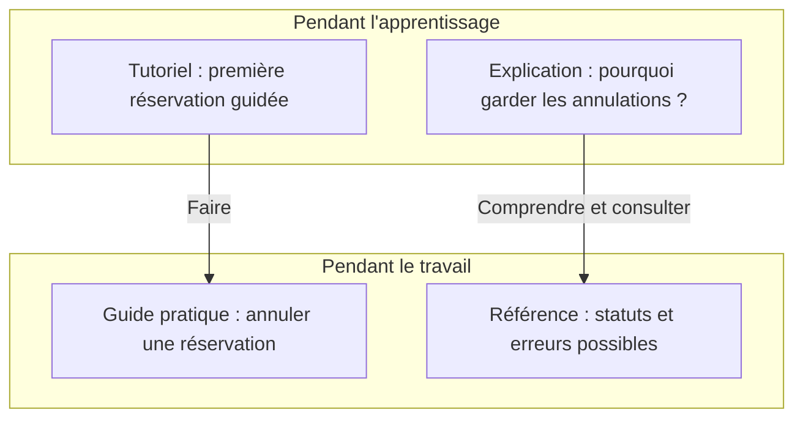

# Organiser les contenus selon les besoins

Une personne qui cherche la commande de lancement doit pouvoir la trouver sans lire les comptes rendus de réunion. Organise les pages selon les questions auxquelles elles répondent.

## Distinguer quatre types de documentation

La méthode [Diátaxis](https://diataxis.fr/start-here/) distingue quatre types de documentation selon le besoin du lecteur.

Voici des exemples pour **Réserve ta place**, l'application fictive de réservation d'ateliers de poterie.

| Type | Besoin du lecteur | Exemple de page |
| --- | --- | --- |
| Tutoriel | Apprendre en suivant un exercice guidé | Effectuer sa première réservation sur une version de démonstration |
| Guide pratique | Accomplir une tâche qu'il a besoin de réaliser | Annuler une réservation |
| Référence | Consulter une information exacte | Connaître les statuts possibles d'une réservation |
| Explication | Comprendre une règle ou un choix | Comprendre pourquoi les réservations annulées sont conservées |

Un tutoriel accompagne une découverte. Un guide pratique suppose que le lecteur connaît déjà les bases nécessaires à sa tâche.

Choisis les types utiles à ton lecteur, sans créer systématiquement quatre pages par fonctionnalité.

## Garder une procédure facile à suivre

Imagine qu'un guide de lancement contienne ce passage :

> Démarre le serveur. Les connexions utilisent des sessions, car l'équipe souhaite pouvoir les révoquer. Une session conserve l'état de connexion d'un utilisateur. Sa durée de validité est configurable…

Le lecteur doit interrompre l'installation pour lire une explication sur l'authentification. Répartis les informations ainsi :

- les étapes de lancement restent dans le guide d'installation,
- le nom du paramètre et sa valeur autorisée vont dans la référence de configuration,
- les raisons du choix vont dans une page sur l'authentification.

Ajoute un lien si l'explication peut aider pendant l'installation. Nomme sa destination : « Comprendre la durée de validité des sessions » indique ce que le lecteur trouvera.

## Choisir où publier

Le README présente le projet à l'entrée du dépôt. Il indique comment le lancer et mène aux autres pages. Il peut contenir toute la procédure d'installation d'un petit projet.

Un wiki permet à plusieurs personnes de modifier des pages depuis leur navigateur. Il peut convenir aux contributeurs qui n'utilisent pas Git. Si une information figure aussi dans le dépôt, choisis quelle version doit être mise à jour et remplace l'autre par un lien.

Quelques fichiers Markdown peuvent suffire si tes lecteurs peuvent les consulter et tes contributeurs les modifier.

## Exemple d'organisation

Ces chemins sont des exemples à adapter dans ton projet.

| Emplacement | Question traitée |
| --- | --- |
| `README.md` | À quoi sert le projet et par où commencer ? |
| `docs/installation.md` | Comment le lancer sur son ordinateur ? |
| `docs/architecture.md` | Quelles applications et quels stockages échangent des données ? |
| `docs/donnees.md` | Que représentent les données et quelles règles s'appliquent ? |
| `docs/decisions/` | Pourquoi ces choix techniques ont-ils été retenus ? |
| `docs/maintenance.md` | Comment diagnostiquer une panne et entretenir le service ? |

Crée une page lorsqu'elle contient une réponse utile. Si quelques lignes du README suffisent, garde-les à cet endroit.

## Exemple visuel : quatre pages pour une réservation

Dans le kit, « Réaliser sa première réservation pas à pas » serait un tutoriel. « Rejouer les scénarios BDD » est un guide pratique. La liste des paramètres de reserver est une référence. « Pourquoi conserver les annulations » est une explication appuyée sur un ADR.

Un rapport de tests peut alimenter la référence des règles. Il ne remplace pas le tutoriel qui accompagne une première utilisation. Évite de transformer le menu en liste d’outils : un collègue cherchera « Pourquoi la demande est refusée ? » avant de chercher « Cucumber ».

Pour un produit réel, crée des entrées selon les tâches des lecteurs : réserver, gérer les ateliers, intégrer l’API, intervenir en cas d’incident.

Exercice court : classe une procédure d’installation, une liste de statuts et une décision de stockage. Corrigé : guide pratique, référence, explication. Une introduction peut renvoyer vers les trois sans les recopier.

## Exercice : réorganiser une page

Choisis une page de ton projet et écris la question principale à laquelle elle doit répondre.

1. Pour chaque paragraphe, note s'il aide à apprendre, à agir, à consulter un fait ou à comprendre une raison.
2. Repère un passage qui détourne le lecteur de sa tâche.
3. Déplace-le dans une section ou une page adaptée.
4. Ajoute un lien si le lecteur peut avoir besoin de ce complément.
5. Relis la page seule pour vérifier qu'aucune étape ou définition ne manque après le déplacement.

À discuter : quelle information mérite une page séparée dans ton projet, et pourquoi ?

[Retour au sommaire](/documentation/)
