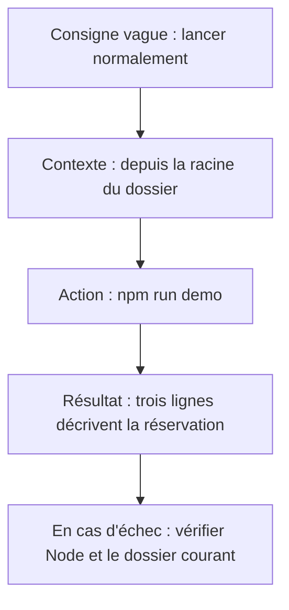

# Écrire clairement et nommer les choses

Une consigne claire indique ce que le lecteur doit faire et comment reconnaître le résultat. Une explication claire nomme les éléments concernés et décrit leur fonctionnement.

## Remplacer les appréciations par des faits

Les mots « simple », « robuste » ou « normalement » ne disent pas comment utiliser le projet. Remplace-les par une action ou un comportement précis.

Ces exemples fictifs montrent comment formuler une information vérifiée.

| Formulation vague | Formulation précise |
| --- | --- |
| La configuration est très simple. | Copie `.env.example` vers `.env`, puis renseigne `DATABASE_URL` avec l'adresse de la base de test. |
| Le système est robuste. | Si l'envoi du courriel échoue, la réservation reste enregistrée. |
| Lance le projet normalement. | Dans le dossier `serveur`, exécute `npm run dev`. Le terminal doit afficher l'adresse du serveur local. |
| Cela permet de gérer les erreurs. | Si la demande ne contient pas d'identifiant d'atelier, le serveur la refuse et renvoie le message « Atelier requis ». |

Dans le guide complet, précise ce qu'il faut installer avant ces commandes et comment obtenir les valeurs de configuration.

## Nommer qui fait quoi

« La donnée est validée puis enregistrée » laisse deux questions : quelle donnée et par quelle partie de l'application ?

Écris par exemple :

> Le serveur vérifie qu'une place est disponible, puis enregistre la réservation dans la base.

Le lecteur peut situer le contrôle et le stockage. Ce principe rejoint les conseils de Google sur les [phrases claires en rédaction technique](https://developers.google.com/tech-writing/one/clear-sentences).

Dans une consigne, utilise un verbe qui désigne une action : ouvre, copie, sélectionne, exécute. Remplace « Vérifie les paramètres » par les paramètres à consulter et les valeurs attendues.

## Garder le même nom pour le même concept

Dans **Réserve ta place**, on réserve une place à un atelier de poterie. Garde le mot « réservation » dans tout le guide. Alterner avec « inscription » ou « commande » peut faire croire qu'il s'agit de fonctions différentes.

Si le code utilise des noms anglais, indique leur correspondance :

| Mot dans l'application | Nom dans le code fictif | Sens |
| --- | --- | --- |
| Réservation | `booking` | Place réservée par une personne pour un atelier |
| Atelier | `event` | Séance de poterie à une date précise, avec un nombre de places limité |

Limite le glossaire aux mots ambigus ou inconnus du lecteur.

## Expliquer les acronymes à leur première utilisation

Écris le terme complet, l'acronyme entre parenthèses et une courte définition :

> Le modèle conceptuel des données (MCD) décrit les objets du métier et leurs liens, par exemple les personnes, les ateliers et les réservations. Le MCD ne précise pas encore les types de colonnes de la base.

Utilise ensuite « MCD » dans la page. Si l'expression n'apparaît qu'une fois, tu peux te passer de l'acronyme. Le [guide de Google sur les abréviations](https://developers.google.com/style/abbreviations) détaille cet usage.

Pour les noms anglais, ajoute aussi une définition en français.

## Aider le lecteur à se repérer

Choisis des titres qui annoncent le contenu : « Configurer l'envoi des courriels » ou « Statuts des réservations ».

Numérote les étapes qui doivent être suivies dans l'ordre. Place chaque condition avant l'action concernée : « Si la base de test est vide, importe les données de démonstration. »

Accompagne les captures d'écran d'une légende et d'instructions écrites. Le lecteur doit pouvoir retrouver une règle par une recherche textuelle, même si l'interface a changé.

## Exemple à exécuter et à réécrire

« Lance les tests, tout devrait fonctionner » devient :

> Depuis la racine du kit, avec Node.js 24 installé, lance npm test. Le résultat attendu est six tests réussis et zéro échec. Si la commande signale un module introuvable, vérifie que les fichiers du dossier demo ont bien été copiés.

Cette instruction donne un emplacement, un prérequis et un résultat observable. La procédure complète reste dans le [README du kit](/documentation/10-demonstration/). Lorsque le nombre de tests change, relis aussi les pages qui l’annoncent.

Pour documenter une configuration inconnue, écris « Adresse du serveur de courriel de test à obtenir auprès de l’équipe » et indique le rôle de la variable. N’invente pas une valeur qui ressemble à une configuration vérifiée.

Réécris : « Une réservation ne marche pas quand c’est plein ». Corrigé possible : « Quand le nombre de réservations confirmées atteint la capacité de la séance, une nouvelle demande est refusée avec le message Atelier complet. L’historique ne change pas. » Le test doit vérifier le refus et l’absence d’ajout.

## Exercice : préciser sans inventer

Réécris ce passage :

> Il suffit de configurer correctement le SMTP et de lancer normalement le backend. Le système gère ensuite automatiquement les inscriptions. En cas de problème, vérifier les paramètres.

SMTP désigne ici le protocole d'envoi des courriels, et « backend » désigne le serveur de l'application.

1. Liste les informations manquantes : paramètres, dossier, commande, comportement attendu et erreur concernée.
2. Retrouve celles que ton projet permet de vérifier. Note les autres comme « à vérifier ».
3. Rédige les consignes avec ces informations.
4. Applique la même relecture à un paragraphe de ta documentation.

À discuter : quelles informations connaissais-tu déjà sans les avoir écrites pour le lecteur ?

[Retour au sommaire](/documentation/)
