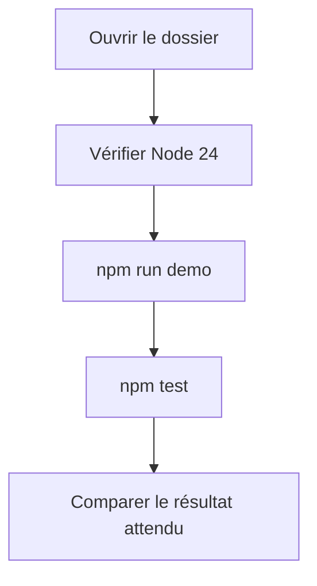

# Rédiger un README et des guides pratiques

Le README présente le projet et indique par où commencer. Un guide pratique décrit les étapes d'une tâche, comme lancer l'application ou exporter des réservations.

## Présenter l'usage avant les technologies

Commence le README par ce que l'application permet de faire et pour qui :

> Réserve ta place permet à une association de publier ses ateliers de poterie et aux participants de réserver une place.

Indique ensuite les fonctionnalités disponibles et les limites connues. Si les paiements ne sont pas gérés, précise-le avant les instructions d'installation. Présente les technologies dans une section dédiée ou dans la page d'architecture.

## Préparer les instructions de lancement

Avant de rédiger, relève dans ton projet :

1. les logiciels nécessaires et les versions avec lesquelles le lancement a été vérifié,
2. les commandes d'installation des dépendances, avec le dossier où les exécuter,
3. les fichiers de configuration à créer et le rôle des variables à renseigner,
4. les étapes de préparation de la base de test, si le projet en utilise une,
5. les commandes pour démarrer les différentes parties de l'application,
6. l'adresse à ouvrir et le résultat qui confirme le démarrage.

Explique comment obtenir les comptes de test et les valeurs confidentielles nécessaires. Ne publie aucun mot de passe ni aucune clé d'accès dans le document.

Teste les étapes dans cet ordre pour repérer les dépendances ou les variables oubliées.

## Structure de README à compléter

Remplace les indications de ce modèle par les données de ton projet. Supprime les sections sans objet.

```md
# Nom du projet

Décris qui utilise l'application et pour faire quoi.

## Fonctionnalités et limites

Indique ce qui fonctionne et ce qui n'est pas encore disponible.

## Lancer le projet en local

Liste les prérequis et les accès nécessaires.
Donne les étapes de configuration et les commandes dans l'ordre.
Précise le dossier de chaque commande et le résultat attendu.

## Vérifier le fonctionnement

Donne la commande des tests existants ou un parcours manuel à suivre.

## Comprendre et modifier le projet

Ajoute les liens vers l'architecture, les données et les décisions.

## Maintenance et contribution

Indique où trouver les procédures de maintenance,
signaler un problème et proposer une modification.
Précise la licence si une licence a été choisie pour le projet.
```

Si le guide d'installation est déjà dans une autre page, ajoute un lien dans le README. Garde une seule version des étapes à maintenir.

## Rédiger un guide pour une tâche précise

Choisis un titre qui annonce le résultat, par exemple « Exporter les réservations confirmées ». Indique la situation de départ, puis les étapes et le résultat à contrôler. C'est l'objectif d'un [guide pratique dans Diátaxis](https://diataxis.fr/how-to-guides/).

Voici un exemple fondé sur une interface fictive de Réserve ta place.

### Exporter les réservations confirmées d'un atelier

Connecte-toi avec un compte organisateur. Cette procédure télécharge la liste des réservations confirmées pour un seul atelier de poterie.

1. Ouvre l'atelier concerné. Vérifie son titre et sa date.
2. Sélectionne **Réservations**.
3. Dans le filtre **Statut**, garde uniquement **Confirmée**.
4. Note le nombre total de réservations correspondant au filtre.
5. Sélectionne **Exporter la sélection**. Dans cet exemple, ce bouton exporte toutes les réservations correspondant au filtre.
6. Ouvre le fichier téléchargé. Vérifie que le nombre de lignes de données correspond au total noté, sans compter la ligne des noms de colonnes.

Si la liste est vide, vérifie l'atelier et le filtre sélectionnés. Conserve le fichier dans un emplacement accessible uniquement aux personnes autorisées à consulter ces données.

## Préciser les conditions avant les actions

Si une étape ne concerne qu'une base vide, indique-le avant la commande. Si plusieurs configurations sont possibles, sépare les parcours et précise comment choisir le bon.

Une commande qui efface des données doit être isolée des étapes de lancement habituel. Avant de la présenter, explique quelles données seront supprimées, comment vérifier la base ciblée et quelle sauvegarde préparer. Les essais du cours se font uniquement en local ou sur un environnement de test.

## Exemple fourni : un README que l’on peut essayer

Le [README de la démonstration](/documentation/10-demonstration/) est un exemple complet : usage, périmètre, prérequis, commandes, résultats attendus et dépannage. Ouvre-le avec un collègue qui n’a pas préparé le dossier.





Les règles métier seules se lancent sans installer de dépendance :

~~~sh
npm run demo
npm test
~~~

La première commande affiche une création, une annulation et le refus d’une nouvelle réservation. La seconde doit réussir six tests. La construction du site et le BDD nécessitent l’installation supplémentaire décrite dans le README.

À faire : cacher les explications de l’auteur, suivre la procédure et noter le premier blocage. Complète le README à partir de ce blocage. Si l’environnement ne correspond pas aux prérequis, note la différence au lieu de conclure que toutes les installations fonctionnent.

## Exercice : écrire et faire suivre un guide

Choisis une tâche de ton projet. Note son public, la situation de départ, les accès nécessaires et le signe de réussite.

Rédige les étapes, puis demande à quelqu'un de les suivre sans aide orale. Note les arrêts et les erreurs. Corrige les informations manquantes et fais reprendre les étapes concernées.

À discuter : à quel moment le lecteur peut-il affirmer qu'il a terminé la tâche ?

[Retour au sommaire](/documentation/)
