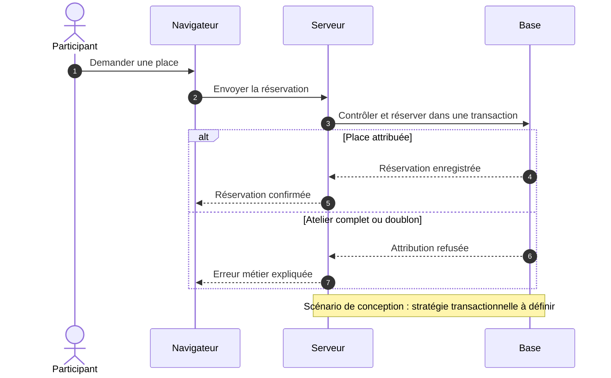

# Représenter l'architecture avec C4

Un schéma d'architecture montre les parties de l'application et leurs échanges, par exemple le trajet d'une réservation du navigateur à la base.

C4 propose quatre niveaux de détail : contexte, conteneurs, composants et code. Son nom vient des termes anglais *Context, Containers, Components, Code*. Choisis les vues selon la question à expliquer. Les vues de contexte et de conteneurs suffisent à de nombreuses équipes, selon le [site officiel C4](https://c4model.com/diagrams).

| Vue | Question traitée |
| --- | --- |
| Contexte | Qui utilise le système et avec quels services externes échange-t-il ? |
| Conteneurs | Quelles applications et quels stockages composent le système ? |
| Composants | Comment les responsabilités sont-elles réparties dans une application ? |
| Code | Quelles fonctions ou classes réalisent une partie de ce fonctionnement ? |

## Montrer les utilisateurs et les services externes

Dans la vue de contexte, représente l'application par un seul bloc. Place autour les personnes et les services qui interagissent avec elle.

Pour **Réserve ta place**, l'application fictive de réservation d'ateliers de poterie :

- le participant utilise l'application pour réserver une place,
- l'organisateur l'utilise pour publier un atelier et consulter les réservations,
- l'application demande à un service externe d'envoyer les courriels de confirmation.

Relie ces éléments avec des flèches nommées : « Réserve une place », « Publie un atelier », « Demande l'envoi d'une confirmation ». La base de données et le serveur seront détaillés dans la vue suivante.

## Montrer les applications et les stockages

Un conteneur C4 désigne une application ou un stockage, par exemple un serveur applicatif ou une base de données. Il ne correspond pas nécessairement à un conteneur Docker. La [définition officielle](https://c4model.com/abstractions/container) donne plusieurs exemples.

Retenons cette architecture fictive pour Réserve ta place :

| Élément | Rôle | Échange à représenter |
| --- | --- | --- |
| Application dans le navigateur | Afficher les ateliers et envoyer les demandes de réservation | Envoie les demandes au serveur par HTTPS |
| Serveur applicatif | Vérifier les droits et les places disponibles, puis enregistrer les réservations | Lit et écrit dans PostgreSQL, demande l'envoi des courriels |
| Base PostgreSQL | Conserver les personnes, les ateliers et les réservations | Reçoit les requêtes du serveur |
| Service de courriels externe | Envoyer les confirmations aux participants | Reçoit les demandes du serveur |

Trace une frontière autour de l'application dans le navigateur, du serveur et de la base. Le service de courriels reste à l'extérieur. Cette frontière regroupe les éléments du système étudié, indépendamment de leur hébergement.

Adapte le dessin au projet. Un site qui génère ses pages sur le serveur peut ne pas avoir d'application navigateur distincte. Indique les technologies et les protocoles que tu as vérifiés.

## Détailler une partie seulement si nécessaire

Une vue des composants peut montrer, à l'intérieur du serveur, les parties chargées du contrôle d'accès, des réservations et de l'accès aux données. Elle aide à repérer où modifier une règle.

Un [composant C4](https://c4model.com/abstractions/component) regroupe du code qui remplit une responsabilité. Il ne correspond pas automatiquement à un fichier ni à un composant d'interface React ou Vue.

Pour une règle courte, un lien vers la fonction et quelques phrases peuvent suffire. Ajoute un schéma si les relations entre fonctions ou classes sont difficiles à suivre.

## Dessiner et rendre le schéma lisible

Dans Excalidraw, crée un cadre par vue.

1. Donne un titre qui précise l'application, la vue et l'état représenté, par exemple « Réserve ta place : conteneurs, état actuel ».
2. Nomme chaque élément et décris son rôle. Ajoute sa technologie dans la vue des conteneurs.
3. Oriente les flèches et nomme les échanges.
4. Dessine les frontières et nomme les services externes. La couleur seule ne suffit pas à les distinguer.
5. Conserve le fichier modifiable et un export lisible depuis la documentation.

Ajoute une description textuelle du fonctionnement. Les flèches d'une vue statique montrent les relations. Pour expliquer l'ordre des appels d'une réservation, utilise une description numérotée ou un schéma de scénario séparé.

## Deux vues prêtes à lire et à modifier

Ces vues décrivent l’application web fictive. Le kit exécutable ne contient que ses règles en mémoire.

[Source Mermaid de la vue de contexte](https://github.com/theopaolo/cours-documentation-web/blob/main/cours-documentation/visuels/c4-contexte.mmd).

[Source Mermaid de la vue de conteneurs](https://github.com/theopaolo/cours-documentation-web/blob/main/cours-documentation/visuels/c4-conteneurs.mmd). Un conteneur C4 désigne ici une application ou un stockage. Il ne signifie pas nécessairement un conteneur Docker.

Mermaid propose bien une syntaxe C4. Sa [documentation officielle](https://mermaid.js.org/syntax/c4.html) la signale encore comme expérimentale lors de la vérification de septembre 2026. Le kit fixe la version du moteur et conserve le SVG. Pour un ensemble de vues issues d’un modèle commun, examine [Structurizr ou LikeC4](/documentation/14-outils-et-sources/).

## Montrer un échange et un cas d’échec

[Source de la séquence](https://github.com/theopaolo/cours-documentation-web/blob/main/cours-documentation/visuels/reservation-sequence.mmd). Ce dessin propose un comportement à discuter. La gestion transactionnelle des accès concurrents reste à concevoir dans une application réelle.

Exercice : ajoute un service d’export aux deux vues C4, nomme son échange puis régénère les SVG avec `npm run docs:diagrams`. Vérifie qui utilise ce service et quelles données sortent de l’application.

Un diagramme Mermaid écrit à la main reste un modèle à maintenir. Le [graphe des imports du kit](https://github.com/theopaolo/cours-documentation-web/blob/main/cours-documentation/visuels/dependances.svg), lui, est extrait du code. Il ne permet pas de déduire tous les utilisateurs, services externes ou raisons des choix d’architecture.

## Exercice : suivre une action dans ton projet

Dessine une vue de contexte et une vue des conteneurs. Choisis ensuite une action, comme envoyer un formulaire.

Retrouve dans le code les appels, les routes du serveur et les accès aux données qu'elle déclenche. Corrige les échanges du schéma si nécessaire.

Demande à quelqu'un de montrer où la demande est reçue, où elle est vérifiée et où les données sont conservées. Précise le dessin si ces réponses restent ambiguës.

À discuter : quelle question nécessiterait une vue plus détaillée de ton projet ?

Pour voir une présentation du modèle : [Visualising software architecture with the C4 model](https://www.youtube.com/watch?v=x2-rSnhpw0g).

[Retour au sommaire](/documentation/)
