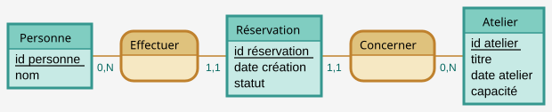
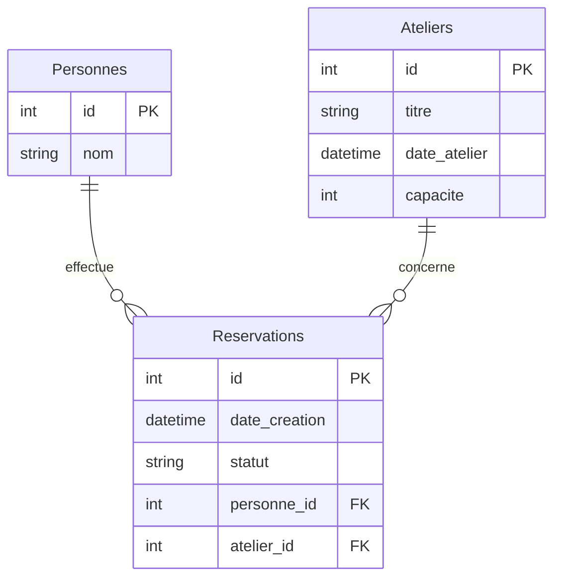

# Documenter les données avec Merise

La page d'architecture indique où les données sont stockées. La documentation des données explique ce qu'elles représentent et quelles règles elles doivent respecter.

Pour **Réserve ta place**, qui permet de réserver une place à un atelier de poterie, il faut préciser à qui appartient une réservation et si une personne peut en créer plusieurs pour le même atelier.

Merise est une méthode de conception des systèmes d'information. Ce chapitre en utilise les modèles de données pour passer des règles du métier aux tables d'une base relationnelle.

## Distinguer les trois modèles

| Modèle | Ce qu'il décrit | Exemple |
| --- | --- | --- |
| Modèle conceptuel des données (MCD) | Les objets du métier et leurs liens, sans choisir comment les stocker | Chaque réservation concerne une personne |
| Modèle logique des données (MLD) | L'organisation en tables et en clés dans le cas relationnel | La table des réservations contient l'identifiant de la personne |
| Modèle physique des données (MPD) | Les colonnes, types, contraintes et index du moteur choisi | Dans PostgreSQL, `personne_id` est obligatoire et référence une personne existante |

Le chapitre 1 du [cours de bases de données de l'Université Clermont Auvergne](https://sancy.iut.uca.fr/~lafourcade/PAPERS/PDF/Livret-Cours-BD-2021-2022.pdf) détaille le passage du MCD au modèle relationnel.

## Écrire les règles avant de dessiner

Dans notre exemple :

- une personne peut réserver une place dans plusieurs ateliers,
- chaque réservation concerne une seule personne et un seul atelier,
- une personne ou un atelier peut n'avoir aucune réservation,
- une personne ne peut avoir qu'une réservation par atelier, même après annulation,
- une réservation possède un identifiant, une date de création et un statut : confirmée ou annulée.

La quatrième règle empêche de créer une nouvelle réservation après annulation. Si ton application l'autorise, adapte la règle et sa contrainte d'unicité.

## Construire le MCD et lire les cardinalités

Une entité représente un type d'objet, comme Personne, Atelier ou Réservation. Ses propriétés décrivent cet objet : un atelier possède un titre, une date et une capacité. Une association relie les entités, par exemple « Personne effectue Réservation ».

Une cardinalité indique le nombre minimal et maximal de participations d'un objet à une association. `0,N` signifie zéro à plusieurs. `1,1` signifie exactement une.

| Association | Cardinalité à placer près de | Lecture |
| --- | --- | --- |
| Personne effectue Réservation | Personne : `0,N` | Une personne peut effectuer zéro, une ou plusieurs réservations |
| Personne effectue Réservation | Réservation : `1,1` | Une réservation est effectuée par exactement une personne |
| Réservation concerne Atelier | Réservation : `1,1` | Une réservation concerne exactement un atelier |
| Réservation concerne Atelier | Atelier : `0,N` | Un atelier peut recevoir zéro, une ou plusieurs réservations |

Dans Excalidraw, dessine les trois entités et les deux associations. Ajoute leurs propriétés et leurs identifiants. Place les cardinalités près des entités auxquelles elles se rapportent. Les clés étrangères seront ajoutées au MLD.

## Traduire les liens dans le MLD

Une clé primaire identifie une ligne de table. Une clé étrangère relie ici une réservation à une personne ou à un atelier existant.

| Table | Clé primaire | Autres colonnes |
| --- | --- | --- |
| `personnes` | `id` | `nom` |
| `ateliers` | `id` | `titre`, `date_atelier`, `capacite` |
| `reservations` | `id` | `date_creation`, `statut`, `personne_id`, `atelier_id` |

Dans `reservations`, `personne_id` référence `personnes.id` et `atelier_id` référence `ateliers.id`. Ces deux valeurs sont obligatoires. Le couple `(personne_id, atelier_id)` doit être unique pour empêcher une seconde réservation de la même personne au même atelier.

Adapte ces noms au projet et indique leur correspondance, par exemple `bookings` pour les réservations.

Un lien plusieurs-à-plusieurs se traduit par une table intermédiaire. Ici, `reservations` relie les personnes et les ateliers. Ce chapitre ne couvre pas les associations à trois entités ni les autres cas complexes.

## Vérifier le MPD dans le projet

Consulte le schéma de la base et les migrations, les fichiers qui décrivent ses modifications successives. Vérifie que les migrations attendues ont été appliquées à la base examinée.

Un outil de mapping objet-relationnel (ORM) fait correspondre les objets du code aux tables. Ses modèles aident à lire la structure prévue, mais il faut vérifier les migrations appliquées à la base.

Pour une réservation, vérifie notamment :

- les types des identifiants et de la date,
- les colonnes obligatoires,
- les clés étrangères et la contrainte d'unicité,
- les valeurs autorisées pour le statut,
- le comportement lors de la suppression de la personne ou de l'atelier.

La [documentation PostgreSQL sur les contraintes](https://www.postgresql.org/docs/current/ddl-constraints.html) explique les mécanismes correspondants. Dans ta page, fais des liens vers les fichiers du projet au lieu de recopier tout le schéma.

La capacité demande un contrôle supplémentaire. Si deux personnes réservent la dernière place en même temps, le logiciel doit empêcher de confirmer les deux demandes. Indique où ce cas est traité ou note qu'il reste à vérifier.

## Si ton projet n'utilise pas de base relationnelle

Décris les objets, leurs identifiants, leurs liens et leurs règles de validation. Précise où ils sont conservés, pendant combien de temps et comment l'application y accède. Tu peux utiliser un MCD sans le traduire en tables.

## Comparer un MCD à un schéma relationnel

Ce MCD est généré depuis le [texte Mocodo](https://github.com/theopaolo/cours-documentation-web/blob/main/cours-documentation/visuels/reservations.mcd). Une Personne participe à zéro ou plusieurs associations Effectuer. Une Réservation y participe exactement une fois. Le même raisonnement relie Réservation à Atelier. Lis les cardinalités du point de vue de l’entité à laquelle elles sont attachées.

Le [texte Mermaid ER](https://github.com/theopaolo/cours-documentation-web/blob/main/cours-documentation/visuels/reservations-erd.mmd) représente ici les tables du modèle relationnel. Cette notation ne remplace pas la notation Merise du premier dessin. Il faut encore préciser la contrainte unique sur le couple personne_id, atelier_id. Les deux cardinalités un-à-plusieurs ne suffisent pas à l’exprimer.

Les types du dictionnaire doivent préciser les unités et conventions. Une capacité est un entier de places. Une date de séance doit distinguer la date civile d’un instant avec fuseau. Le statut annulé conserve la réservation et ne consomme pas de place. Le kit JavaScript illustre cette dernière règle, mais ne met pas en œuvre les tables proposées.

## Second terrain d’exercice : une bibliothèque d’objets

La ressource [Bibi d’objets](https://docmost.ludique.dev/share/gcbrd7j46z/p/bibi-d-objets-5Sn6BRDnSM) présente notamment les données Adhérent, Objet, Emprunt et Catégorie. Le [mémento Merise](https://memento-dev.fr/docs/merise) permet de revoir le passage du dictionnaire au MCD puis au MLD et au MPD.

À partir de ces données, écrire deux emprunts successifs du même objet par le même adhérent. Un emprunt doit pouvoir être distingué du précédent, par exemple par son identifiant. Une contrainte unique sur le seul couple adhérent-objet empêcherait ces deux occurrences. La règle d’unicité de Réserve ta place ne se transpose donc pas automatiquement.

Préciser aussi si « date de retour » est la date prévue ou le retour effectivement constaté. Si les deux sont utiles, les nommer séparément. Demander si un objet peut appartenir à plusieurs catégories avant de choisir la cardinalité. Ces réponses sont des décisions du métier, aucune génération de SQL ne les invente.

Pour reproduire les schémas, utilise les commandes du [kit](/documentation/10-demonstration/). Mocodo génère depuis un modèle textuel. SchemaSpy inspecte une base existante. Leurs entrées et leurs questions sont différentes.

## Exercice : vérifier une relation

1. Choisis trois objets de ton application et écris leurs règles en phrases.
2. Dessine leurs liens et les cardinalités du MCD.
3. Si la base est relationnelle, montre la traduction en tables et en clés.
4. Retrouve une relation dans la base. Vérifie si elle peut être absente, dupliquée ou supprimée.
5. Note les écarts entre la règle attendue et le comportement observé.

À discuter : quelle règle est expliquée dans ta documentation mais n'est pas encore garantie par l'application ?

[Retour au sommaire](/documentation/)
