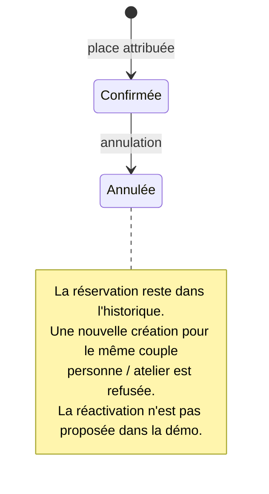
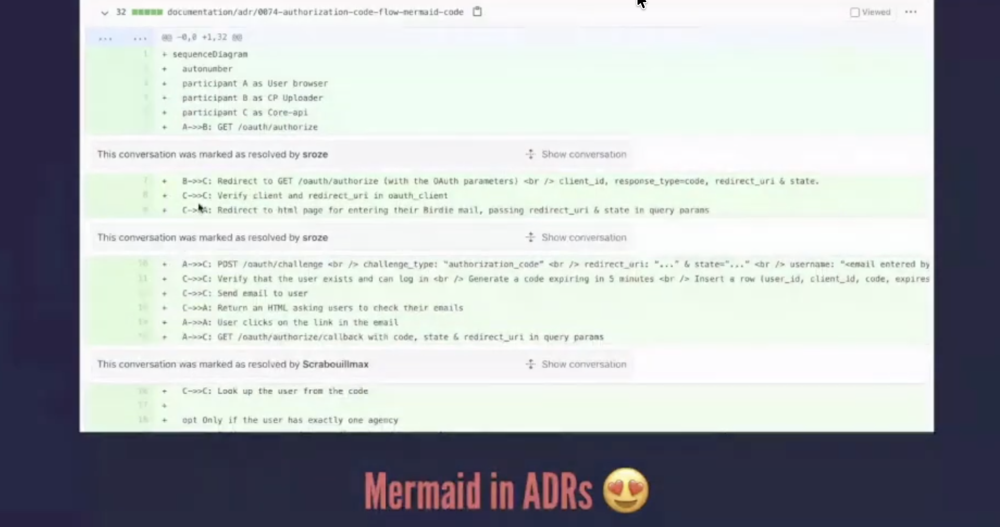

# Documenter les décisions et le code

Une note de décision conserve les raisons d'un choix technique. Elle aide à comprendre les contraintes de l'équipe avant de modifier sa solution.

## Conserver une décision technique

Un *Architecture Decision Record* (ADR) est une courte note qui décrit une décision d'architecture, son contexte et ses conséquences. Le [format présenté par Michael Nygard](https://www.cognitect.com/blog/2011/11/15/documenting-architecture-decisions) rassemble ces informations autour d'une seule décision.

Rédige un ADR pour un choix qu'une autre personne pourrait vouloir réexaminer : moteur de base de données, authentification, hébergement ou dépendance importante. Une convention déjà expliquée peut être référencée sans créer une nouvelle note.

## Exemple : expliquer le choix de PostgreSQL

L'application fictive **Réserve ta place** stocke les réservations d'ateliers de poterie dans PostgreSQL. Voici une raison possible, inventée pour l'exemple :

> **Décision : utiliser PostgreSQL pour les données de réservation.**
>
> Statut : accepté dans cet exemple fictif.
>
> L'association dispose d'un service PostgreSQL et l'équipe connaît son administration. Nous choisissons ce moteur pour les personnes, les ateliers et les réservations. Aucune comparaison avec un autre moteur n'a été menée.
>
> L'équipe réutilise ainsi un service qu'elle administre déjà. Le développement local demande une base de test accessible. La configuration des sauvegardes et le test de restauration restent à vérifier.

Le service existant explique le choix. « PostgreSQL est performant » ne donnerait pas cette information.

## Modèle de note à adapter

```md
# 001 : [Choix technique retenu]

Statut : [proposé, accepté ou remplacé par un lien vers une autre note]
Date de rédaction : [date]
Date de décision : [date ou inconnue]
Note rédigée après la décision : [oui ou non]

## Contexte

Décris le besoin et les contraintes au moment du choix.

## Décision

Indique la solution choisie et la partie du projet concernée.

## Alternatives envisagées

Nomme les autres solutions étudiées et les raisons de leur abandon.
Si aucune comparaison n'a eu lieu, indique-le.

## Conséquences

Décris ce que ce choix apporte et les limites qu'il impose.
Distingue les résultats observés des bénéfices attendus.

## Sources et points à vérifier

Ajoute les liens vers le code, la configuration ou les échanges conservés.
Indique les informations que tu n'as pas pu retrouver.
```

Sépare les raisons confirmées des hypothèses. « Je connaissais cet outil et le délai était court » suffit si c'est la raison réelle du choix.

Quand le choix change, conserve la note précédente, marque-la comme remplacée et ajoute un lien vers la nouvelle décision.

## Expliquer une règle locale avec un commentaire

Un commentaire est utile lorsqu'une contrainte n'est pas compréhensible en lisant les instructions seules.

```js
// L'association accepte les demandes jusqu'à l'instant de clôture inclus.
return requestedDate <= closingDate;
```

Cet exemple suppose que les deux valeurs représentent des instants comparables. Le commentaire explique pourquoi l'égalité est acceptée. Un commentaire comme `// compare les dates` répéterait seulement l'instruction.

Place l'explication près du code concerné. Si elle porte sur toute l'architecture, écris-la dans une page dédiée et ajoute un lien si nécessaire.

## Décrire ce qu'une fonction ou une route garantit

Le contrat d'une fonction décrit ce qu'on lui transmet, ce qu'elle renvoie, les erreurs possibles et les données qu'elle modifie. Il permet de l'utiliser sans lire toute son implémentation.

Pour une route, c'est-à-dire un point d'entrée du serveur, documente :

| Élément | Information à fournir |
| --- | --- |
| Appel | Méthode, chemin et authentification requise |
| Demande | Champs attendus, types et valeurs autorisées |
| Réponse réussie | Code de statut et contenu retourné |
| Erreurs | Situations refusées et réponses correspondantes |
| Modifications | Données créées ou mises à jour |

Par exemple, une route de réservation doit préciser comment elle répond lorsqu'il ne reste aucune place. Décris les cas réellement traités par le code.

Si une référence générée existe, vérifie-la et ajoute un exemple d'utilisation au lieu de la recopier.

## Exemple complet : une décision avec son diagramme

Lis l’[ADR 001 sur la conservation des annulations](/documentation/13-adr-001/). Il relie le contexte, les options, le choix, ses conséquences et les tests correspondants.





Le [texte Mermaid de cet ADR](https://github.com/theopaolo/cours-documentation-web/blob/main/cours-documentation/visuels/adr-annulation.mmd) conserve l’état du modèle à la date de la décision. Si une réactivation est ensuite acceptée, ajoute un nouvel ADR qui remplace celui-ci et relie les deux. Le diagramme de référence courante peut évoluer, tandis que le schéma historique garde son sens.



Samuel Rozé, Living Documentation, 2020. Capture fournie pour le cours, [crédits et conférence](/documentation/16-credits/).

## Retrouver une modification et générer une référence

Dans un dépôt qui possède des commits, ces commandes permettent de chercher l’historique du fichier :

~~~sh
git blame -w -- demo/src/reservations.mjs
git log -p -- demo/src/reservations.mjs
~~~

Ouvre ensuite le commit identifié avec `git show` suivi de son identifiant. Le [git blame officiel](https://git-scm.com/docs/git-blame) attribue les lignes à des révisions. Son résultat ne donne pas automatiquement le raisonnement de la décision. Lis le message, la proposition de changement et l’ADR associés. Si le dossier du cours n’a pas d’historique Git, fais cet essai dans un dépôt jetable.

Pour la référence du code, lance npm run docs:api après installation. [reserver et annuler](https://github.com/theopaolo/cours-documentation-web/blob/main/demo/src/reservations.mjs) comportent des annotations JSDoc sur les paramètres, effets et erreurs. La génération extrait ces informations. Les tests vérifient les comportements couverts.

Exercice : explique pourquoi le message « Réservation déjà existante » peut arriver alors qu’il reste une place. Le doublon est contrôlé indépendamment de la capacité et inclut les réservations annulées. Si ce choix ne convient plus au métier, propose une évolution de la règle et de l’ADR.

## Exercice : documenter un choix et une règle

Pour apprendre à afficher les descriptions et les types directement au survol dans VS Code, suis la [manipulation JSDoc, TSDoc et TypeDoc](/documentation/12-documentation-editeur/). Elle fournit un appel JavaScript documenté, une variante TypeScript et un mauvais type à faire détecter. L’aide dans l’éditeur et la référence publiée réutilisent les informations placées près du code.

Choisis une décision de ton projet. Retrouve ses raisons dans les échanges ou les fichiers conservés, puis rédige un ADR. Signale les raisons que tu n'as pas pu confirmer.

Relis ensuite une fonction ou une route. Ajoute l'information qui manque pour la comprendre ou l'utiliser. Choisis son emplacement selon ce qu'elle décrit : un commentaire, une référence ou une page d'architecture.

À discuter : quel changement dans le projet justifierait de réexaminer la décision documentée ?

[Retour au sommaire](/documentation/)
