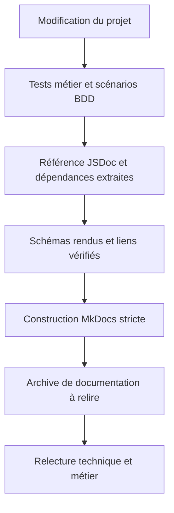

# Vérifier et maintenir la documentation

Fais suivre le guide d'installation par une personne qui découvre le projet. Tu verras si les étapes suffisent sans ta propre configuration.

La relecture porte sur la compréhension. L'essai vérifie que la procédure donne le résultat annoncé.

## Observer sans compléter les instructions à l'oral

Choisis une personne qui possède les connaissances annoncées par le document. Donne-lui une tâche et laisse-la suivre les instructions.

Quand elle s'arrête, note l'étape et la difficulté : commande absente, mot inconnu ou mauvais lien, par exemple.

Si la difficulté vient d'un prérequis, ajoute ce prérequis au début du document et indique où l'acquérir. Si une instruction est ambiguë, réécris-la puis fais reprendre l'étape.

## Préparer un essai sur un environnement de test

Pour tester une installation, utilise si possible une nouvelle copie du dépôt et une base réservée aux essais. Vérifie l'adresse de la base ciblée avant d'appliquer des migrations ou d'importer des données.

Conserve le travail existant et utilise des données fictives. Transmets les accès confidentiels par le moyen prévu dans le projet, sans les publier dans le guide.

Si tu peux seulement relire la procédure sur ta machine, indique cette limite : « Procédure relue, lancement depuis une nouvelle installation non testé. »

## Noter les résultats

Note la date, la version du projet, l'environnement de test et les observations :

| Tâche | Résultat attendu | Problème observé | Correction | Nouvel essai |
| --- | --- | --- | --- | --- |
| Lancer l'application | La page d'accueil s'affiche | Une variable de connexion n'est pas expliquée | Ajouter son rôle et la façon d'obtenir sa valeur de test | À effectuer |
| Comprendre une réservation | Identifier où elle est enregistrée | La flèche vers la base n'a pas de libellé | Ajouter « Enregistre la réservation » | À effectuer |

Après l'essai, inscris le résultat dans la dernière colonne. Note séparément les erreurs du logiciel à corriger.

## Mettre à jour les documents avec le projet

L'approche *Docs as Code* consiste à versionner et relire la documentation avec des pratiques proches de celles du code. Elle peut se limiter à des fichiers Markdown conservés dans le dépôt. [Write the Docs décrit cette approche](https://www.writethedocs.org/guide/docs-as-code/).

Lorsqu'une modification du projet change une information documentée, corrige les pages concernées dans la même proposition de changement.

| Modification | Documents à vérifier |
| --- | --- |
| Ajout d'une variable de configuration | Guide d'installation et liste des paramètres |
| Ajout d'un statut de réservation | Règles de données et guides qui utilisent ce statut |
| Ajout d'un service externe | Schémas d'architecture, accès nécessaires et maintenance |
| Remplacement d'une décision | Ancienne note et nouvelle note de décision |
| Changement d'une commande | Toutes les procédures qui la mentionnent |

Les vérifications automatiques peuvent repérer des liens cassés ou tester des commandes. Une relecture reste nécessaire pour vérifier que les explications correspondent au fonctionnement du projet.

## Éviter les copies qui ne sont plus à jour

Conserve une seule procédure d'installation et ajoute des liens depuis les autres pages. Pour les détails des tables, renvoie vers le schéma ou les migrations du projet.

Garde les explications qui complètent ces fichiers. Une migration peut ajouter une colonne `statut`. La documentation explique ce que chaque statut signifie pour l'utilisateur.

## Préparer la maintenance

Une page de maintenance doit indiquer où lire les journaux du serveur, comment vérifier que le service répond, où trouver la procédure de déploiement et quelles sauvegardes sont configurées.

Pour la restauration, indique le résultat du dernier essai ou « Restauration non testée ».

## Une chaîne de vérification fournie

Le kit fournit un [workflow GitHub Actions](https://github.com/theopaolo/cours-documentation-web/blob/main/scripts/documentation-workflow.yml) à placer dans .github/workflows/documentation.yml dans le dépôt qui hébergera le cours. Il exécute les tests, génère les pages et conserve le site comme artefact de construction. Il ne publie pas automatiquement un site public. Son exécution sur GitHub doit être vérifiée après l’ajout au dépôt.

Pour commencer localement :

~~~sh
npm test
npm run test:bdd
npm run check:links
~~~

La [procédure complète](/documentation/10-demonstration/) génère ensuite les références, les diagrammes et le site MkDocs en mode strict. Le contrôle de liens local vérifie les fichiers visés. Il ne valide ni les ancres de titres ni la disponibilité des sites externes. Le mode strict de MkDocs complète la vérification de construction, sans garantir le sens de la documentation.

Associe une version du code et une date d’exécution au rapport que tu partages. Un rapport vert enregistré la semaine dernière ne prouve rien sur une modification effectuée ce matin.

## Montrer un défaut détecté

~~~sh
npm run demo:regression
~~~

Cette démonstration prépare une copie temporaire du code, remplace le contrôle de capacité « supérieur ou égal » par « strictement supérieur » et exécute les tests. Deux tests doivent échouer dans la copie. Le script confirme ensuite que le défaut préparé a été détecté et termine avec succès. Le code de travail reste intact.

Quelle phrase de la documentation devient fausse ? Une demande peut désormais dépasser la capacité. Un test qui vérifie uniquement la création de la première réservation ne détecterait pas ce défaut.

Pour relier les tests aux discussions métier et aux pages consultées par les autres collègues, poursuis avec la [documentation vivante et le BDD](/documentation/09-documentation-vivante/).

## Exercice : faire reprendre le projet

Donne ta documentation à une autre personne et demande-lui de :

1. expliquer à qui sert l'application,
2. la lancer dans l'environnement de test prévu,
3. suivre une demande depuis l'interface jusqu'au stockage,
4. expliquer une règle de données,
5. retrouver la raison d'un choix technique et une limite de ce choix,
6. repérer où commencer une modification, sans la réaliser.

Note les blocages, corrige les deux plus importants et fais reprendre les étapes concernées. Conserve les autres points à traiter.

## Relire avant de partager

- Les noms gardent le même sens et les acronymes spécialisés sont expliqués.
- Chaque consigne indique une action et le résultat à vérifier.
- Les liens mènent aux documents annoncés.
- Les schémas précisent l'application et l'état représentés.
- Les exemples et les captures ne contiennent aucun secret.
- Les résultats des essais sont distingués des vérifications restantes.

À discuter : quel prochain changement du projet demandera une mise à jour de cette documentation ?

[Retour au sommaire](/documentation/)
