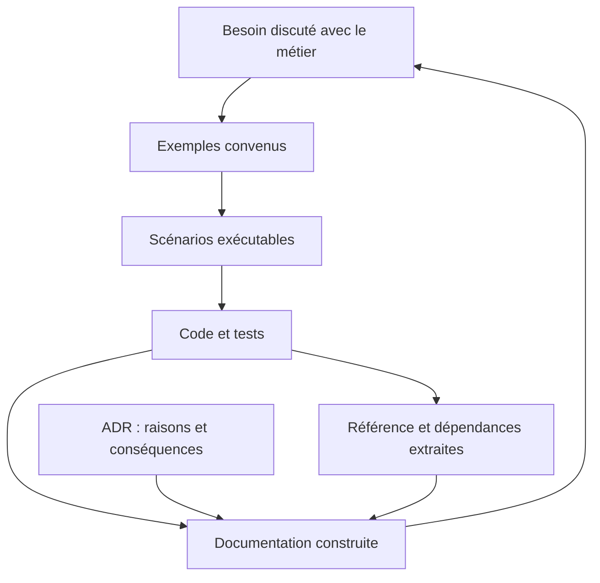
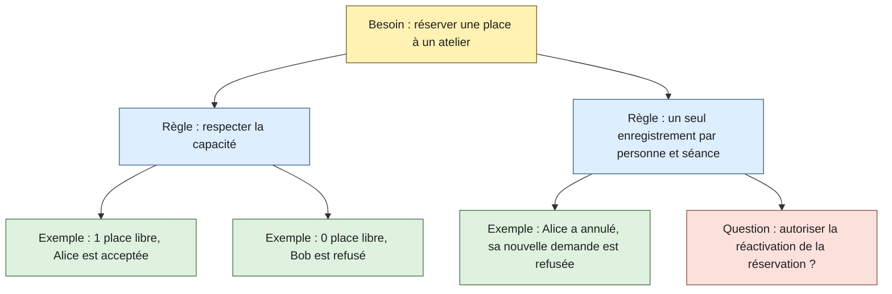
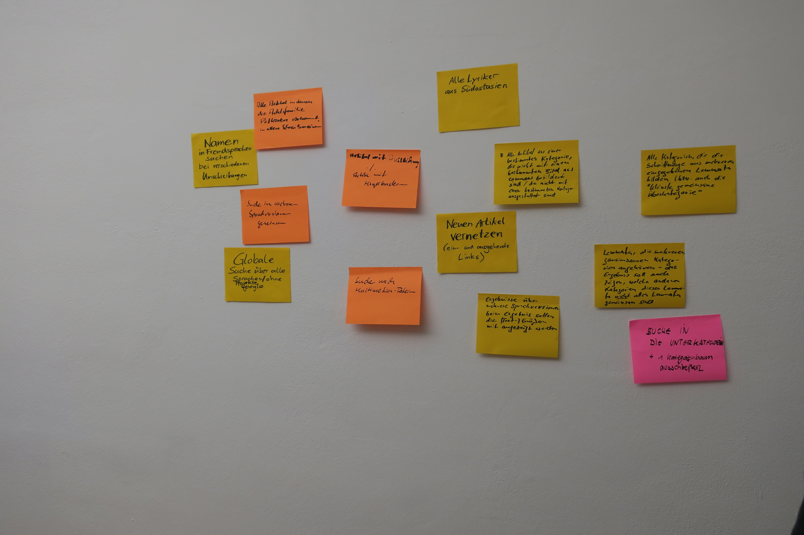
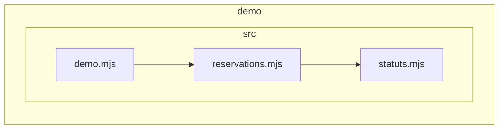

# Faire vivre la documentation avec le projet

Une règle de réservation apparaît dans une discussion, un test, du code et un guide. Si ces représentations évoluent séparément, elles peuvent finir par se contredire. La Living Documentation cherche à conserver et partager cette connaissance avec un effort d’entretien adapté.

À la fin de ce chapitre, tu sauras expliquer une règle par des exemples, relier un scénario à du code exécuté et choisir quelles informations générer. Le [kit JavaScript](/documentation/10-demonstration/) fournit les fichiers nécessaires. Il représente les règles de réservation en mémoire, sans interface web, serveur HTTP ni base PostgreSQL.

Le livre [Living Documentation de Cyrille Martraire](https://www.informit.com/store/living-documentation-continuous-knowledge-sharing-by-9780134689326), paru en 2019, propose notamment de réutiliser les connaissances existantes et de prévoir comment leur exactitude sera entretenue. La collaboration et la lisibilité comptent autant que la génération de pages.

## Choisir la source qui fait autorité

Le code montre un comportement actuel. Les personnes du métier confirment le comportement souhaité. Un ADR conserve les raisons d’une décision. Choisis la source selon la question.

| Information | Source à consulter ou entretenir | Vérification possible |
| --- | --- | --- |
| Comportement attendu après annulation | Règle convenue avec le métier et exemples | Discussion des cas ambigus, puis tests |
| Paramètres et résultat d’une fonction | Signature, types et JSDoc | Référence générée et tests de son usage |
| Dépendances entre modules | Imports du code | Analyse des imports et règles d’architecture |
| Structure de la base déployée | Schéma de la base, version et migrations appliquées | Inspection de l’environnement concerné |
| Raison de conserver les annulations | ADR accepté | Relecture de la décision et de ses conséquences |
| Étapes d’installation | Guide et scripts du projet | Installation dans un environnement neuf |

Un comportement observé peut être un défaut. Une information générée peut être incomplète. Il faut donc aussi savoir ce que la source permet de conclure.

## Découvrir le BDD par une conversation

BDD signifie *Behaviour-Driven Development*, ou développement guidé par le comportement. Une personne qui connaît le métier, une personne qui développe et une personne qui cherche les cas limites examinent ensemble une petite fonctionnalité. Ces perspectives peuvent être tenues par trois personnes ou réparties autrement dans l’équipe.

Le [processus décrit par Cucumber](https://cucumber.io/docs/bdd/) articule la découverte du besoin, la formulation d’exemples et leur automatisation. Commence par la conversation. Installer Cucumber ne remplace pas cette étape.

Pour Réserve ta place, pose une question précise : « Que se passe-t-il quand une personne annule puis veut revenir ? » Plusieurs réponses sont possibles : créer une seconde réservation, réactiver la précédente ou refuser. Le cours retient le refus d’une nouvelle création et ne propose pas de réactivation dans sa démonstration.

### Organiser les exemples

L’*Example Mapping* consiste à distinguer le besoin, les règles, les exemples et les questions ouvertes. Les cartes ont des couleurs conventionnelles, mais leurs libellés doivent suffire à les comprendre. [Méthode officielle](https://cucumber.io/docs/bdd/example-mapping/).

Pendant dix minutes, classe les contributions. « Il reste une place, Alice réserve » est un exemple. « Ne pas dépasser la capacité » est une règle. « Une annulation permet-elle de revenir ? » est une question à résoudre.

Cette photo montre une collecte de besoins au WikiMuc, pas une séance BDD. Elle peut servir à discuter de la façon de conserver le résultat d’un atelier. Crédit : Jan Dittrich (WMDE), [source et licence](/documentation/16-credits/).

## Formuler un scénario lisible

Gherkin est un langage structuré pour écrire des exemples. Les mots-clés existent en français. Dans ce scénario, « Étant donné » décrit la situation de départ, « Quand » l’action et « Alors » le résultat attendu.

~~~gherkin
# language: fr
Fonctionnalité: Réserver une place à un atelier
  Scénario: Refuser une réservation lorsque l'atelier est complet
    Étant donné un atelier de 1 place
    Et Bob possède une réservation confirmée
    Quand Alice réserve une place
    Alors la demande est refusée avec "Atelier complet"
    Et l'historique contient 1 réservation
~~~

Évite de décrire des clics, des sélecteurs CSS et chaque détail d’écran lorsque tu veux expliquer une règle métier. Ces détails appartiennent au code qui réalise les étapes. La [référence Gherkin](https://cucumber.io/docs/gherkin/reference/) explique les mots-clés et la correspondance avec ce code.

Le [fichier complet de scénarios](https://github.com/theopaolo/cours-documentation-web/blob/main/demo/features/reservations.feature) couvre la dernière place, l’atelier complet, le retour après annulation et la place libérée pour une autre personne.

## Relier le texte au logiciel

Une définition d’étape associe une phrase à une action ou une assertion. Ici, l’action appelle la vraie fonction de la démonstration.

~~~javascript
When('Alice réserve une place', function () {
  try {
    this.resultat = reserver(this.historique, {
      personne: 'Alice', atelier: 'poterie', capacite: this.capacite
    });
  } catch (erreur) {
    this.erreur = erreur;
  }
});

Then('la demande est refusée avec {string}', function (message) {
  assert.equal(this.resultat, undefined);
  assert.equal(this.erreur?.message, message);
});
~~~

Dans [les définitions complètes](https://github.com/theopaolo/cours-documentation-web/blob/main/demo/features/steps/reservations.mjs), un Before recrée un historique vide pour chaque scénario. Les fonctions ordinaires donnent accès au contexte du scénario par this. Les assertions comparent le résultat à l’attendu.

Depuis la racine du dossier, après l’installation décrite dans le README :

~~~sh
npm run test:bdd
~~~

Le kit doit exécuter quatre scénarios et 23 étapes. Il écrit un rapport HTML local, sans utiliser le service de publication de Cucumber. Le contrôle qui suit refuse aussi une exécution avec zéro scénario. Consulte les scénarios réellement exécutés, les étapes ignorées et les éventuels échecs.

Ces tests portent sur les règles en mémoire. Ils ne vérifient pas l’authentification, un serveur, les courriels ou les accès simultanés à une base.

## Générer ce que l’on sait extraire

La documentation peut aussi être consultée directement dans l’éditeur. Le [guide JSDoc, TSDoc, TypeDoc et aide au survol](/documentation/12-documentation-editeur/) montre comment faire apparaître le contrat d’une fonction pendant son utilisation, puis générer une référence à partir de ses commentaires. Les types, les explications et les tests se complètent.

Les [commentaires JSDoc](https://github.com/theopaolo/cours-documentation-web/blob/main/demo/src/reservations.mjs) précisent les paramètres, les effets et les erreurs de la fonction. La commande suivante produit leur référence HTML :

~~~sh
npm run docs:api
~~~

JSDoc extrait les annotations et la structure qu’il sait analyser. Il ne prouve pas que chaque phrase du commentaire est correcte. La prose d’un commentaire peut rester fausse malgré une référence fraîchement générée.

Pour extraire les dépendances JavaScript :

~~~sh
npm run docs:deps
~~~

Ce schéma provient de dependency-cruiser. Il représente des imports, pas l’ordre des appels ni l’architecture métier complète. Les noms de fichiers peuvent aider les développeurs, tandis qu’une personne du support aura plutôt besoin de la règle et d’un exemple.

## Distinguer un diagramme textuel d’un diagramme extrait

Un fichier Mermaid écrit à la main décrit un modèle. Son texte se relit dans Git et son image se régénère. Pour suivre le logiciel, il faut encore actualiser ce modèle ou le comparer au code.

Un outil d’analyse peut extraire les imports du code ou les relations d’une base. Cela réduit certaines recopies, dans les limites de ce que l’outil observe. Une relation d’infrastructure ou une intention métier peut rester invisible.

Conserve les vues C4 pour donner le contexte aux lecteurs. Utilise les vues extraites pour explorer les détails techniques. La [sélection d’outils](/documentation/14-outils-et-sources/) compare Mermaid, Structurizr, LikeC4, dependency-cruiser, Mocodo et SchemaSpy.

## Construire des pages accessibles aux collègues

MkDocs transforme des fichiers Markdown en site navigable avec recherche. Les lecteurs peuvent consulter le résultat sans lire les fichiers dans Git. La publication peut rester interne. L’édition peut passer par une proposition de changement accompagnée ou par l’interface du dépôt.

Pour inclure du code, commence par un outil existant comme JSDoc, TypeDoc ou un gestionnaire mkdocstrings adapté au langage. Les [hooks de MkDocs](https://www.mkdocs.org/user-guide/configuration/#hooks) permettent aussi de brancher une petite transformation spécifique, sans distribuer un plugin complet.

Le [hook fourni](https://github.com/theopaolo/cours-documentation-web/blob/main/scripts/mkdocs_hook.py) insère des fichiers explicitement sélectionnés dans les pages, au moment de la construction. Les [exemples complets](/documentation/11-exemples/) l’utilisent. Il n’analyse pas les annotations JavaScript : JSDoc s’en charge séparément. Il ne parcourt pas aveuglément le disque.

Avant une extraction, choisis le public et les sources. Un fichier de configuration confidentiel, une donnée de test réelle ou un commentaire interne n’a pas automatiquement sa place dans une documentation partagée. Le script de préparation du site copie une liste précise de contenus pédagogiques.

## Concevoir en écrivant la documentation

La *documentation-driven design* consiste à rédiger un usage, une explication ou un contrat avant de l’implémenter, puis à le faire relire. L’effort d’explication fait apparaître les ambiguïtés. Cette idée figure dans les [principes de Write the Docs](https://www.writethedocs.org/guide/writing/docs-principles/).

Avant de coder une réactivation, écris : « Une personne peut réactiver sa réservation annulée si une place est disponible. » La phrase ouvre déjà plusieurs questions : garde-t-on le même identifiant ? Qui peut réactiver ? Que répondre si l’atelier est complet ?

Discute ces questions, écris deux exemples et indique que le comportement est proposé. Implémente ensuite les exemples convenus et mets le statut de la documentation à jour.

Cette démarche complète la documentation extraite du code. L’une aide à concevoir un comportement, l’autre à consulter ce qui est décrit ou réalisé. Évite l’acronyme DDD sans précision : il désigne aussi le *Domain-Driven Design*, une autre approche centrée sur le domaine métier.

## Exercice : faire évoluer une règle

1. En groupe, décider si une réservation annulée devrait pouvoir être réactivée.
2. Écrire un exemple accepté, un exemple refusé et une question non résolue.
3. Choisir si cette modification nécessite un nouvel ADR. Conserver le précédent comme trace historique.
4. Ajouter le scénario avant de modifier le code. Constater son échec ou son absence de définition.
5. Implémenter le comportement convenu dans une copie du kit.
6. Relancer les tests, générer la documentation et faire expliquer la règle par une personne qui n’a pas écrit le code.

Le corrigé doit suivre la décision prise par le groupe. Pour une première démonstration plus courte, le [guide d’animation](https://github.com/theopaolo/cours-documentation-web/blob/main/guide-animation.md) fournit une régression préparée et réversible sur la capacité.

À discuter : quelle information de ton projet peut être extraite automatiquement, et quelle information doit encore être expliquée par une personne ?

[Retour au sommaire](/documentation/)
