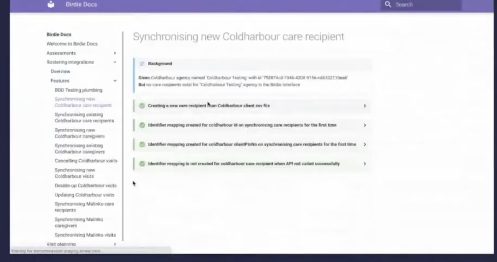

# Choisir les outils et vérifier les sources

Sources consultées les 9 et 10 septembre 2026. Les versions du kit sont fixées pour reproduire la démonstration. Les outils cités comme alternatives demandent un essai sur le langage et le projet de l’équipe.

## Commencer avec une chaîne courte

Le kit utilise des fichiers Markdown, des sources Mermaid ou Mocodo, des tests et des commentaires JavaScript. MkDocs rassemble les pages, le rapport BDD et la référence générée dans un site avec recherche.

Pour un premier projet, choisir une règle métier, un ADR et une vue d’architecture. Automatiser leur vérification ou leur génération quand l’entrée est clairement identifiée. Éviter de commencer par un plugin censé comprendre tous les fichiers du dépôt.

## Ce que chaque outil produit

| Outil | Entrée et sortie | Usage et limite |
| --- | --- | --- |
| [Mermaid](https://mermaid.js.org/) | Texte de diagramme vers SVG | Schémas relus dans Git. Le texte écrit à la main doit suivre les changements du logiciel |
| [C4 dans Mermaid](https://mermaid.js.org/syntax/c4.html) | Modèle C4 textuel vers dessin | Syntaxe encore signalée expérimentale. Vérifier le moteur réellement utilisé par le lecteur Markdown |
| [Structurizr DSL](https://docs.structurizr.com/dsl) | Modèle d’architecture vers plusieurs vues | Réutilise les mêmes éléments entre vues. Le modèle ne se déduit pas automatiquement de tout le code |
| [LikeC4](https://likec4.dev/) | Modèle textuel vers vues navigables | Exploration interactive. Il faut définir et entretenir le modèle |
| [dependency-cruiser](https://github.com/sverweij/dependency-cruiser) | Imports JavaScript ou TypeScript vers graphe et contrôles | Montre les dépendances détectées. Ne découvre pas à lui seul les échanges réseau ou le sens métier |
| [Mocodo](https://github.com/laowantong/mocodo) | Modèle Merise textuel vers MCD et transformations | Permet de garder le modèle dans Git. La justesse des règles reste à discuter |
| [SchemaSpy](https://schemaspy.org/) | Métadonnées d’une base accessible vers documentation et relations | Décrit le schéma observé. Ce résultat n’est pas un MCD conceptuel |
| [JSDoc](https://jsdoc.app/) | Code et annotations JavaScript vers HTML | Référence de fonctions et types documentés. La prose n’est pas vérifiée sémantiquement |
| [TypeDoc](https://typedoc.org/) | TypeScript et commentaires vers HTML ou JSON | Adapté aux projets TypeScript. Compléter la référence avec des usages testés |
| [TSDoc](https://tsdoc.org/) | Convention de commentaires pour TypeScript | Décrit une syntaxe commune. Le survol vient du service de langage, et la génération de pages d’un outil comme TypeDoc |
| [mkdocstrings](https://mkdocstrings.github.io/) | Sources via un gestionnaire de langage vers pages MkDocs | Choisir et installer le gestionnaire compatible, par exemple Python. Ne pas supposer une prise en charge universelle |
| [Cucumber](https://cucumber.io/docs/bdd/) | Scénarios et définitions d’étapes vers exécution et rapport | Rend des exemples exécutables. La conversation métier précède l’outil |
| [MkDocs](https://www.mkdocs.org/) | Markdown et ressources vers site statique | Navigation et recherche. Les contenus inclus doivent être choisis pour les lecteurs |

Pour une API HTTP, [OpenAPI](https://spec.openapis.org/oas/latest.html) décrit un contrat. Choisir une stratégie explicite : contrat écrit d’abord ou contrat extrait du serveur. Vérifier les exemples contre l’implémentation. Le kit n’inclut pas de serveur HTTP et ne prétend pas valider un contrat OpenAPI.

## Versions utilisées dans la démonstration

Le [prolongement sur la documentation dans l’éditeur](/documentation/12-documentation-editeur/) fournit les exemples JavaScript et TypeScript, les raccourcis de survol et les commandes de génération TypeDoc. Ses outils optionnels sont séparés des dépendances du kit de base.

| Composant | Version du kit |
| --- | --- |
| Node.js | Série 24 |
| Cucumber.js | 13.2.1 |
| Mermaid CLI | 11.17.0 |
| dependency-cruiser | 18.2.0 |
| JSDoc | 4.0.5 |
| Python | 3.12 |
| MkDocs | 1.6.1 |
| Mocodo | 4.3.2 |

Le verrou npm conserve les versions des dépendances JavaScript. Le fichier requirements-docs.txt fixe les deux outils Python principaux, sans verrouiller toutes leurs dépendances transitives. Le rendu local a été préparé avec Helium sur macOS. Le README explique la configuration du navigateur.

## Inclure des fichiers ou écrire un plugin MkDocs

Un [hook MkDocs](https://www.mkdocs.org/user-guide/configuration/#hooks) suffit pour la transformation spécifique du kit. Il reconnaît des marqueurs d’inclusion et lit les fichiers autorisés. La référence des annotations JavaScript est produite séparément par JSDoc.

Un [plugin MkDocs](https://www.mkdocs.org/dev-guide/plugins/) complet devient utile lorsque cette logique doit être empaquetée, configurée et partagée entre plusieurs projets. Avant de l’écrire, vérifier si un générateur ou un gestionnaire de langage couvre déjà le besoin. Extraire tous les commentaires sans sélection produirait aussi des notes internes, des détails inutiles et des textes potentiellement périmés.

## Conférence Living Documentation

La [vidéo indiquée par Samuel Rozé](https://www.youtube.com/watch?v=hjjuhiCwgf0) correspond au sujet présenté au Forum PHP 2020. Le [diaporama](https://www.slideshare.net/slideshow/living-documentation/238968322) et les captures fournies montrent les exemples cités ici.

Trois idées sont mises en pratique dans le kit : relier des scénarios au comportement, conserver les décisions dans le dépôt et publier une documentation que d’autres métiers peuvent consulter. La capture suivante montre le résultat présenté dans la conférence, pas une interface fournie par ce kit.

[Crédits de la capture](/documentation/16-credits/).

Le chiffre de 40 à 60 % visible sur une autre diapositive n’est pas repris comme fait établi : la source primaire et sa méthode n’ont pas été vérifiées. De même, les noms d’outils d’une conférence de 2020 doivent être recontrôlés avant installation.

## Retour d’expérience sur les agents IA

Dans [Our top code contributor is an AI agent: our learnings so far](https://medium.com/@sroze/our-top-code-contributor-is-an-ai-agent-our-learnings-so-far-d3a5e866c53c), publié le 14 septembre 2025, Samuel Rozé décrit l’importance des tests exécutables, du retour conservé dans les consignes et de la préparation technique des tâches. Il présente une expérience d’équipe, sans démontrer une supériorité générale des agents.

Application au cours : donner à un collègue ou à un agent des exemples, les décisions applicables et une procédure de vérification. Relire les changements et mesurer les défauts ou le temps de reprise. Le nombre de contributions ne mesure pas à lui seul la qualité.

Un plan de réalisation et un ADR peuvent se compléter. Le premier organise des tâches, le second conserve une décision et ses conséquences. Une documentation générée par une IA demande aussi de vérifier les faits, les liens et le comportement décrit.

## Lectures par chapitre

| Chapitre | Sources et intérêt |
| --- | --- |
| 1. Besoins | [Principes de documentation, Write the Docs](https://www.writethedocs.org/guide/writing/docs-principles/) |
| 2. Organisation | [Diátaxis](https://diataxis.fr/start-here/), intentions des quatre types de pages |
| 3. Rédaction | [Google Technical Writing One](https://developers.google.com/tech-writing/one), exercices sur la clarté |
| 4. Guides | [Docs as Code, Write the Docs](https://www.writethedocs.org/guide/docs-as-code/), pratiques de maintenance |
| 5. Architecture | [Modèle C4](https://c4model.com/diagrams), niveaux et choix des vues |
| 6. Merise | [Mémento Merise](https://memento-dev.fr/docs/merise) et [Bibi d’objets](https://docmost.ludique.dev/share/gcbrd7j46z/p/bibi-d-objets-5Sn6BRDnSM), ressources pédagogiques à comparer au cas du cours |
| 7. Décisions | [Michael Nygard, ADR](https://www.cognitect.com/blog/2011/11/15/documenting-architecture-decisions) et [git blame](https://git-scm.com/docs/git-blame) |
| 8. Vérification | [Artefacts GitHub Actions](https://docs.github.com/en/actions/tutorials/store-and-share-data) et [configuration MkDocs](https://www.mkdocs.org/user-guide/configuration/) |
| 9. Documentation vivante | [Livre de Cyrille Martraire](https://www.informit.com/store/living-documentation-continuous-knowledge-sharing-by-9780134689326), [Example Mapping](https://cucumber.io/docs/bdd/example-mapping/), [Gherkin](https://cucumber.io/docs/gherkin/reference/) |

L’exercice sur les emprunts successifs part du dictionnaire de Bibi d’objets. Les règles complémentaires proposées au chapitre 6 restent à confirmer avec le métier.
