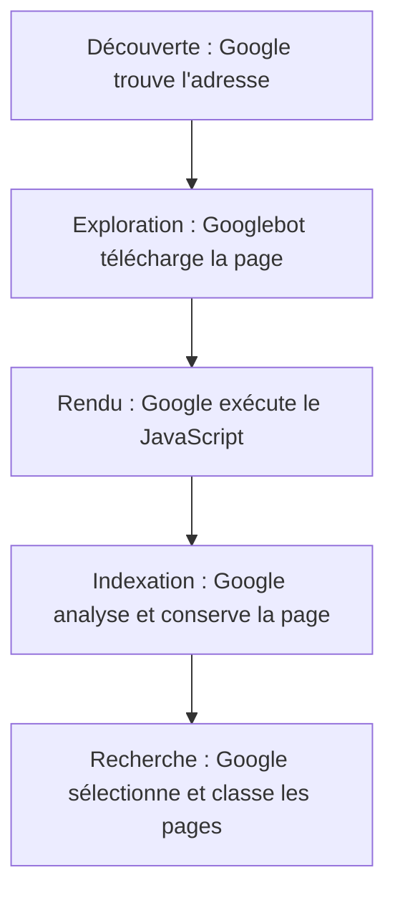

# Comment fonctionne un moteur de recherche

Quand vous lancez une recherche, Google consulte son **index**, une base de données constituée à partir des pages que ses robots ont visitées, sans parcourir à nouveau tout le web. Pour apparaître dans les résultats naturels, une page doit donc d'abord entrer dans cet index.

## De la découverte d'une page à son affichage

Google découvre les adresses grâce aux liens et aux **sitemaps**, puis son robot, **Googlebot**, télécharge les pages : c'est l'**exploration**. Vient ensuite l'**indexation**, au cours de laquelle Google analyse leur contenu et décide lesquelles conserver dans son index. C'est parmi ces pages qu'il sélectionne et classe les résultats d'une recherche.

Plusieurs obstacles peuvent intervenir au cours de ces étapes : une erreur du serveur peut empêcher le téléchargement, tandis qu'une balise `noindex` demande de ne pas indexer la page. Même sur une page accessible, un texte qui n'apparaît qu'après un clic risque de ne pas être lu. Le [chapitre technique](/seo-geo/02-seo-technique/) explique comment repérer ces problèmes.

Même si son code respecte les consignes, rien ne garantit qu'une page sera explorée, indexée ou affichée, comme le précise Google dans sa [présentation du fonctionnement de la recherche](https://developers.google.com/search/docs/fundamentals/how-search-works?hl=fr).

## Ce qui influence le classement

Google cherche des pages qui répondent au besoin de la personne. Pour "escalade lyon débutant", la localisation, les cours proposés et les informations pratiques comptent davantage qu'une longue histoire de l'escalade.

Dans sa [présentation du classement des résultats](https://www.google.com/search/howsearchworks/how-search-works/ranking-results/), Google explique tenir compte du sens de la recherche, de la pertinence du contenu, de sa fiabilité, du confort d'utilisation et du contexte, comme le lieu ou la langue. Les liens venant d'autres sites peuvent également l'aider à évaluer une page, mais la liste complète des signaux et leur poids ne sont pas publics.

## Reconnaître les éléments d'une page de résultats

La page de résultats, appelée **SERP** (Search Engine Results Page) dans les outils SEO, rassemble plusieurs types de réponses dont la présence varie selon la recherche.

| Élément | Comment le reconnaître |
| --- | --- |
| Annonce | Un résultat avec une mention comme "Sponsorisé" |
| **Résultat naturel** | Un titre, une adresse et un extrait de la page, sans mention publicitaire |
| Résultats locaux, ou **pack local** | Une carte et des fiches d'établissements avec adresse, horaires et avis |
| **Aperçu IA** | Une réponse rédigée par IA avec des liens vers des sources |
| Autres questions | Des questions proches de la recherche |

<figure class="course-figure">

<figcaption>Recherche "salle d'escalade lyon débutant", le 1er octobre 2026, sans compte Google. Les résultats locaux occupent le premier écran. Les notes, adresses et horaires viennent des fiches d'établissement. Capture de Google Search.</figcaption>
</figure>

<figure class="course-figure">

<figcaption>Recherche "escalade bloc ou voie pour débuter", le 1er octobre 2026, sans compte Google. L'Aperçu IA apparaît avant le premier résultat naturel. Capture de Google Search, recadrée.</figcaption>
</figure>

Les sources de cet Aperçu IA comprennent une marque de matériel et des sites spécialisés. Une page qui répond à une question de débutant peut donc servir de source, même si elle ne vient pas d'un grand site généraliste. Les réponses et les sources peuvent changer d'une recherche à l'autre.

<aside class="course-note">

Cherchez "escalade lyon", puis "escalade bloc ou voie". Repérez le premier élément affiché pour chaque recherche. Pourquoi les résultats diffèrent-ils ?

Pour voir les annonces, désactivez votre bloqueur de publicité, y compris celui intégré à Helium.

</aside>

## Quelques idées reçues sur le référencement

Payer une annonce Google Ads permet d'acheter un emplacement publicitaire, sans améliorer le classement naturel du site.

Google précise que la balise [`meta keywords` n'aide pas au classement](https://developers.google.com/search/blog/2009/09/google-does-not-use-keywords-meta-tag) et qu'il n'existe pas de longueur de texte idéale. Ses [conseils sur le contenu utile](https://developers.google.com/search/docs/fundamentals/creating-helpful-content?hl=fr) invitent à fournir les informations nécessaires pour répondre à la recherche.

L'expression "être premier sur Google" n'a de sens que pour une recherche et un contexte donnés : vérifiez donc les résultats pour plusieurs formulations. Une fois le site en ligne, **Search Console** permet de suivre sa visibilité.
