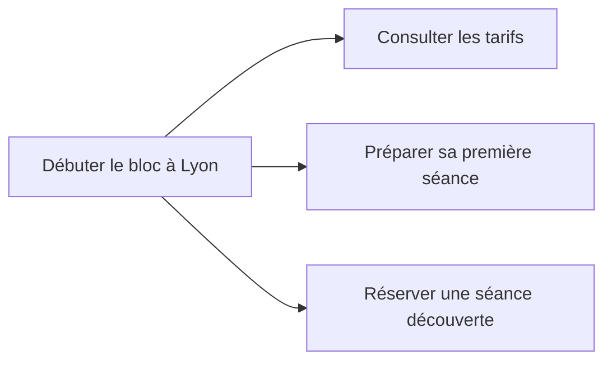

# Le contenu : répondre aux recherches des visiteurs

Une personne qui cherche le prix d'une séance attend un prix. Si la page ne donne que des formules comme "une expérience unique", elle ne répond pas à sa question.

## Comprendre le besoin derrière une recherche

L'**intention de recherche** est ce que la personne cherche à faire : comprendre, trouver un lieu, comparer ou réserver.

| Recherche | Besoin | Page utile |
| --- | --- | --- |
| "c'est quoi l'escalade de bloc" | Comprendre une activité | Une explication avec des photos |
| "prise d'air lyon horaires" | Trouver une information sur la salle | Les horaires et l'adresse |
| "salle de bloc lyon débutant" | Choisir une salle | Une présentation des séances et des conditions d'accueil |
| "réserver séance escalade lyon" | Réserver | Une page avec les créneaux et le prix |

Tapez la recherche dans Google et observez les résultats. Des articles explicatifs, une carte ou des pages de réservation vous donnent des indices sur le besoin que le moteur a retenu.

Avant de rédiger, associez chaque page à une intention principale. Plusieurs formulations proches peuvent mener à la même page : inutile de créer une page par variante de mot-clé.

| URL de Prise d'Air | Intention principale |
| --- | --- |
| `/` | Trouver une salle de bloc à Lyon 7e |
| `/seance-decouverte` | Préparer et réserver une première séance |
| `/tarifs` | Connaître les prix des séances et abonnements |
| `/conseils/premiere-seance` | Savoir quoi apporter et comment se déroule la découverte |

## Employer les mots des visiteurs

Les professionnels et les visiteurs n'emploient pas toujours les mêmes mots : la salle peut parler de "séance d'initiation", alors qu'un débutant tape "première fois escalade". En vous limitant au vocabulaire de la salle, vous risquez de moins bien répondre à cette recherche et de ne pas y apparaître. Reprenez donc aussi les formulations des visiteurs dans vos textes.

Pour trouver ces formulations, appuyez-vous sur :

- les suggestions que Google affiche pendant la saisie
- le bloc "Autres questions posées" dans la page de résultats
- les questions que les clients posent à l'accueil, au téléphone ou par mail

**Search Console** montrera aussi les recherches qui ont fait apparaître le site, une fois celui-ci publié.

Un petit site a souvent plus de chances d'apparaître pour une recherche précise comme "escalade bloc Lyon 7 débutant" que pour un terme très général comme "escalade", car le besoin est mieux défini. Ces recherches précises font souvent partie de la **longue traîne**, qui désigne l'ensemble des nombreuses recherches peu fréquentes.

## Donner la réponse avant les détails

Choisissez un sujet principal par page, annoncez-le dans le `title` et le `h1`, puis donnez la réponse dans les premières lignes. Développez ensuite les questions associées dans les sections, par exemple le prix, le matériel à apporter ou les conditions de réservation.

| Texte vague | Texte utile au débutant |
| --- | --- |
| "Venez vivre une expérience unique dans notre salle. Notre équipe passionnée vous attend dans un cadre exceptionnel." | "La séance découverte dure 1 h 30 et coûte 18 €, chaussons compris. Un moniteur vous apprend à tomber sur les tapis, puis vous essayez des blocs faciles. La séance est ouverte dès 8 ans, avec un adulte jusqu'à 14 ans." |

Un moteur ou une IA peut aussi reprendre ces informations dans un extrait.

Pour un conseil technique, indiquez qui l'a écrit et sur quelle expérience il s'appuie. Un article signé par une monitrice, accompagné de photos de la salle et d'explications concrètes, donne au lecteur des éléments pour évaluer sa fiabilité. Cette démarche rejoint les [recommandations de Google sur le contenu utile et fiable](https://developers.google.com/search/docs/fundamentals/creating-helpful-content?hl=fr).

Le sujet peut apparaître naturellement dans le `title`, le `h1` et le texte. Il n'y a ni densité de mots-clés à atteindre ni nombre de mots idéal : arrêtez-vous lorsque la page répond au besoin.

### Identifier l'auteur et montrer son expérience

Les repères **E-E-A-T** désignent l'expérience, l'expertise, l'autorité et la fiabilité. Google précise qu'ils ne constituent pas un facteur de classement unique. Pour le lecteur, ils se traduisent par des éléments vérifiables : qui écrit, sur quelle expérience, avec quelles sources ? [Google, contenu utile et E-E-A-T](https://developers.google.com/search/docs/fundamentals/creating-helpful-content?hl=fr).

Pour Prise d'Air, une page « L'équipe » peut présenter les moniteurs, leurs qualifications réelles et un moyen de contact. Un article peut renvoyer vers la personne qui l'a rédigé. Un compte rendu d'atelier peut préciser le public accueilli, l'objectif, le déroulement, les difficultés observées et les enseignements, avec des photos autorisées. Ces détails apportent davantage au lecteur qu'une galerie sans explication.

Des articles comme « Que faut-il apporter pour sa première séance ? » ou « Comment se déroule une initiation au bloc ? » répondent aux questions de l'accueil. Rédigez-les à partir de l'expérience de l'équipe et vérifiez les conseils avant publication.

## Faire des liens entre les pages utiles

La page "Débuter le bloc à Lyon" peut présenter l'activité et renvoyer vers les tarifs, le matériel et la réservation. Ces liens aident le visiteur à poursuivre sa démarche et le robot à découvrir les pages.

Écrivez "Voir les tarifs" ou "Préparer sa première séance" plutôt que "En savoir plus". Si deux pages répètent les mêmes informations, demandez-vous si une seule page serait plus facile à consulter et à maintenir.

## Garder les informations à jour

Il n'est pas nécessaire de publier un article par semaine pour être bien référencé : Google recommande dans ses [conseils sur le contenu](https://developers.google.com/search/docs/fundamentals/creating-helpful-content?hl=fr) de privilégier l'utilité des pages plutôt que de chercher à faire paraître le site plus actif. De même, changer une date sans modifier le contenu ne constitue pas une mise à jour.

Pour **Prise d'Air**, commencez par vérifier les prix, les horaires de vacances et les conditions des séances, puis ajoutez des articles s'ils répondent à des questions encore sans réponse sur le site. Un calendrier de publication peut aider à organiser ce travail, mais il ne remplace pas la vérification des informations.

Une IA peut vous aider à préparer un plan ou à reformuler un texte, à condition de vérifier les faits et d'y apporter les informations propres à la salle. Produire beaucoup de pages génériques qui n'aident pas les visiteurs peut enfreindre les [règles de Google contre le spam](https://developers.google.com/search/docs/essentials/spam-policies?hl=fr).

## Faire connaître la salle sur d'autres sites

Un lien depuis un autre site vers le vôtre s'appelle un **backlink**. Un club universitaire, un office de tourisme ou un article de presse locale peut faire découvrir *Prise d'Air* et envoyer des visiteurs vers son site.

L'intérêt d'un backlink dépend notamment de la pertinence du site qui le publie : multiplier les liens dans des annuaires sans rapport avec l'activité n'apporte pas la même valeur qu'une mention sur un site lié à l'escalade ou à la vie locale. Acheter des liens pour manipuler le classement enfreint par ailleurs les règles de Google.

Pour les recherches locales, complétez la **[fiche d'établissement Google](https://business.google.com/)** avec la catégorie, l'adresse, les horaires, les photos et le lien vers le site, en veillant à garder les mêmes coordonnées sur les différents supports. Vous pouvez aussi répondre aux avis et demander des retours sincères aux clients.

## Suivre les résultats dans Search Console

Le rapport Performances indique quelles recherches font apparaître le site et lesquelles amènent des visites.

| Mesure | Ce qu'elle indique |
| --- | --- |
| **Impressions** | Combien de fois un résultat du site a été affiché |
| Clics | Combien de fois une personne a cliqué vers le site |
| **CTR**, ou taux de clics | La part des impressions qui ont produit un clic |
| **Position moyenne** | La position moyenne du premier résultat du site |

Beaucoup d'impressions et peu de clics peuvent signaler un titre peu clair, mais aussi s'expliquer par une réponse déjà visible dans les résultats. Avant de modifier la page, examinez donc la recherche concernée et comparez des périodes assez longues pour observer une tendance.
