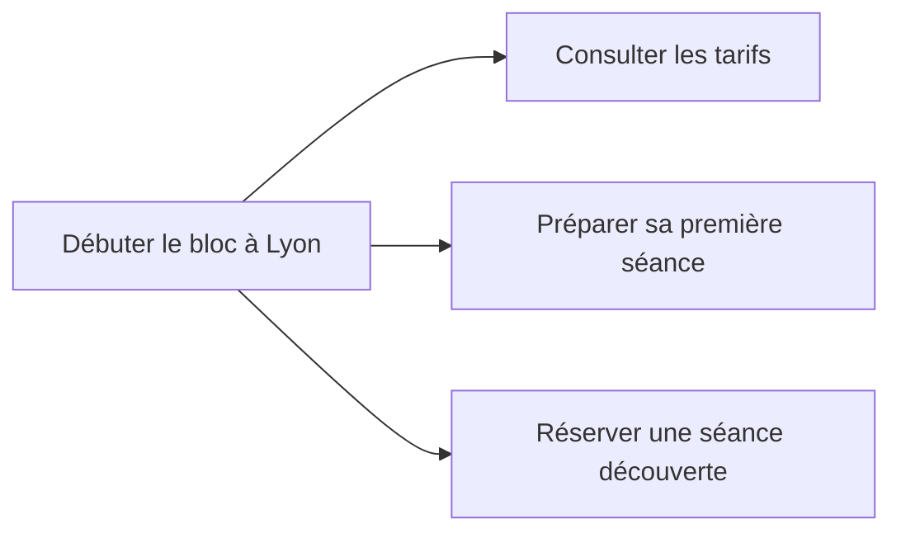

# Le contenu : répondre aux recherches des visiteurs

Une personne qui cherche le prix d'une séance attend un prix. Si la page ne donne que des formules comme "une expérience unique", elle ne répond pas à sa question.

## Comprendre le besoin derrière une recherche

L'**intention de recherche** est ce que la personne cherche à faire : comprendre, trouver un lieu, comparer ou réserver.

| Recherche | Besoin | Page utile |
| --- | --- | --- |
| "c'est quoi l'escalade de bloc" | Comprendre une activité | Une explication avec des photos |
| "prise d'air lyon horaires" | Trouver une information sur la salle | Les horaires et l'adresse |
| "salle de bloc lyon débutant" | Choisir une salle | Une présentation des séances et des conditions d'accueil |
| "réserver séance escalade lyon" | Réserver | Une page avec les créneaux et le prix |

Tapez la recherche dans Google et observez les résultats. Des articles explicatifs, une carte ou des pages de réservation vous donnent des indices sur le besoin que le moteur a retenu.

## Employer les mots des visiteurs

Un moniteur peut parler de "séance d'initiation", tandis qu'un débutant cherche "première fois escalade". Pour trouver ces formulations, consultez les suggestions de Google, le bloc "Autres questions" et les questions reçues par la salle.

**Search Console** montrera aussi les recherches qui ont fait apparaître le site, une fois celui-ci publié.

Un petit site a souvent plus de chances d'apparaître pour une recherche précise que pour un mot très général. "Escalade bloc Lyon 7 débutant" décrit un besoin plus clair que "escalade". On parle de **longue traîne** pour les nombreuses recherches peu fréquentes.

## Donner la réponse avant les détails

Choisissez un sujet principal par page. Annoncez-le dans le `title` et le `h1`, puis donnez la réponse dans les premières lignes. Les sections peuvent traiter les questions suivantes : le prix, le matériel à apporter ou les conditions de réservation.

Voici deux textes pour la même séance :

| Texte vague | Texte utile au débutant |
| --- | --- |
| "Venez vivre une expérience unique dans notre salle. Notre équipe passionnée vous attend dans un cadre exceptionnel." | "La séance découverte dure 1 h 30 et coûte 18 €, chaussons compris. Un moniteur vous apprend à tomber sur les tapis, puis vous essayez des blocs faciles. La séance est ouverte dès 8 ans, avec un adulte jusqu'à 14 ans." |

Le second aide la personne à décider si la séance lui convient. Un moteur ou une IA peut aussi reprendre ces informations dans un extrait.

Pour un conseil technique, indiquez qui l'a écrit et sur quelle expérience il s'appuie. Un article signé par une monitrice, avec des photos de la salle et des explications concrètes, permet au lecteur d'évaluer sa fiabilité. [Google, contenu utile et fiable](https://developers.google.com/search/docs/fundamentals/creating-helpful-content?hl=fr).

## Faire des liens entre les pages utiles

La page "Débuter le bloc à Lyon" peut présenter l'activité et renvoyer vers les tarifs, le matériel et la réservation. Ces liens aident le visiteur à poursuivre sa démarche et le robot à découvrir les pages.

Écrivez "Voir les tarifs" ou "Préparer sa première séance" plutôt que "En savoir plus". Si deux pages répètent les mêmes informations, demandez-vous si une seule page serait plus facile à consulter et à maintenir.

## Garder les informations à jour

Publier un article par semaine n'est pas une obligation pour être bien référencé. Google recommande de publier des contenus utiles, plutôt que d'ajouter des pages pour faire paraître le site plus actif. Changer une date sans modifier le contenu n'est pas une mise à jour. [Conseils Google sur le contenu](https://developers.google.com/search/docs/fundamentals/creating-helpful-content?hl=fr).

Pour **Prise d'Air**, vérifiez d'abord les prix, les horaires de vacances et les conditions des séances. Ajoutez un article quand il répond à une question qui n'est pas encore traitée. Un calendrier de publication peut aider à s'organiser, mais il ne remplace pas ce travail.

Une IA peut proposer un plan ou aider à reformuler. Vérifiez les faits et ajoutez les informations de la salle. Produire beaucoup de pages génériques sans aider les visiteurs peut enfreindre les règles de Google contre le spam. [Google, règles sur le spam](https://developers.google.com/search/docs/essentials/spam-policies?hl=fr).

## Faire connaître la salle sur d'autres sites

Un lien depuis un autre site vers le vôtre s'appelle un **backlink**. Un club universitaire, un office de tourisme ou un article de presse locale peut faire découvrir *Prise d'Air* et envoyer des visiteurs vers son site.

La pertinence du site qui fait le lien compte. Multiplier les liens dans des annuaires sans rapport avec l'activité n'apporte pas le même intérêt. Acheter des liens pour manipuler le classement enfreint les règles de Google.

Pour les recherches locales, complétez la **[fiche d'établissement Google](https://business.google.com/)** : catégorie, adresse, horaires, photos et lien vers le site. Gardez les mêmes coordonnées sur les différents supports. Répondez aux avis et demandez des retours sincères aux clients.

## Suivre les résultats dans Search Console

Le rapport Performances indique quelles recherches font apparaître le site et lesquelles amènent des visites.

| Mesure | Ce qu'elle indique |
| --- | --- |
| **Impressions** | Combien de fois un résultat du site a été affiché |
| Clics | Combien de fois une personne a cliqué vers le site |
| **CTR**, ou taux de clic | La part des impressions qui ont produit un clic |
| **Position moyenne** | La position moyenne du premier résultat du site |

Beaucoup d'impressions et peu de clics peuvent signaler un titre peu clair, mais aussi une réponse déjà visible dans les résultats. Regardez la recherche concernée avant de modifier la page. Comparez ensuite des périodes assez longues pour observer une tendance.
