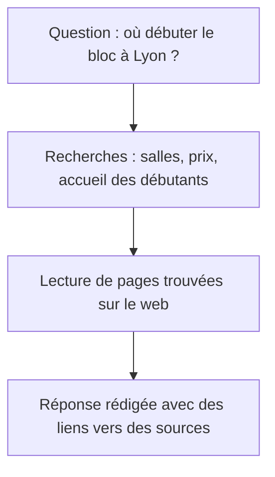

# Le GEO : être cité par une IA

Une IA peut lire plusieurs pages et rédiger une réponse qui cite certaines d'entre elles. Le **GEO** consiste à préparer un site pour qu'il puisse faire partie de ces sources. Il ne permet pas de choisir ce que l'IA écrira.

## Comment une IA trouve ses sources

Une IA peut répondre à partir de ce qu'elle a appris pendant son **entraînement**. Dans ce cas, elle ne consulte pas forcément de page et ses informations peuvent être anciennes.

Lorsqu'elle utilise la recherche web, elle cherche des pages, en lit des passages et s'appuie sur eux pour rédiger. Cette méthode est souvent appelée **RAG**. Retenez surtout la différence : une réponse issue d'une recherche peut renvoyer vers les pages consultées.

Une question comme "Quelle salle de bloc pour débuter à Lyon ?" peut entraîner plusieurs recherches : salles à Lyon, accueil des débutants, prix et horaires. Google décrit ce fonctionnement dans sa [documentation sur les fonctionnalités d'IA](https://developers.google.com/search/docs/appearance/ai-features?hl=fr).



Votre page n'a pas besoin de répondre à toute la question pour être utile. Elle peut fournir un prix, un horaire ou une condition d'accès.

## Comparer les réponses et vérifier les informations

Voici la même question posée au **Mode IA** de Google et à ChatGPT le 1er octobre 2026 : "Quelle salle d'escalade pour débuter à Lyon, pas trop chère, un samedi ?".

<figure class="course-figure">

<figcaption>Le Mode IA de Google cite un site d'information sur l'escalade et les pages de deux salles Climb Up. Les extraits contiennent des prix repris dans la réponse. Capture de Google Search, recadrée.</figcaption>
</figure>

<figure class="course-figure">

<figcaption>ChatGPT utilise la recherche web. Les étiquettes à la fin des paragraphes renvoient aux sources. Capture de ChatGPT, recadrée.</figcaption>
</figure>

Les deux outils reprennent des informations publiées par les salles et par un site spécialisé. Ils ne choisissent pas forcément les mêmes sources. Leur réponse peut aussi changer si vous reposez la question.

Ouvrez les liens pour vérifier les prix, les dates des offres et les horaires. La présence d'une citation ne suffit pas à prouver que toute la réponse est exacte.

## Publier des informations que les robots peuvent lire

Commencez par les bases du **SEO** : une page accessible, des liens et du texte dans le HTML. Pour les **Aperçus IA** et le Mode IA, Google demande une page indexée qui peut être affichée avec un extrait. Il ne demande pas de balisage spécial pour l'IA. [Google, conditions d'affichage](https://developers.google.com/search/docs/appearance/ai-features?hl=fr).

Publiez ensuite les informations de la salle avec assez de contexte pour qu'elles soient comprises seules :

| Formulation vague | Information utilisable |
| --- | --- |
| "Nos tarifs sont très accessibles." | "La séance découverte coûte 18 €, chaussons compris." |
| "Ouvert tard en semaine !" | "La salle Prise d'Air est ouverte du lundi au vendredi de 12 h à 23 h." |

Ces phrases servent d'abord aux visiteurs. Elles donnent aussi aux outils de recherche des faits à reprendre. Vérifiez-les et mettez-les à jour lorsqu'ils changent.

## Autoriser la recherche sans autoriser l'entraînement

Les entreprises d'IA utilisent des robots pour des tâches différentes. Chez OpenAI, `OAI-SearchBot` sert à la recherche de sources dans ChatGPT, tandis que `GPTBot` collecte du contenu qui peut servir à l'entraînement.

Les deux réglages sont indépendants. Voici un exemple qui laisse la recherche accéder aux pages publiques, tout en refusant la collecte par `GPTBot` :

```txt
User-agent: *
Disallow: /compte/

User-agent: GPTBot
Disallow: /

Sitemap: https://prisedair.example/sitemap.xml
```

Le groupe `GPTBot` s'applique à ce robot. Les autres suivent le groupe `*`. Ce choix n'assure pas que la salle sera citée. Il faut aussi que le serveur laisse passer les requêtes. [OpenAI, documentation des robots](https://developers.openai.com/api/docs/bots).

Pour Google, `Googlebot` explore les pages pour la recherche, y compris ses réponses IA. `Google-Extended` règle certains usages liés à Gemini, indépendamment du référencement dans Google. Vérifiez la documentation du fournisseur avant de modifier ces règles. [Google, contrôles des contenus](https://developers.google.com/search/docs/appearance/ai-features?hl=fr) et [rôle de Google-Extended](https://developers.google.com/crawling/docs/crawlers-fetchers/google-common-crawlers#google-extended).

## Aucune citation par une IA n'est garantie

Aucun réglage ne garantit "la première place dans ChatGPT". Les sources dépendent de la question et du fonctionnement de l'outil.

Pour apparaître dans les réponses IA de Google, vous n'avez pas besoin d'un fichier `llms.txt` ni de données structurées spéciales. Gardez des pages utiles et lisibles. [Google, bonnes pratiques](https://developers.google.com/search/docs/appearance/ai-features?hl=fr).

La [proposition llms.txt](https://llmstxt.org/) décrit un fichier Markdown qui présente un site et ses ressources aux outils d'IA. Il ne remplace pas les règles de `robots.txt`.

N'ajoutez pas de texte caché qui ordonne à une IA de recommander la salle. Cette tentative de manipulation, appelée **injection de prompt**, peut détourner une réponse et tromper la personne qui la lit.

## Observer les citations et les visites

Pour un premier contrôle, posez une question liée à l'activité et notez les sources citées. Répétez la recherche avant d'en tirer une conclusion. Une seule réponse ne mesure pas la visibilité d'un site.

Sur un site publié, l'outil de statistiques peut montrer des visites provenant de services comme ChatGPT ou Perplexity. Certaines visites ne transmettent pas leur origine. Une citation peut aussi faire connaître la salle sans produire de clic : distinguez ce que l'outil cite des visites qu'il envoie.
