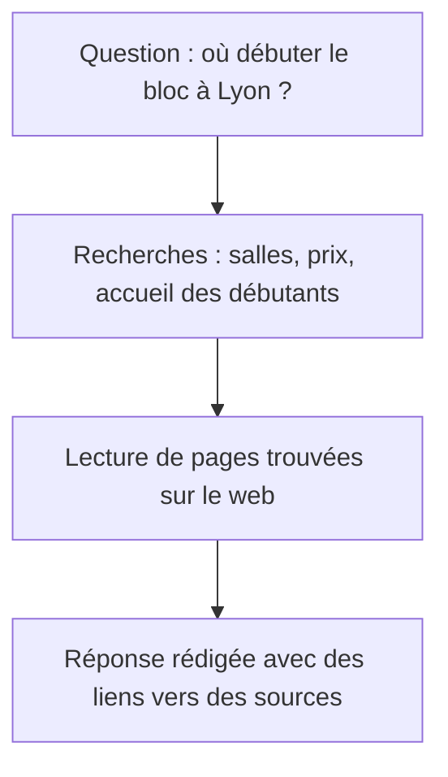

# Le GEO : être cité par une IA

Une IA peut s'appuyer sur plusieurs pages pour rédiger une réponse et citer certaines d'entre elles. Le **GEO** consiste à préparer un site pour qu'il puisse faire partie de ces sources, sans permettre de choisir ce que l'IA écrira.

## Comment une IA trouve ses sources

Une IA peut répondre à partir de ce qu'elle a appris pendant son **entraînement**. Dans ce cas, elle ne consulte pas forcément de page et ses informations peuvent être anciennes.

Lorsqu'elle utilise la recherche web, l'IA cherche des pages et en lit des passages sur lesquels elle s'appuie pour rédiger sa réponse. Cette méthode, souvent appelée **RAG**, permet d'associer la réponse aux pages consultées et d'y renvoyer par des liens.

Une question comme "Quelle salle de bloc pour débuter à Lyon ?" peut entraîner plusieurs recherches : salles à Lyon, accueil des débutants, prix et horaires. Google décrit ce fonctionnement dans sa [documentation sur les fonctionnalités d'IA](https://developers.google.com/search/docs/appearance/ai-features?hl=fr).



Votre page peut être utile en fournissant un prix, un horaire ou une condition d'accès, même si elle ne répond pas à l'ensemble de la question.

## Comparer les réponses et vérifier les informations

Voici les réponses du **Mode IA** de Google et de ChatGPT à une même question posée le 1er octobre 2026 : "Quelle salle d'escalade pour débuter à Lyon, pas trop chère, un samedi ?"

<figure class="course-figure">

<figcaption>Le Mode IA de Google cite un site d'information sur l'escalade et les pages de deux salles Climb Up. Les extraits contiennent des prix repris dans la réponse. Capture de Google Search, recadrée.</figcaption>
</figure>

<figure class="course-figure">

<figcaption>ChatGPT utilise la recherche web. Capture de ChatGPT, recadrée.</figcaption>
</figure>

Les deux outils reprennent des informations publiées par les salles et par un site spécialisé, sans forcément choisir les mêmes sources. Leurs réponses peuvent aussi changer si vous posez une deuxième fois la même question.

Un lien placé après une phrase ne garantit pas que la page source confirme ce qui est écrit : l'outil peut mélanger les prix de deux salles, reprendre une offre terminée ou donner les horaires de la semaine au lieu de ceux du samedi. Il faut donc ouvrir les sources pour vérifier ces informations.

## Publier des informations que les robots peuvent lire

Commencez par les bases du **SEO** : une page accessible, des liens et du texte dans le HTML. Pour les **Aperçus IA** et le Mode IA, les [conditions d'affichage de Google](https://developers.google.com/search/docs/appearance/ai-features?hl=fr) exigent une page indexée qui peut être affichée avec un extrait, sans demander de balisage spécial pour l'IA.

Publiez ensuite les informations de la salle avec assez de contexte pour qu'elles soient comprises seules :

| Formulation vague | Information utilisable |
| --- | --- |
| "Nos tarifs sont très accessibles." | "La séance découverte coûte 18 €, chaussons compris." |
| "Ouvert tard en semaine !" | "La salle Prise d'Air est ouverte du lundi au vendredi de 12 h à 23 h." |

Vérifiez les informations publiées et mettez-les à jour lorsqu'elles changent.

## Autoriser la recherche sans autoriser l'entraînement

Les entreprises d'IA utilisent des robots pour des tâches différentes. Chez OpenAI, `OAI-SearchBot` sert à la recherche de sources dans ChatGPT, tandis que `GPTBot` collecte du contenu qui peut servir à l'entraînement.

Les deux réglages sont indépendants. Voici un exemple qui laisse la recherche accéder aux pages publiques, tout en refusant la collecte par `GPTBot` :

```txt
User-agent: *
Disallow: /compte/

User-agent: GPTBot
Disallow: /

Sitemap: https://prisedair.example/sitemap.xml
```

Dans cet exemple, `GPTBot` suit les règles du groupe qui lui est réservé, tandis que les autres robots suivent celles du groupe `*`. Autoriser l'exploration dans ce fichier ne suffit toutefois pas : le serveur doit aussi laisser passer les requêtes, comme l'explique la [documentation des robots d'OpenAI](https://developers.openai.com/api/docs/bots). Même lorsque l'accès est possible, rien ne garantit que la salle sera citée.

Chez Google, `Googlebot` explore les pages pour la recherche, y compris pour les réponses IA, tandis que `Google-Extended` contrôle certains usages liés à Gemini, indépendamment du référencement dans Google. Avant de modifier ces règles, consultez la documentation du fournisseur sur les [contrôles des contenus](https://developers.google.com/search/docs/appearance/ai-features?hl=fr) et le [rôle de Google-Extended](https://developers.google.com/crawling/docs/crawlers-fetchers/google-common-crawlers#google-extended).

## Aucune citation par une IA n'est garantie

Aucun réglage ne garantit "la première place dans ChatGPT", puisque le choix des sources dépend de la question et du fonctionnement de l'outil.

Les [bonnes pratiques de Google](https://developers.google.com/search/docs/appearance/ai-features?hl=fr) n'exigent ni fichier `llms.txt` ni données structurées spéciales pour apparaître dans ses réponses IA : le travail consiste à garder des pages utiles et lisibles.

La [proposition llms.txt](https://llmstxt.org/) décrit un fichier Markdown qui présente un site et ses ressources aux outils d'IA. Il ne remplace pas les règles de `robots.txt`.

N'ajoutez pas de texte caché qui ordonne à une IA de recommander la salle. Cette tentative de manipulation, appelée **injection de prompt**, peut détourner une réponse et tromper la personne qui la lit.

## Observer les citations et les visites

Pour un premier contrôle, posez une question liée à l'activité et notez les sources citées, puis répétez la recherche avant d'en tirer une conclusion. Une seule réponse ne suffit pas à mesurer la visibilité d'un site.

Sur un site publié, l'outil de statistiques peut montrer des visites provenant de services comme ChatGPT ou Perplexity, même si leur origine n'est pas toujours transmise. Une citation peut aussi faire connaître la salle sans produire de clic : distinguez donc les citations du site dans les réponses des visites qu'elles lui apportent.
