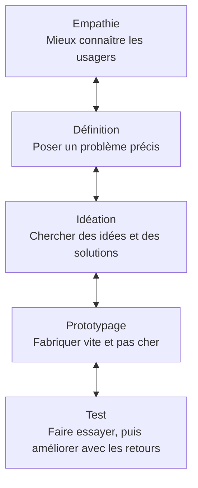

# L'UX et l'UI

UX veut dire _user experience_, l'expérience utilisateur. UI veut dire _user interface_, l'interface utilisateur.

## L'UX, l'expérience

L'UX couvre ce que vit une personne avant, pendant et après l'utilisation d'un produit. Un ou une UX designer :

- Comprend les besoins et les attentes des utilisateurs.
- Conçoit leur parcours et organise l'information.
- Interroge des utilisateurs et leur fait tester le produit.
- Vérifie que les utilisateurs arrivent à faire ce qu'ils souhaitent.

Ce travail commence avant la conception et se poursuit après la mise en ligne.

## L'UI, l'interface

L'UI est la partie visible du produit :

- Les couleurs, les polices et la mise en page.
- Les éléments sur lesquels on agit : boutons, champs, cartes, menus.
- La hiérarchie visuelle, qui fait ressortir les éléments importants.
- La cohérence visuelle d'un écran à l'autre.

## Les deux ensemble

Pour une appli de commande dans un snack, l'UX organise le parcours et l'UI dessine les écrans :

| | UX | UI |
| --- | --- | --- |
| La question | De quoi le client a-t-il besoin pour commander vite ? | À quoi ressemble l'écran de commande ? |
| La décision | Commander en trois écrans et voir le temps d'attente | Un grand bouton « Commander » en bas de l'écran |
| La vérification | Un client commande seul, sans aide, en moins d'une minute | Le bouton se voit et se lit sur un petit écran |

## Les cinq plans

Le designer Jesse James Garrett découpe un produit en cinq plans, du plus abstrait au plus concret. Chaque plan s'appuie sur le précédent. On commence par la stratégie et on finit par la surface.

| Plan | La question | Dans le projet |
| --- | --- | --- |
| 1. Stratégie (_strategy_) | Que veulent les utilisateurs et le client ? | Brief, entretiens et persona, lundi |
| 2. Périmètre (_scope_) | Quelles fonctions et quels contenus ? | User stories, lundi |
| 3. Structure | Comment ranger les pages et enchaîner les étapes ? | Journey et sitemap, lundi |
| 4. Squelette (_skeleton_) | Où placer chaque élément sur l'écran ? | Zoning et wireframes, mardi |
| 5. Surface | À quoi ressemble l'écran : couleurs, polices, images ? | Style guide et maquette, mardi |

L'UX travaille surtout les trois premiers plans. L'UI travaille surtout les deux derniers.

## Utile et utilisable

Un site utile répond à un besoin. Un site utilisable permet d'accomplir une tâche sans difficulté. Il peut être utile tout en restant pénible à utiliser.

La norme ISO 9241-11 mesure l'utilisabilité avec trois questions, pour des utilisateurs et une tâche précis :

- L'efficacité : la personne arrive-t-elle au bout de sa tâche ?
- L'efficience : combien de temps et d'efforts lui a-t-il fallu ?
- La satisfaction : comment l'a-t-elle vécu ?

L'affordance désigne les indices qui suggèrent comment utiliser un objet. Une poignée invite à tirer, un interrupteur à appuyer. Sur le web, un bouton doit être reconnaissable comme tel et un champ doit inviter à saisir du texte.

## Le design thinking

Le design thinking part des besoins des personnes pour concevoir, prototyper et tester une solution. On le découpe souvent en cinq étapes. Un test peut conduire à revenir sur une décision précédente.

| Étape | Dans le projet |
| --- | --- |
| 1. Empathie | Entretiens et persona, lundi |
| 2. Définition | User stories et journey, lundi |
| 3. Idéation | Sitemap lundi, zoning mardi |
| 4. Prototypage | Wireframes et maquette, mardi |
| 5. Test | Test de la maquette mardi, tests d'accessibilité mercredi |

## À lire et à regarder

- [L'UX, 60 secondes pour comprendre](https://www.youtube.com/watch?v=g57_0gejMig), vidéo d'Orange.
- [L'UX Design c'est quoi ?](https://www.youtube.com/watch?v=eBbUNs8odVA), vidéo de la chaîne UX Time.
- [Faites la différence entre UX et UI](https://openclassrooms.com/fr/courses/3013856-decouvrez-les-fondamentaux-de-l-ux-design/4088746-faites-la-difference-entre-ux-et-ui) et [Familiarisez-vous avec la notion d'usabilité](https://openclassrooms.com/fr/courses/3013856-decouvrez-les-fondamentaux-de-l-ux-design/4088821-familiarisez-vous-avec-la-notion-d-usabilite), deux chapitres du cours gratuit d'OpenClassrooms.
- [Comprenez le principe d'affordance](https://openclassrooms.com/fr/courses/3013856-decouvrez-les-fondamentaux-de-l-ux-design/4053056-comprenez-le-principe-d-affordance), OpenClassrooms.
- [It's not you. Bad doors are everywhere.](https://www.youtube.com/watch?v=yY96hTb8WgI), vidéo de Vox sur les portes qu'on pousse au lieu de les tirer. En anglais, activez les sous-titres.
- [Dopamine](https://www.arte-campus.fr/serie/dopamine-tous-les-episodes), série d'ARTE en épisodes de 10 minutes. Chaque épisode montre comment une appli connue est conçue pour qu'on y revienne.
- [Comment le web vous arnaque ? (Les dark patterns)](https://www.youtube.com/watch?v=fx5VZFdkuf4), vidéo de Basti UI, 9 minutes. Un dark pattern est une interface conçue pour piéger l'utilisateur, par exemple un désabonnement caché.
- [Whatnot : le nouveau sponsor YouTube qui te met en danger](https://www.youtube.com/watch?v=IQP_2wnEgoY), enquête de Basti UI, 33 minutes. Une appli d'enchères en direct reprend des mécanismes des casinos pour qu'on y reste.

## Pour la discussion

- Une appli qui vous énerve : laquelle, et à quel moment précis ?
- Ce problème vient-il de l'UX ou de l'UI ?
- Une appli conçue pour qu'on y passe le plus de temps possible offre-t-elle une bonne expérience ? Bonne pour qui ?

## Le roasting

En équipe, 20 minutes.

Choisissez un site de MJC ou de centre socioculturel. Cherchez une activité pour un jeune de 17 ans et comment s'y inscrire.

Gardez une idée à reprendre et un problème à éviter dans votre projet, avec une capture. Déposez vos remarques dans votre fichier d'équipe.

Arrêtez-vous avant tout envoi de formulaire. Ne créez pas de compte et ne payez rien.

Critiquez l'interface, pas la personne qui l'a faite. Pas de contenu choquant. « C'est nul » ne compte pas : dites quel élément gêne et ce qu'il empêche de faire.
