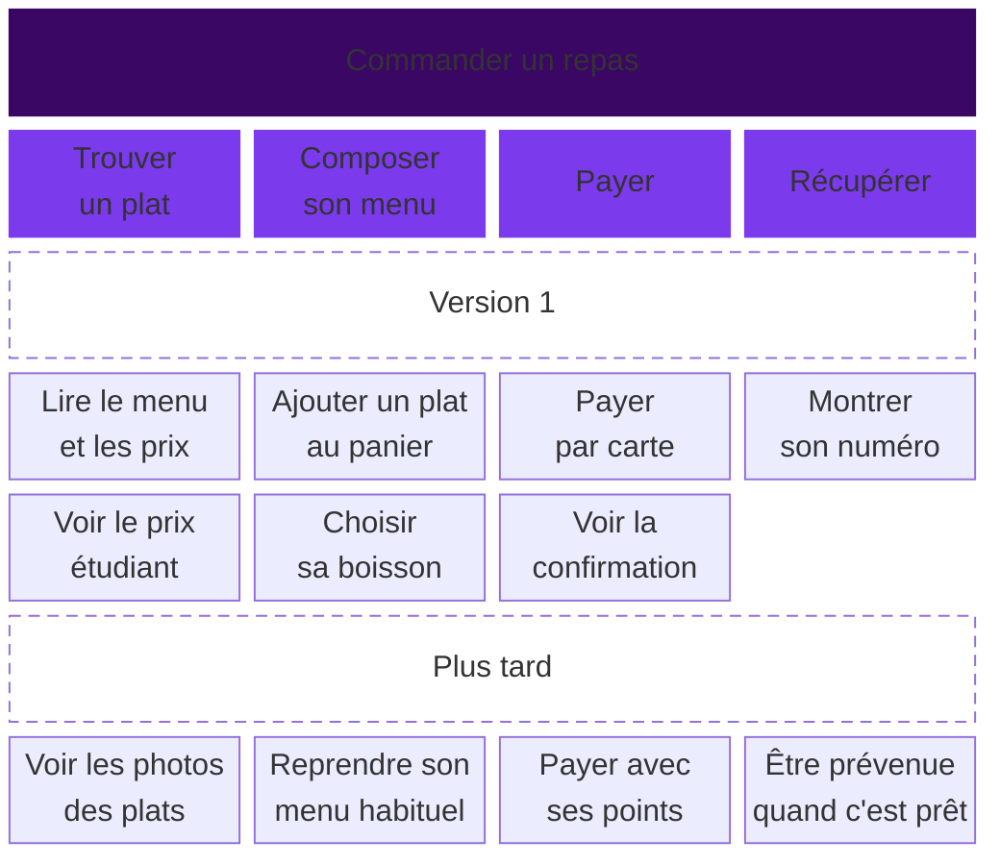

# Les user stories

Une user story formule une action que votre persona veut accomplir et la raison pour laquelle elle compte.

## Écrire une story

> En tant que [persona], je veux [action] afin de [but].

Par exemple : « En tant qu'Inès, lycéenne, je veux voir les menus et leurs prix afin de choisir un repas à moins de 7 €. »

Décrivez ce que la personne veut faire. « Je veux un bouton vert » décrit déjà une solution.

## Vérifier la story

Un critère d'acceptation précise ce qu'on doit pouvoir constater sur la page. Pour la story ci-dessus :

- Chaque menu affiche son prix et ce qu'il contient.
- Un menu indisponible est signalé comme tel.
- Si aucun menu n'est disponible, la page l'indique clairement.

## Une bonne story

Les équipes vérifient leurs stories avec six critères, résumés par le mot anglais INVEST.

| Lettre | Critère | La question |
| --- | --- | --- |
| I | Indépendante | Peut-on la réaliser sans attendre une autre story ? |
| N | Négociable | L'équipe peut-elle encore en discuter les détails ? |
| V | Utile (_valuable_) | Apporte-t-elle quelque chose à l'utilisateur ou au client ? |
| E | Estimable | L'équipe peut-elle dire combien de temps elle prendra ? |
| S | Petite (_small_) | Peut-on la terminer sans la découper davantage ? |
| T | Testable | Des critères d'acceptation permettent-ils de vérifier qu'elle est finie ? |

Une story décrit un besoin. Une spécification technique décrit comment réaliser la solution.

| Spécification technique | User story |
| --- | --- |
| « Créer une table SQL des commandes. » | « En tant que cliente du snack, je veux retrouver mes commandes passées afin de recommander mon menu habituel. » |

## La story map

Une liste de stories ne montre pas le parcours en entier. La story map range les stories dans l'ordre où l'utilisateur les vit. Jeff Patton a rendu cette méthode populaire dans les équipes agiles.

Une équipe agile peut livrer un produit par petites versions, recueillir des retours, puis améliorer la suivante. La méthode Scrum est expliquée dans le cours [Stories et backlog](/stories-backlog/#la-methode-scrum).

### À quoi elle sert

- Voir le produit en entier. Dans un backlog, les stories forment une simple liste et on perd le fil du parcours.
- Repérer les trous, par exemple une étape sans aucune story.
- Choisir ce qui entre dans la première version, et ce qui attend.
- Parler du produit avec toute l'équipe : design, développement, client.

### Les trois niveaux

- Les activités sont les grandes tâches de l'utilisateur, par exemple « Commander un repas ».
- Les étapes découpent chaque activité, dans l'ordre, de gauche à droite.
- Les détails sont les actions précises de chaque étape. Ils s'empilent sous leur étape, le plus important en haut.

Chaque carte décrit ce que fait l'utilisateur. On écrit « Payer par carte », pas « Appeler l'API de paiement ». Chaque détail devient ensuite une story, avec ses critères d'acceptation. Dans le backlog, une étape devient souvent une _epic_, une grande story découpée en plusieurs petites.

### La ligne de version

Une ligne horizontale sépare la première version du reste. Au-dessus de la ligne, l'équipe place ce qu'elle livre d'abord. Cette première version doit permettre de faire tout le parcours, même simplement. On l'appelle le produit minimum viable, ou MVP (_minimum viable product_).

Dans votre projet, la première version est la page de réservation à coder.

### Un exemple

Voici la story map de l'appli du snack. Elle se lit de gauche à droite, puis de haut en bas.

La première version permet à Inès de commander et de payer, sans photos ni points de fidélité. Elle règle les deux blocages de son [journey](/ux-ui/07-journey/#un-exemple) : le prix étudiant est affiché, et une confirmation suit le paiement.

### Story map ou journey map

La journey map suit la personne : ce qu'elle fait, pense et ressent, sur tous les canaux. La story map suit le produit : ce que l'équipe va construire, et dans quel ordre. Les étapes d'un journey peuvent servir de départ aux étapes d'une story map.

## Atelier : écrire les besoins du persona

1. Reprenez le brief MJC et votre persona. En haut de la carte, notez l'activité « Réserver une séance d'essai ». Placez les étapes de gauche à droite : choisir un atelier, réserver un créneau, connaître le résultat.
2. Sous chaque étape, placez les actions précises de la personne, une par carte. Rangez les plus importantes en haut. Prévoyez aussi ce qui se passe si la séance est complète ou si la personne est mineure.
3. Tracez une ligne entre la première version et les améliorations futures. Vérifiez qu'avec les cartes au-dessus de la ligne, la personne peut aller du choix de l'atelier au résultat de sa réservation. Les règles du brief doivent être respectées dès cette version, y compris la liste d'attente et le message sur l'autorisation parentale.
4. À partir des cartes de cette première version, écrivez trois user stories : une pour choisir un atelier, une pour réserver un créneau et une pour connaître le résultat. Utilisez la forme « En tant que…, je veux… afin de… ».

Pour la réservation, ajoutez deux critères qui permettront de vérifier qu'elle fonctionne. Gardez en tête la séance complète et l'accord parental.

Rendu : la story map avec sa ligne de version, trois stories et deux critères dans le cadre « 4. Story map et user stories » de votre fichier de projet.

## Pour aller plus loin

- [Stories et backlog](/stories-backlog/) : scénarios, backlog et priorités.
- [Mapping User Stories in Agile](https://www.nngroup.com/articles/user-story-mapping/), Nielsen Norman Group : les trois niveaux, les lignes de version et la différence avec la journey map. En anglais.

## Pour la discussion

- Quelle story compte le plus pour votre persona ? Pourquoi ?
- Une de vos stories décrit-elle une solution plutôt qu'un besoin ?
- Parmi vos stories, lesquelles entrent dans la première version ?
