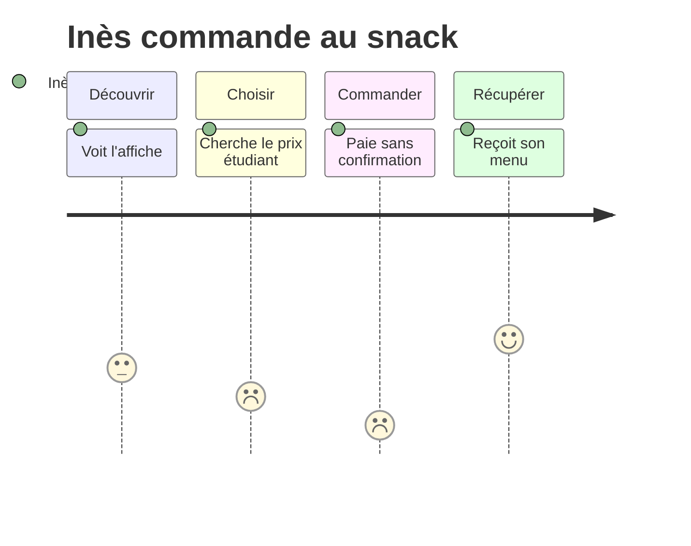

# Le parcours utilisateur

C'est l'étape 5 du projet.

Le parcours utilisateur, ou _user journey_, est l'histoire d'une personne qui veut atteindre un but. Il décrit les étapes qu'elle traverse, ce qu'elle fait, ce qu'elle pense et ce qu'elle ressent. Il commence souvent avant votre site et se termine après.

La carte du parcours, ou _journey map_, est le schéma qui raconte cette histoire. Le parcours est ce que vit la personne. La carte est le document que l'équipe dessine pour le voir d'un coup d'œil.

## Trois mots proches

- Le _customer journey_ suit un client dans toute sa relation avec une marque : la publicité, l'achat, le service après-vente. Le marketing s'en sert.
- Le _user journey_ suit un persona qui veut atteindre un but précis avec votre produit. C'est celui que vous dessinez.
- Le _user flow_ montre les écrans et les choix à l'intérieur du produit, sans les émotions. Il est expliqué sur la page [User flow, séquence et UML](/ux-ui/10-user-flow-sequence-uml/).

Une carte peut montrer le parcours actuel ou celui que l'on veut concevoir. La MJC des Tilleuls est fictive : vous dessinez un parcours envisagé, en vous appuyant sur les expériences d'inscription racontées en entretien. Distinguez les faits recueillis de vos hypothèses.

## Ce que contient la carte

| Ligne | La question à se poser |
| --- | --- |
| Les étapes | Quelles grandes étapes traverse la personne, dans l'ordre ? |
| Ce qu'elle fait | Quelles actions à chaque étape ? |
| Le point de contact | Où se passe l'étape : affiche, réseau social, site, téléphone, accueil ? |
| Ce qu'elle pense | Quelles questions se pose-t-elle ? |
| Ce qu'elle ressent | Quelle émotion, positive ou négative ? |
| Ce qui coince | Qu'est-ce qui la ralentit ou la fait hésiter ? |
| La piste | Que pourrait-on changer pour l'aider ? |

En haut de la carte, notez le persona, son but et ses attentes. La ligne des émotions se dessine souvent comme une courbe. Ses creux montrent où l'équipe doit agir.

## Comment faire une journey map

1. Choisissez un persona et un but. Une carte suit une seule personne.
2. Fixez le début et la fin du parcours, par exemple de « j'ai faim » à « j'ai mangé ».
3. Découpez le parcours en 4 à 6 étapes. Nommez chaque étape avec un verbe : découvrir, choisir, commander.
4. Remplissez les lignes pour chaque étape. Chaque case vient de vos entretiens. Si elle vient de votre imagination, marquez-la « à vérifier ».
5. Tracez la courbe des émotions et repérez le point le plus bas.
6. Écrivez une piste pour chaque blocage. Le point le plus bas passe en premier.

## Un exemple

Inès, 17 ans, commande au snack pour sa pause de midi. Son but : manger en moins de 20 minutes sans dépasser 7 €. Elle attend des prix clairs et une commande prête à l'heure.

| | 1. Découvrir | 2. Choisir | 3. Commander | 4. Récupérer |
| --- | --- | --- | --- | --- |
| Ce qu'elle fait | Voit l'affiche du snack devant le lycée | Ouvre l'appli et lit le menu | Choisit un menu et paie en ligne | Passe au comptoir à 12 h 10 |
| Le point de contact | L'affiche, avec un QR code | L'appli, écran du menu | L'appli, écran de paiement | Le comptoir |
| Ce qu'elle pense | « Ils ont une appli ? » | « Combien coûte le menu étudiant ? » | « Ma commande est bien partie ? » | « Laquelle est la mienne ? » |
| Ce qu'elle ressent | Curieuse | Hésitante | Inquiète | Soulagée |
| Ce qui coince | Le QR code est trop petit | Le prix étudiant n'est pas affiché | Pas de message de confirmation | Une seule file pour tout le monde |
| La piste | Un QR code plus grand | Le prix sur chaque plat | Un écran de confirmation avec un numéro | Les commandes prêtes rangées par numéro |

Le point le plus bas est la commande. Inès doute que sa commande soit partie. Une confirmation visible répondrait à cette question : c'est la première chose que l'écran de paiement doit régler.

## L'activité

En équipe, 40 minutes.

1. Dessinez le journey de votre persona, de « j'entends parler de l'atelier » à « je viens à la séance ».
2. Prévoyez 4 à 6 étapes. Pour chaque étape : ce qu'il fait, ce qu'il pense, ce qu'il ressent, ce qui coince.
3. Appuyez-vous sur vos entretiens. Si une case vient de votre imagination, marquez-la « à vérifier ».
4. Entourez le moment le plus difficile. Proposez ce que le site peut améliorer et ce qui demande une action de la MJC, par exemple à l'accueil de la séance.

Si vous avez le temps, ajoutez les lignes « point de contact » et « piste », comme dans l'exemple.

Dans Figma, une grille de rectangles avec du texte suffit : une colonne par étape, une ligne par question. Vous pouvez aussi utiliser [draw.io](https://app.diagrams.net/), ou dessiner sur papier et coller une photo.

Rendu : le journey, dans la section « 5. Journey ».

## À lire

- [Qu'est-ce que le parcours utilisateur ?](https://blog-ux.com/quest-ce-que-le-parcours-utilisateur/), blog-ux.
- [La carte du parcours utilisateur](https://imfusio.com/fr/bibliotheque/carte-du-parcours-utilisateur), avec un modèle à télécharger.
- [Customer journey map : cartographier le parcours client](https://business.ladn.eu/experts-metiers/marketing-communication/digital/solutions-digitales/developpement-web/customer-journey-map-cartographier-parcours-client/), L'ADN, avec l'exemple d'un site d'annonces immobilières.
- [User journey mapping](https://www.figma.com/resource-library/user-journey-map/), Figma : les éléments d'une carte, la différence avec le customer journey, et un exemple. En anglais.
- [Journey Mapping 101](https://www.nngroup.com/articles/journey-mapping-101/), Nielsen Norman Group. En anglais.
- [User Journeys vs. User Flows](https://www.nngroup.com/articles/user-journeys-vs-user-flows/), Nielsen Norman Group, avec la journey map d'un patient qui cherche un médecin. En anglais.

## Pour la discussion

- Quel est le moment le plus difficile de votre journey ?
- Ce moment se passe-t-il sur la page, ou avant, ou après ?
