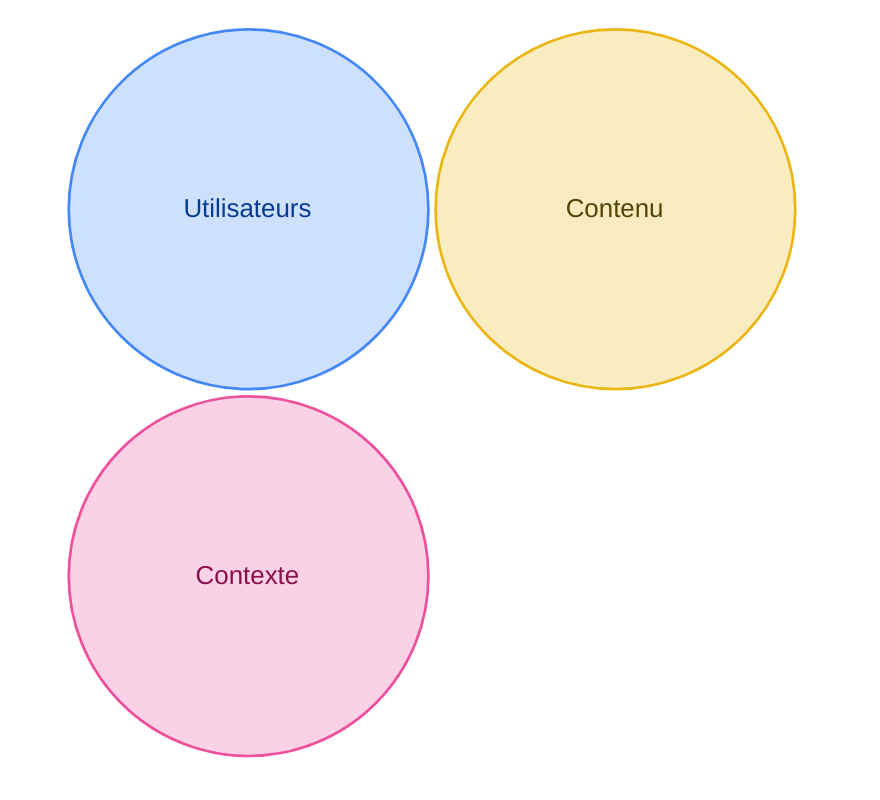
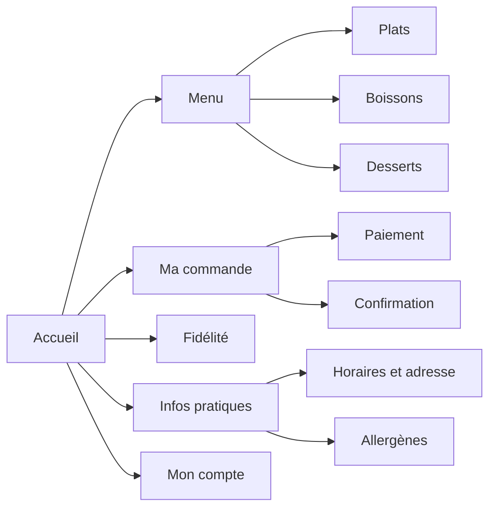

# L'architecture de l'information

C'est l'étape 6 du projet, mardi matin. Vous passez des besoins du persona à la structure du site.

L'architecture de l'information, ou IA, consiste à organiser, nommer et ranger le contenu pour que l'utilisateur trouve vite ce qu'il cherche. Dans un site bien rangé, on fait moins de clics et on hésite moins.

## Trois cercles

Louis Rosenfeld et Peter Morville ont écrit un livre de référence sur l'architecture de l'information. Ils la placent au croisement de trois cercles.

| Cercle | La question | Dans votre projet |
| --- | --- | --- |
| Utilisateurs | Qui sont-ils, et de quoi ont-ils besoin ? | Vos personas et vos entretiens |
| Contenu | Quelles informations le site doit-il montrer ? | Le brief et vos user stories |
| Contexte | Où, quand, pourquoi et sur quel appareil consultent-ils ce contenu ? | Votre journey |

Un site qui oublie un cercle crée des blocages. Un menu complet, rangé avec les mots du restaurant et pas ceux des clients, oublie les utilisateurs. Une appli pensée pour un grand écran, alors que les clients commandent debout dans la rue, oublie le contexte.

## Trois livrables

| Livrable | La question | Où l'apprendre |
| --- | --- | --- |
| Le sitemap | Quelles pages, et rangées comment ? | Sur cette page |
| Les wireframes | Que contient chaque page, et dans quel ordre ? | [Le zoning et les wireframes](/ux-ui/09-zoning-et-wireframes/) |
| Le plan de navigation | Comment passe-t-on d'une page à l'autre ? | [User flow, séquence et UML](/ux-ui/10-user-flow-sequence-uml/) |

## Le sitemap

Le sitemap, ou arborescence, montre toutes les pages du site rangées en arbre. L'accueil est à la racine. Chaque niveau en dessous demande un clic de plus.

Voici le sitemap de l'appli d'un snack de quartier :

### Plat ou profond

| | Sitemap plat | Sitemap profond |
| --- | --- | --- |
| Sa forme | Peu de niveaux. Beaucoup de pages juste sous l'accueil. | Plusieurs niveaux de catégories. |
| Ses avantages | Tout est à 1 ou 2 clics. Le menu montre tout. | Chaque catégorie est claire. Le premier niveau reste court. Le site peut grandir. |
| Ses défauts | Le menu devient long quand les pages se multiplient. | Il faut plus de clics. On se perd plus facilement. Il faut un fil d'Ariane. |
| Il convient à | Un petit site, une page de réservation | Un site avec beaucoup de contenus, comme une boutique |

La loi de Hick s'applique ici : un premier niveau court aide à décider vite.

## La navigation

La navigation relie les pages entre elles. Un site combine en général plusieurs types.

| Type | Ce qu'elle fait | Un exemple |
| --- | --- | --- |
| Globale | Mène aux grandes rubriques depuis n'importe quelle page | Le menu en haut de l'écran |
| Locale | Mène aux pages d'une même rubrique | Le sous-menu d'une rubrique |
| Contextuelle | Mène à un contenu lié à ce qu'on lit | Un lien « Voir aussi » dans un article |
| Linéaire | Guide étape par étape vers un but | Panier, puis adresse, puis paiement |
| Fil d'Ariane | Montre où l'on est et permet de remonter | Accueil › Menu › Plats › Tacos poulet |

## L'activité

En équipe, 45 minutes.

1. Listez les contenus nécessaires à l'inscription à la MJC : ateliers, âge minimum, créneaux, matériel, accord parental, liste d'attente et confirmation. Complétez avec vos user stories et votre journey. Faites une carte par contenu.
2. Rangez les cartes en groupes.
3. Nommez chaque groupe avec les mots de votre persona.
4. Dessinez l'arbre dans Figma, ou dans [draw.io](https://app.diagrams.net/) puis collez l'export PNG dans Figma. Distinguez les pages des informations qu'elles contiennent. Une confirmation peut être un état du formulaire plutôt qu'une page séparée.
5. Relisez chaque user story. Montrez où le persona trouve l'information et comment il rejoint la réservation.

Rendu : le sitemap, dans la section « 6. Sitemap ».

## À lire

- [What is information architecture?](https://www.figma.com/resource-library/what-is-information-architecture/), Figma : les trois cercles, les systèmes de rangement, de nommage, de navigation et de recherche, et les huit principes de Dan Brown. En anglais.
- [Breadcrumbs: 11 Design Guidelines](https://www.nngroup.com/articles/breadcrumbs/), Nielsen Norman Group, sur le fil d'Ariane. En anglais.

## Pour la discussion

- Quelle carte a été la plus difficile à ranger ? Pourquoi ?
- En combien de clics votre persona arrive-t-il à la réservation depuis l'accueil ?
