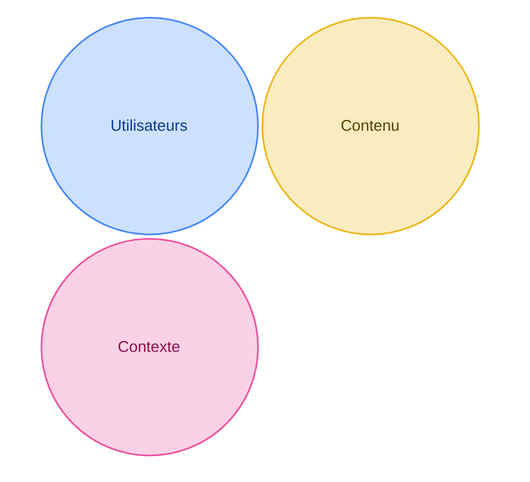
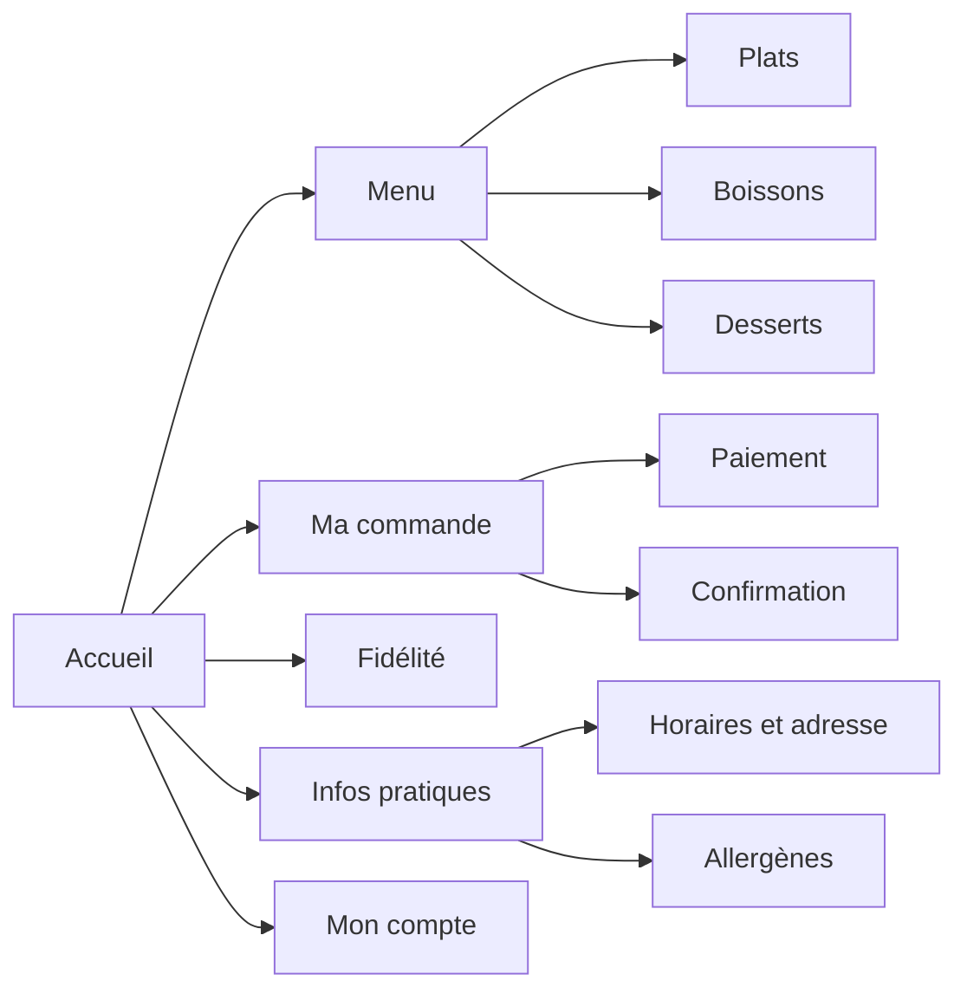

# L'architecture de l'information

L'architecture de l'information organise et nomme les contenus pour aider les personnes à les trouver. Son abréviation anglaise, IA pour *information architecture*, apparaît dans le schéma ci-dessous. Elle ne désigne pas ici l'intelligence artificielle.

## Trois cercles

Louis Rosenfeld et Peter Morville ont écrit un livre de référence sur l'architecture de l'information. Ils la placent au croisement de trois cercles.

| Cercle | La question | Dans votre projet |
| --- | --- | --- |
| Utilisateurs | Qui sont-ils, et de quoi ont-ils besoin ? | Vos personas et vos entretiens |
| Contenu | Quelles informations le site doit-il montrer ? | Le brief et vos user stories |
| Contexte | Où, quand, pourquoi et sur quel appareil consultent-ils ce contenu ? | Votre journey |

Un menu rangé avec les mots du restaurateur peut être difficile à comprendre pour ses clients. Si ces clients commandent sur leur téléphone, une interface conçue seulement pour un grand écran risque aussi de les gêner.

## De la structure aux écrans

Pour passer du contenu aux écrans, vous utiliserez trois documents :

| Livrable | La question | Où l'apprendre |
| --- | --- | --- |
| Le sitemap | Quelles pages prévoir et comment les organiser ? | Sur cette page |
| Les wireframes | Que contient chaque page, et dans quel ordre ? | [Le zoning et les wireframes](/ux-ui/09-zoning-et-wireframes/) |
| Le user flow | Comment passe-t-on d'une page à l'autre ? | [User flow, séquence et UML](/ux-ui/10-user-flow-sequence-uml/) |

## Le sitemap

Le sitemap, ou arborescence, montre comment les pages du site sont regroupées. L'accueil est à la racine. Les liens de navigation déterminent ensuite le chemin réel entre les pages.

Voici le sitemap de l'appli d'un snack de quartier :

### Plat ou profond

| | Sitemap plat | Sitemap profond |
| --- | --- | --- |
| Sa forme | Peu de niveaux. Beaucoup de pages juste sous l'accueil. | Plusieurs niveaux de catégories. |
| Ses avantages | Les pages principales sont proches de l'accueil. Le menu montre tout. | Le premier niveau reste court. On peut ajouter des pages dans chaque catégorie. |
| Ses défauts | Le menu devient long quand les pages se multiplient. | Certaines pages sont plus difficiles à trouver si les catégories sont mal nommées. Un fil d'Ariane peut aider à se repérer. |
| Il convient à | Un petit site, une page de réservation | Un site avec beaucoup de contenus, comme une boutique |

Regrouper les pages sous des intitulés clairs peut aider à choisir sans parcourir tout le site.

## La navigation

La navigation relie les pages entre elles. Un site combine en général plusieurs types.

| Type | Ce qu'elle fait | Un exemple |
| --- | --- | --- |
| Globale | Mène aux grandes rubriques depuis n'importe quelle page | Le menu en haut de l'écran |
| Locale | Mène aux pages d'une même rubrique | Le sous-menu d'une rubrique |
| Contextuelle | Mène à un contenu lié à ce qu'on lit | Un lien "Voir aussi" dans un article |
| Linéaire | Guide étape par étape vers un but | Panier, puis adresse, puis paiement |
| Fil d'Ariane | Montre où l'on est et permet de remonter | Accueil › Menu › Plats › Tacos poulet |

## Atelier : organiser les pages du site

Dessinez l'arbre des pages de votre site. Donnez-leur des noms clairs et indiquez où se trouvent les informations nécessaires à l'inscription.

Vérifiez que votre persona peut trouver un atelier et réserver. Distinguez les pages de leur contenu : une confirmation peut être un état du formulaire.

Rendu : le sitemap dans votre fichier de projet. Un schéma simple suffit.

## À lire

- [What is information architecture?](https://www.figma.com/resource-library/what-is-information-architecture/), Figma : les trois cercles, les systèmes d'organisation, de nommage (*labeling*), de navigation et de recherche, et les huit principes de Dan Brown. En anglais.
- [Breadcrumbs: 11 Design Guidelines](https://www.nngroup.com/articles/breadcrumbs/), Nielsen Norman Group, sur le fil d'Ariane. En anglais.

## Pour la discussion

- Quelle carte a été la plus difficile à ranger ? Pourquoi ?
- En combien de clics votre persona arrive-t-il à la réservation depuis l'accueil ?
