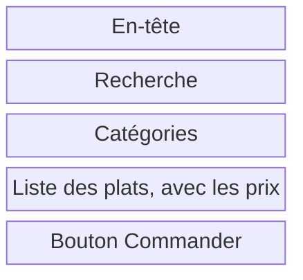

# Le zoning et les wireframes

Inès ouvre l'appli du snack pour trouver un repas à moins de 7 €. Pour concevoir cet écran, il faut choisir où placer les plats et leurs prix, quelles informations afficher et comment passer une commande.

Le zoning, le wireframe, le mockup et le prototype permettent d'examiner ces choix à différents niveaux de détail. Vous allez les distinguer, puis dessiner le zoning et les wireframes de votre projet MJC.

## Du zoning au prototype

Ces représentations de l'interface sont des livrables : des dessins ou des fichiers que l'on partage pour discuter des choix de conception.

| Livrable | Ce qu'on représente | La question à vérifier |
| --- | --- | --- |
| Zoning | Les grandes zones, avec leur nom et leur place | Où mettre les informations prioritaires ? |
| Wireframe | Les contenus et les commandes de chaque zone | Que faut-il lire, choisir ou remplir ? |
| Mockup, ou maquette graphique | L'apparence prévue : couleurs, typographie, images | Les éléments sont-ils lisibles et reconnaissables ? |
| Prototype | Les réactions aux actions, simulées sur un parcours | La personne arrive-t-elle à accomplir sa tâche ? |

Dans ce cours, « maquette » désigne la maquette graphique. Le mot peut avoir un sens plus large dans une équipe : précisez si vous attendez un dessin en gris, un écran avec ses styles ou un parcours à essayer.

On peut relier des wireframes pour les tester avant de travailler les couleurs. Si le test révèle qu'une information arrive trop tard, on peut revenir au zoning pour changer sa place.

Avant le zoning, un croquis au crayon suffit souvent pour essayer une idée. Voici le croquis, le zoning et le wireframe de la page d'une voiture électrique :

## Le zoning

Le zoning fixe la place des grandes zones d'un écran. On dessine des blocs nommés, avant de détailler leur contenu dans le wireframe.

1. Placez d'abord les informations nécessaires au choix de l'atelier.
2. Organisez les zones autour des besoins du persona.
3. Dessinez des blocs et nommez-les. Gardez les textes détaillés, les images et les couleurs pour la suite.

Voici le zoning de la page menu du snack, sur téléphone :

Le parcours d'Inès a montré qu'elle cherchait le prix du menu étudiant. On prévoit donc de l'afficher dans la liste des plats.

Imaginez deux zonings : dans le premier, une grande présentation du snack repousse la liste des plats en bas. Dans le second, la liste apparaît juste après les catégories. Pour Inès, qui doit choisir pendant sa pause, le second donne plus tôt accès aux prix. Vous pouvez comparer ces deux organisations avec quelques rectangles.

Avant de détailler l'écran, demandez à une autre personne de repérer la liste des plats et l'accès à la commande sur votre zoning. Si une zone manque ou semble mal placée, déplacez-la maintenant.

Un autre exemple montre une page d'accueil en zoning, en wireframe puis en prototype. Le bleu repère ici les éléments prévus pour être cliquables. Cette image fixe ne permet pas d'essayer leurs réactions : il faut ouvrir le prototype pour cela.

## Le wireframe

Un wireframe, ou « maquette fil de fer », détaille le contenu des zones : titres, textes, champs et boutons. Dans cet atelier, il reste en gris pour concentrer la discussion sur ce que la personne comprend et peut faire.

Voici le wireframe de la même page :

<strong>Snack du coin</strong>Panier

Chercher un plat

KebabTacosSoda

<i></i>Menu étudiant<b>6,50 €</b>

<i></i>Tacos poulet<b>7 €</b>

<i></i>Assiette falafel<b>8 €</b>

Commander

Un rectangle barré d'une croix remplace une image.

Le zoning disait « Liste des plats, avec les prix ». Le wireframe écrit « Menu étudiant, 6,50 € ». Inès peut maintenant comparer ce prix à son budget. Le libellé « Commander » indique l'action proposée.

Le dessin laisse toutefois une décision ouverte : comment sélectionner un plat avant de commander ? Ajoutez un bouton « Ajouter » sur chaque ligne ou prévoyez une fiche qui permet de choisir. Annotez le comportement retenu. Un bouton dessiné indique une action possible, mais ne la fait pas encore fonctionner.

Un wireframe peut aussi se dessiner à la main. Sur ces deux écrans d'une appli de commandes, les croix marquent les images et des vagues remplacent les paragraphes. Les titres et les boutons gardent leurs vrais mots : « Cancel », « Accept ».

### Basse et haute fidélité

La fidélité décrit la proximité avec le produit envisagé. On peut préciser l'apparence, les contenus et les interactions séparément. Des textes réalistes peuvent donc figurer sur un croquis très simple.

| Représentation | Ce qu'elle permet d'examiner |
| --- | --- |
| Croquis ou wireframe peu détaillé | L'ordre des contenus et les actions proposées |
| Wireframe détaillé | Les textes, les dimensions et les différents états d'un écran |
| Maquette graphique | Le rendu des contenus avec les couleurs, les polices et les images prévues |

Dans cette illustration, « haute fidélité » désigne le wireframe plus détaillé du milieu. Le niveau de détail visuel ne dit pas si un écran est interactif : une image très soignée peut être statique, et un croquis peut servir à tester un parcours. [Nielsen Norman Group distingue ces dimensions de la fidélité](https://www.nngroup.com/articles/ux-prototype-hi-lo-fidelity/).

Pour cet atelier, restez en basse fidélité, avec de vrais libellés. Les styles se travaillent dans la [maquette](/ux-ui/14-maquette-et-test/).

### Pourquoi faire des wireframes

- Pour vérifier l'ordre des contenus avant de choisir les couleurs.
- Pour discuter avec le client et les développeurs à partir d'un même dessin.
- Pour déplacer un champ ou une section sans reprendre les styles d'une maquette détaillée.

### Ce qu'on évite

- Les couleurs, les polices décoratives et les photos. On les choisit à l'étape de la maquette.
- Le faux texte « lorem ipsum » dans les titres et les boutons. Écrivez les vrais libellés : « Commander » dit ce que fait le bouton.
- Les détails : ombres, arrondis, icônes.

## Le mockup, ou maquette graphique

Le mockup montre l'apparence prévue de l'écran. On applique le [style guide](/ux-ui/13-style-guide-et-composants/) aux contenus du wireframe : typographie, couleurs, espacements, images et icônes.

Sur la page du snack, les rectangles barrés deviennent des photos de plats. On règle la taille et le contraste du prix de 6,50 € pour qu'il soit lisible sur téléphone. Le bouton « Commander » reprend le style des actions principales.

Examinez la maquette à la taille d'un téléphone : le prix se distingue-t-il de la description ? Un nom de plat long reste-t-il lisible ? Le bouton se reconnaît-il comme une action ? Si un texte ne tient pas, adaptez la mise en page. Le wireframe reste une base que l'on peut corriger.

À ce stade, vous pouvez montrer l'aspect du panier. Pour observer comment Inès y ajoute un menu puis corrige sa commande, il faut simuler ces actions.

## Le prototype

Un prototype permet d'essayer une partie du fonctionnement prévu. On prépare les réactions aux actions de la personne, par exemple l'ouverture du panier ou l'affichage d'une confirmation.

Pour le snack, reliez uniquement les écrans nécessaires au scénario :

1. Sur la liste des plats, « Ajouter » place le menu étudiant dans un panier simulé.
2. Le panier affiche le menu, sa quantité et le total. « Retirer » permet de revenir à un panier vide.
3. « Commander » ouvre le récapitulatif et les étapes prévues pour valider la commande.
4. Une confirmation donne le numéro de commande et l'heure de retrait.

Faites essayer ce parcours avec la consigne : « Tu as 7 € et vingt minutes pour déjeuner. Commande un repas, puis indique quand tu pourras le récupérer. » Notez si la personne trouve le prix, comprend le total et repère l'heure de retrait.

Dans ce prototype d'exercice, aucun paiement n'est encaissé et aucune commande n'est envoyée au snack. Les écrans simulent ces résultats. Si une action n'a pas été préparée, notez cette limite au lieu de conclure que la personne ne sait pas utiliser l'interface.

### Tester dès les wireframes

Vous pouvez faire ce premier essai avec des écrans en gris reliés dans Figma ou Penpot. Sur papier, la personne qui teste pointe une commande du doigt et vous présentez la feuille correspondant au résultat. Dans les deux cas, vous observez ses choix avant de finaliser les styles.

Si la personne cherche comment retirer le menu du panier, ajoutez ou clarifiez cette action et refaites l'essai. Les étapes pour relier les écrans et conduire le test sont détaillées dans [La maquette et le test](/ux-ui/14-maquette-et-test/).

## Quel livrable choisir ?

Choisissez le livrable selon la question à résoudre.

| Situation dans le projet MJC | Travail utile maintenant |
| --- | --- |
| Vous hésitez entre placer les créneaux avant ou après la description | Comparer deux zonings de la fiche atelier |
| Vous ne savez pas quoi afficher quand une séance est complète | Dessiner le wireframe de cet état, avec l'accès à la liste d'attente |
| Le bouton de réservation se confond avec le texte | Revoir sa présentation dans la maquette graphique |
| Vous voulez savoir si une personne comprend qu'elle est sur liste d'attente | Lui faire essayer ce cas dans un prototype |

### À vous de reconnaître

Pour chaque cas, nommez le livrable et dites ce qu'il permet de vérifier :

1. Une feuille contient quatre rectangles : « En-tête », « Atelier », « Créneaux », « Réservation ».
2. Un écran gris montre le champ « E-mail », un exemple de saisie et un message d'erreur.
3. Une image de la fiche atelier présente les photos, les couleurs et les polices retenues. On ne peut pas agir dessus.
4. Trois écrans en gris sont reliés. Un clic sur « Réserver » ouvre le formulaire, puis la confirmation.

Voir le corrigé

1. Le zoning permet d'examiner l'ordre des grandes zones de la fiche.
2. Le wireframe montre les informations nécessaires pour remplir le champ et corriger la saisie.
3. Le mockup montre l'apparence prévue de la fiche.
4. Le prototype réalisé avec des wireframes permet d'essayer la réservation, même si les écrans sont encore en gris.

## Les outils de Figma

Figma permet de dessiner et de relier des écrans dans le navigateur. Plusieurs personnes peuvent modifier le même fichier en même temps. Nommez les calques et réutilisez les styles et les composants : vous retrouverez plus facilement un élément à corriger ou à reproduire en code.

### L'interface

1. À gauche, le panneau Pages et calques permet de changer de page et de sélectionner ses éléments.
2. Au centre, le canevas est l'espace où vous dessinez vos écrans.
3. En bas, la barre d'outils permet de créer des frames, des formes et du texte.
4. À droite, le panneau affiche les réglages de l'élément sélectionné : dimensions, disposition et couleurs.
5. En haut à droite, Share permet de partager le fichier. Le bouton de présentation, en forme de triangle, lance le prototype.

### La barre d'outils

La barre d'outils est en bas de l'écran. Survolez un outil : Figma affiche son nom et son raccourci. À droite de la barre, gardez le mode Design sélectionné.

Pour trouver une commande, un plugin ou un composant, ouvrez le menu Actions avec `Ctrl + K`, ou `Cmd + K` sur Mac, et tapez ce que vous cherchez : « auto layout », « Contrast »…

### Les pages et les frames

Une frame est un cadre qui contient des éléments. Elle peut représenter un écran entier, mais aussi un bouton ou une carte. Avec l'outil Frame (`F`), choisissez un format dans le panneau de droite. Le préréglage iPhone 14 fait 390 × 844 px. Nommez ce cadre « Fiche atelier ».

Une page regroupe plusieurs frames. Le fichier de la capture utilise ses trois pages disponibles pour les composants, les wireframes et la maquette. Une section (`Maj + S`) permet de regrouper les écrans d'une même étape au sein d'une page.

Chaque élément a son calque dans le panneau de gauche. Nommez-le « Bouton réserver » plutôt que « Rectangle 12 ».

### La grille

Une grille de colonnes donne des repères pour aligner les éléments. Pour l'exercice sur téléphone, partez de 4 colonnes, avec 24 px de marge de chaque côté et 16 px entre les colonnes. Alignez les textes et les boutons à l'intérieur de ces marges. Ajoutez la grille depuis le panneau de droite de la frame, puis enregistrez-la comme style pour la réutiliser sur les autres écrans.

### L'auto layout

Si vous posez un texte sur un rectangle, allonger le libellé ne redimensionne pas le fond du bouton. L'auto layout (`Maj + A`) organise les éléments dans un cadre. Avec une largeur réglée sur Hug, ce cadre s'adapte au texte et conserve l'espace prévu autour.

Les réglages sont dans la section Layout du panneau de droite.

1. Le bouton en haut de Layout ajoute l'auto layout, comme le raccourci `Maj + A`.
2. Flow règle la disposition : en colonne, en ligne ou en grille. Le premier choix revient au placement libre, sans auto layout.
3. Les menus W (largeur) et H (hauteur) règlent les dimensions. Les options Fixed, Hug et Fill sont expliquées ci-dessous.
4. Ce bouton crée un composant réutilisable. Son raccourci est `Ctrl + Alt + K`, ou `Cmd + Option + K` sur Mac.

Une fois l'auto layout ajouté, de nouveaux champs apparaissent : l'espacement entre les éléments, le padding (l'espace intérieur) et l'alignement.

### Fixed, Hug, Fill

La largeur et la hauteur se règlent séparément. Les options disponibles dépendent de l'élément sélectionné et du cadre qui le contient.

| Réglage | Ce que fait l'élément | Exemple |
| --- | --- | --- |
| Fixed | Il garde la dimension choisie. | Un écran de 390 px de large |
| Hug | Le cadre en auto layout s'ajuste à son contenu et à son padding. | Un bouton qui s'élargit avec son libellé |
| Fill | Il occupe l'espace disponible dans le cadre parent en auto layout. | Un bouton qui remplit la largeur intérieure d'une carte |

### Des espacements réguliers

Utilisez quelques valeurs d'espacement et répétez-les sur les écrans. Pour commencer : 8 px entre un libellé et son champ, 16 px entre deux champs, 24 px autour du contenu d'une carte et 32 px entre deux sections.

Pour ce bouton, essayez 12 px de padding en haut et en bas, et 24 px sur les côtés. Visez une hauteur d'au moins 44 px pour offrir une zone facile à toucher, puis vérifiez le résultat à la taille d'un téléphone.

Les cadres en auto layout peuvent s'emboîter, comme les `div` en HTML : un cadre pour le bouton, un autre pour la ligne de boutons, puis un pour la section qui les contient.

### Le défi de l'auto layout

Combien d'auto layouts contient cet écran ? 1, 7, 10 ou 23 ?

Voir la réponse

Cette version en contient 23. Les pointillés montrent les cadres et leur emboîtement dans les différentes parties de l'écran :

1. L'en-tête : le retour, la recherche et le panier.
2. La photo, puis le nom et le prix.
3. Chaque taille, chaque ligne de tailles, la grille.
4. La barre du bas : le favori et le panier.
5. L'écran entier, qui contient tout le reste.

Pour construire le vôtre, réglez d'abord un bouton. Placez-le ensuite dans une carte, puis la carte dans l'écran.

### Les raccourcis

| Outil | Raccourci | Pour quoi faire |
| --- | --- | --- |
| Frame | F | Créer un écran. Choisissez un format téléphone ou ordinateur dans le panneau de droite. |
| Rectangle | R | Dessiner une zone ou une image |
| Texte | T | Écrire les titres, les libellés et les boutons |
| Auto layout | Maj + A | Empiler des éléments avec un espace régulier |
| Composant | Ctrl + Alt + K, ou Cmd + Option + K sur Mac | Réutiliser un élément, comme un bouton ou une carte |
| Section | Maj + S | Ranger les écrans par étape |
| Actions | Ctrl + K, ou Cmd + K sur Mac | Chercher une commande, un plugin ou un composant |

## Ateliers : dessiner les écrans de la MJC

Travaillez dans votre fichier Figma ou Penpot. Si vous reprenez des documents UX réalisés en groupe, copiez-les et indiquez leur origine. Concevez vos propres écrans. Un camarade peut les tester.

### Le zoning

Dessinez les grandes zones de la fiche atelier. Placez en premier ce dont votre persona a besoin pour décider de réserver. Des rectangles avec un nom suffisent.

Essayez deux ordres différents pour la description et les informations pratiques. Choisissez-en un en vous appuyant sur un besoin de votre persona, puis notez la raison en une phrase.

### Prendre en main Figma

1. Ouvrez votre fichier de projet dans Figma. Si vous n'en avez pas, créez un fichier de design nommé « MJC des Tilleuls, votre prénom ».
2. Avec l'outil Frame (`F`), créez un écran au format téléphone. Nommez-le « Fiche atelier ».
3. Avec Rectangle (`R`) et Texte (`T`), reproduisez les zones de votre zoning. Ajoutez le nom de l'atelier, une description et le texte « Réserver une séance d'essai ».
4. Sélectionnez le texte du bouton et appliquez l'auto layout (`Maj + A`). Réglez la largeur sur Hug. Ajoutez un fond gris et du padding autour du texte.
5. Changez le libellé du bouton : son cadre doit s'adapter au texte. Renommez vos éléments dans le panneau des calques pour les retrouver.

Rendu : une fiche atelier en gris, avec un bouton qui s'adapte à son libellé. Utilisez ce fichier pour les wireframes.

### Les wireframes

Dessinez trois écrans en gris, avec les vrais titres, libellés et boutons :

| Écran | Contenu à prévoir |
| --- | --- |
| Liste des ateliers | Nom et description des activités, public concerné, accès à chaque fiche |
| Fiche atelier | Activité, âge accepté, matériel, lieu, créneaux et accès à la réservation |
| Réservation | Séance choisie, prénom, nom, âge, e-mail et bouton de validation |

Ajoutez les états du parcours :

- Une confirmation avec l'atelier, la date, l'heure, le lieu et le matériel à prévoir.
- Une erreur de saisie qui indique quel champ corriger et comment.
- Une séance complète avec accès à la liste d'attente.
- Un message qui demande aux moins de 18 ans d'apporter une autorisation parentale.

Vérifiez qu'on peut suivre le parcours depuis la liste des ateliers jusqu'au résultat de la réservation.

Demandez à une autre personne de trouver un atelier adapté à son âge, de choisir une séance et d'indiquer ce qu'elle doit apporter. Laissez-la chercher sans la guider. Elle peut pointer les actions pendant que vous lui montrez l'écran suivant.

Avant de rendre, vérifiez que :

- Le prix de la séance d'essai, les âges acceptés et le matériel sont indiqués.
- Chaque champ a un libellé et l'erreur explique comment corriger la saisie.
- La réservation confirmée et l'inscription sur liste d'attente donnent des messages distincts.
- Le cas d'une personne mineure autorise la réservation et rappelle l'autorisation à apporter.

Corrigez une hésitation observée et gardez une courte note de ce que vous avez changé.

Rendu : le zoning et les trois écrans avec leurs états, dans votre fichier de projet. Ils serviront de base à [la maquette UI](/ux-ui/14-maquette-et-test/).

## À lire

- [Quelle est la différence entre le zoning, wireframe, mockup et prototype ?](https://blog-ux.com/quelle-est-la-difference-entre-le-zoning-wireframe-mockup-et-prototype/), Blog UX, pour comparer les quatre livrables.
- [UX Prototypes: Low Fidelity vs. High Fidelity](https://www.nngroup.com/articles/ux-prototype-hi-lo-fidelity/), Nielsen Norman Group, sur les niveaux de fidélité et les tests sur papier ou écran. En anglais.
- [Un wireframe, c'est quoi ?](https://blog-ux.com/un-wireframe-cest-quoi/), blog-ux.
- [Maquettage UX Design : wireframe, maquette ou prototype ?](https://www.arquen.fr/blog/maquettage-ux-wireframe-maquette-ou-prototype/), Arquen.
- [Appliquez les bonnes pratiques de prototypage](https://openclassrooms.com/fr/courses/3013856-decouvrez-les-fondamentaux-de-l-ux-design/4041901-appliquez-les-bonnes-pratiques-de-prototypage), OpenClassrooms.
- [Guide de l'auto layout](https://help.figma.com/hc/fr/articles/360040451373-Guide-de-l-auto-layout), aide de Figma.
- [What is a wireframe and how to make one](https://penpot.app/blog/what-is-a-wireframe-and-how-to-make-one/), Penpot, l'équivalent libre de Figma. En anglais.

## Pour la discussion

- Qu'est-ce qui a changé entre votre zoning et vos wireframes ?
- Que peut-on apprendre en faisant essayer un prototype en gris ? Que reste-t-il à vérifier sur le site codé ?
