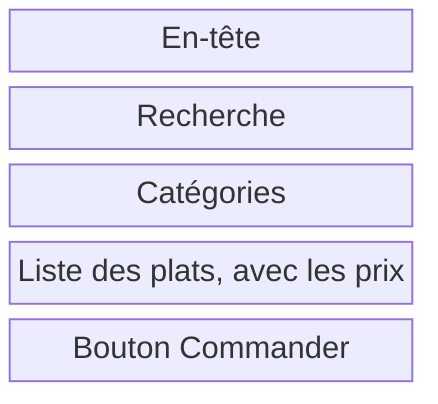

# Le zoning et les wireframes

Mardi matin, vous dessinez les écrans de la MJC, du zoning aux wireframes.

## Du zoning au prototype

Vous passerez par quatre niveaux, des grandes zones à la maquette cliquable. Modifier l'ordre des zones sur un zoning demande moins de travail que de reprendre une page déjà codée.

| Niveau | Ce qu'il montre | Avec quoi | Quand |
| --- | --- | --- | --- |
| Zoning | Les grandes zones de l'écran, avec leur nom | Papier, ou rectangles dans Figma | Mardi matin |
| Wireframe | Le contenu de chaque zone, en gris : titres, textes, champs, boutons | Figma | Mardi matin |
| Maquette | L'écran final, avec les couleurs, les polices et les images | Figma, avec le style guide | Mardi après-midi |
| Prototype | La maquette rendue cliquable, pour tester le parcours | Figma, onglet Prototype | Mardi après-midi |

## Le zoning

Le zoning découpe un écran en grandes zones, avant le wireframe. Chaque zone a un nom et une place. On décide ce qui va où, sans dessiner les détails.

1. Placez d'abord les informations nécessaires au choix de l'atelier.
2. Organisez les zones autour des besoins du persona.
3. Dessinez des blocs et nommez-les. Gardez les textes détaillés, les images et les couleurs pour la suite.

Voici le zoning de la page menu du snack, sur téléphone :



Chaque zone vient du journey d'Inès. La liste affiche les prix, parce qu'Inès cherchait le prix du menu étudiant.

## Le wireframe

Un wireframe est un schéma simplifié d'un écran. Il précise le contenu de chaque zone : les titres, les textes, les champs et les boutons. Il reste en gris.

Voici le wireframe de la même page :

```text
┌────────────────────────────┐
│ Snack du coin       Panier │
├────────────────────────────┤
│ [ Chercher un plat       ] │
│ (Kebab)  (Tacos)  (Soda)   │
│                            │
│ [X]  Menu étudiant  6,50 € │
│ [X]  Tacos poulet      7 € │
│ [X]  Assiette falafel  8 € │
│                            │
│ [        Commander       ] │
└────────────────────────────┘
```

Un rectangle barré d'une croix, ici `[X]`, remplace une image.

### Pourquoi faire des wireframes

- Pour tester la structure vite, avant de choisir les couleurs.
- Pour discuter avec le client et les développeurs à partir d'un même dessin.
- Pour changer d'avis sans perdre de travail.

### Ce qu'on évite

- Les couleurs, les polices décoratives et les photos. On les choisit à l'étape de la maquette.
- Le faux texte « lorem ipsum » dans les titres et les boutons. Écrivez les vrais libellés : « Commander » dit ce que fait le bouton.
- Les détails : ombres, arrondis, icônes.

## Les outils de Figma

| Outil | Raccourci | Pour quoi faire |
| --- | --- | --- |
| Frame | F | Créer un écran. Choisissez un format téléphone ou ordinateur dans le panneau de droite. |
| Rectangle | R | Dessiner une zone ou une image |
| Texte | T | Écrire les titres, les libellés et les boutons |
| Auto layout | Maj + A | Empiler des éléments avec un espace régulier |
| Composant | Ctrl + Alt + K, ou Cmd + Option + K sur Mac | Réutiliser un élément, comme un bouton ou une carte |
| Section | Maj + S | Ranger les écrans par étape |

## L'activité

### Le zoning

En équipe, 20 minutes.

Dessinez les grandes zones de la fiche atelier. Placez en premier ce dont votre persona a besoin pour décider de réserver. Des rectangles avec un nom suffisent.

### Les wireframes

En équipe, 1 heure.

Dessinez en gris la liste des ateliers, la fiche d'un atelier et la réservation, avec les vrais textes et boutons. Répartissez-vous le travail comme vous voulez.

Prévoyez la confirmation, une erreur de saisie et une séance complète avec liste d'attente. Faites apparaître les contraintes du brief, dont l'âge minimum, le matériel et l'accord parental.

Rendu : le zoning et les trois écrans avec leurs états, dans votre fichier d'équipe. Ils serviront de base à [la maquette UI](/ux-ui/11-ui-et-maquette/).

## À lire

- [Un wireframe, c'est quoi ?](https://blog-ux.com/un-wireframe-cest-quoi/), blog-ux.
- [Maquettage UX Design : wireframe, maquette ou prototype ?](https://www.arquen.fr/blog/maquettage-ux-wireframe-maquette-ou-prototype/), Arquen.
- [Appliquez les bonnes pratiques de prototypage](https://openclassrooms.com/fr/courses/3013856-decouvrez-les-fondamentaux-de-l-ux-design/4041901-appliquez-les-bonnes-pratiques-de-prototypage), OpenClassrooms.
- [Guide de l'auto layout](https://help.figma.com/hc/fr/articles/360040451373-Guide-de-l-auto-layout), aide de Figma.
- [What is a wireframe and how to make one](https://penpot.app/blog/what-is-a-wireframe-and-how-to-make-one/), Penpot, l'équivalent libre de Figma. En anglais.

## Pour la discussion

- Qu'est-ce qui a changé entre votre zoning et vos wireframes ?
- Un wireframe en gris suffit-il pour savoir si une page marche ?
