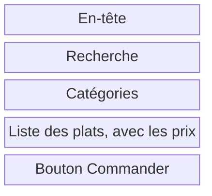

# Le zoning et les wireframes

Le zoning place les grandes zones d'un écran. Le wireframe précise ce qu'elles contiennent. Vous allez dessiner la liste des ateliers de la MJC, la fiche d'un atelier et le formulaire de réservation.

## Du zoning au prototype

Vous passerez par quatre niveaux, des grandes zones à la maquette cliquable. Modifier l'ordre des zones sur un zoning demande moins de travail que de reprendre une page déjà codée.

| Niveau | Ce qu'il montre | Avec quoi |
| --- | --- | --- |
| Zoning | Les grandes zones de l'écran, avec leur nom | Papier, ou rectangles dans Figma |
| Wireframe | Le contenu de chaque zone, en gris : titres, textes, champs, boutons | Figma |
| Maquette | L'écran final, avec les couleurs, les polices et les images | Figma, avec le style guide |
| Prototype | La maquette rendue cliquable, pour tester le parcours | Figma, onglet Prototype |

Avant le zoning, un croquis au crayon suffit souvent pour essayer une idée. Voici le croquis, le zoning et le wireframe de la page d'une voiture électrique :


## Le zoning

Le zoning découpe un écran en grandes zones, avant le wireframe. Chaque zone a un nom et une place. On décide ce qui va où, sans dessiner les détails.

1. Placez d'abord les informations nécessaires au choix de l'atelier.
2. Organisez les zones autour des besoins du persona.
3. Dessinez des blocs et nommez-les. Gardez les textes détaillés, les images et les couleurs pour la suite.

Voici le zoning de la page menu du snack, sur téléphone :



Chaque zone vient du journey d'Inès. La liste affiche les prix, parce qu'Inès cherchait le prix du menu étudiant.

Un autre exemple montre une page d'accueil en zoning, en wireframe puis en prototype. Les zones restent à la même place d'un niveau à l'autre. Le wireframe ajoute les textes, et le prototype marque en bleu les éléments cliquables.


## Le wireframe

Un wireframe est un schéma simplifié d'un écran. Il précise le contenu de chaque zone : les titres, les textes, les champs et les boutons. Il reste en gris.

Voici le wireframe de la même page :

```text
┌────────────────────────────┐
│ Snack du coin       Panier │
├────────────────────────────┤
│ [ Chercher un plat       ] │
│ (Kebab)  (Tacos)  (Soda)   │
│                            │
│ [X]  Menu étudiant  6,50 € │
│ [X]  Tacos poulet      7 € │
│ [X]  Assiette falafel  8 € │
│                            │
│ [        Commander       ] │
└────────────────────────────┘
```

Un rectangle barré d'une croix, ici `[X]`, remplace une image.

Un wireframe peut aussi se dessiner à la main. Sur ces deux écrans d'une appli de commandes, les croix marquent les images et des vagues remplacent les paragraphes. Les titres et les boutons gardent leurs vrais mots : « Cancel », « Accept ».


### Basse et haute fidélité

La fidélité dit à quel point un écran ressemble au produit final.

| Niveau | Ce qu'il montre |
| --- | --- |
| Basse fidélité | La structure en gris, avec des images barrées et des textes courts |
| Haute fidélité | Les vrais contenus, les logos et les tailles de texte, avec peu de couleurs |
| Design final | Le style guide appliqué : couleurs, polices, icônes |


Pour cet atelier, restez en basse fidélité. Les couleurs, les polices et les images se travaillent dans la [maquette](/ux-ui/14-maquette-et-test/).

### Pourquoi faire des wireframes

- Pour vérifier l'ordre des contenus avant de choisir les couleurs.
- Pour discuter avec le client et les développeurs à partir d'un même dessin.
- Pour déplacer un champ ou une section sans reprendre les styles d'une maquette détaillée.

### Ce qu'on évite

- Les couleurs, les polices décoratives et les photos. On les choisit à l'étape de la maquette.
- Le faux texte « lorem ipsum » dans les titres et les boutons. Écrivez les vrais libellés : « Commander » dit ce que fait le bouton.
- Les détails : ombres, arrondis, icônes.

## Les outils de Figma

| Outil | Raccourci | Pour quoi faire |
| --- | --- | --- |
| Frame | F | Créer un écran. Choisissez un format téléphone ou ordinateur dans le panneau de droite. |
| Rectangle | R | Dessiner une zone ou une image |
| Texte | T | Écrire les titres, les libellés et les boutons |
| Auto layout | Maj + A | Empiler des éléments avec un espace régulier |
| Composant | Ctrl + Alt + K, ou Cmd + Option + K sur Mac | Réutiliser un élément, comme un bouton ou une carte |
| Section | Maj + S | Ranger les écrans par étape |

## Ateliers : dessiner les écrans de la MJC

### Le zoning

Dessinez les grandes zones de la fiche atelier. Placez en premier ce dont votre persona a besoin pour décider de réserver. Des rectangles avec un nom suffisent.

### Prendre en main Figma

1. Ouvrez votre fichier de projet dans Figma. Si vous n'en avez pas, créez un fichier de design nommé « MJC des Tilleuls ».
2. Avec l'outil Frame (`F`), créez un écran au format téléphone. Nommez-le « Fiche atelier ».
3. Avec Rectangle (`R`) et Texte (`T`), reproduisez les zones de votre zoning. Ajoutez le nom de l'atelier, une description et le texte « Réserver une séance d'essai ».
4. Sélectionnez le texte du bouton et appliquez l'auto layout (`Maj + A`). Ajoutez un fond gris et de l'espace autour du texte.
5. Changez le libellé du bouton : son cadre doit s'adapter au texte. Renommez vos éléments dans le panneau des calques pour les retrouver.

Rendu : une fiche atelier en gris, avec un bouton qui s'adapte à son libellé. Utilisez ce fichier pour les wireframes.

### Les wireframes

Dessinez trois écrans en gris, avec les vrais titres, libellés et boutons :

| Écran | Contenu à prévoir |
| --- | --- |
| Liste des ateliers | Nom et description des activités, public concerné, accès à chaque fiche |
| Fiche atelier | Activité, âge accepté, matériel, lieu, créneaux et accès à la réservation |
| Réservation | Séance choisie, prénom, nom, âge, e-mail et bouton de validation |

Ajoutez les états du parcours :

- Une confirmation avec l'atelier, la date, l'heure, le lieu et le matériel à prévoir.
- Une erreur de saisie qui indique quel champ corriger et comment.
- Une séance complète avec accès à la liste d'attente.
- Un message qui demande aux moins de 18 ans d'apporter une autorisation parentale.

Vérifiez qu'on peut suivre le parcours depuis la liste des ateliers jusqu'au résultat de la réservation.

Rendu : le zoning et les trois écrans avec leurs états, dans votre fichier de projet. Ils serviront de base à [la maquette UI](/ux-ui/14-maquette-et-test/).

## À lire

- [Un wireframe, c'est quoi ?](https://blog-ux.com/un-wireframe-cest-quoi/), blog-ux.
- [Maquettage UX Design : wireframe, maquette ou prototype ?](https://www.arquen.fr/blog/maquettage-ux-wireframe-maquette-ou-prototype/), Arquen.
- [Appliquez les bonnes pratiques de prototypage](https://openclassrooms.com/fr/courses/3013856-decouvrez-les-fondamentaux-de-l-ux-design/4041901-appliquez-les-bonnes-pratiques-de-prototypage), OpenClassrooms.
- [Guide de l'auto layout](https://help.figma.com/hc/fr/articles/360040451373-Guide-de-l-auto-layout), aide de Figma.
- [What is a wireframe and how to make one](https://penpot.app/blog/what-is-a-wireframe-and-how-to-make-one/), Penpot, l'équivalent libre de Figma. En anglais.

## Pour la discussion

- Qu'est-ce qui a changé entre votre zoning et vos wireframes ?
- Un wireframe en gris suffit-il pour savoir si une page marche ?
