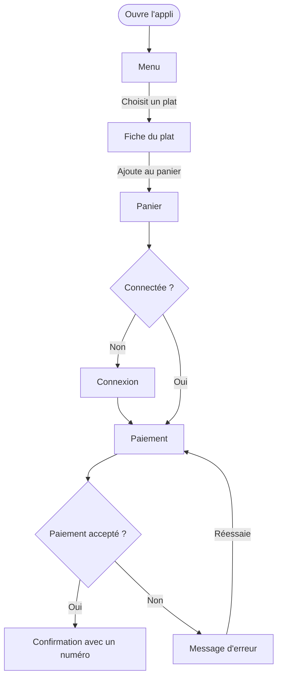
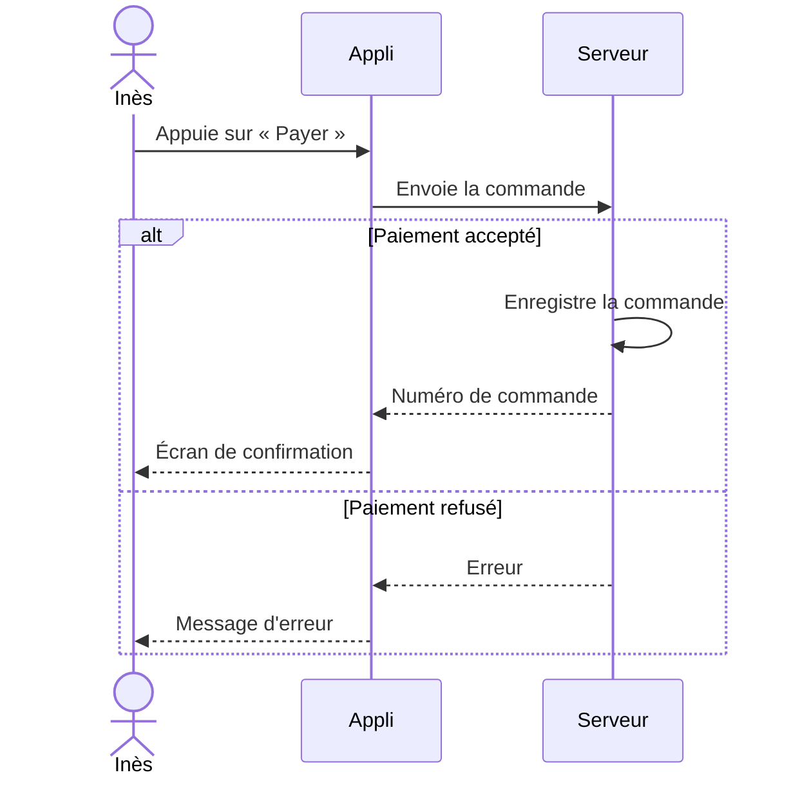
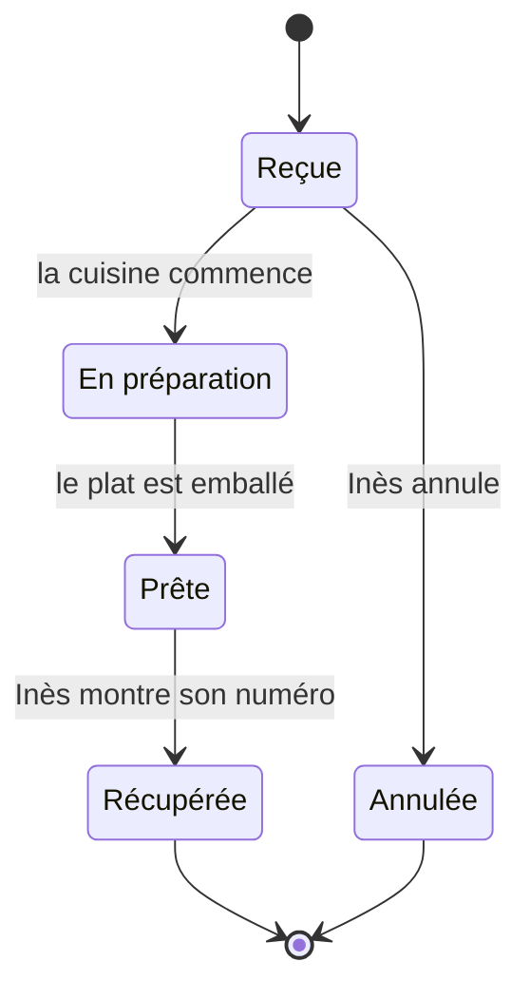

# User flow, séquence et UML

Le journey raconte ce que vit une personne. Pour concevoir puis coder, il faut aussi décrire ce qui se passe dans le produit : les écrans, les choix, les échanges avec le serveur. Designers et développeurs utilisent ces schémas pour se mettre d'accord avant de coder.

## Quel schéma pour quelle question

| Schéma | La question | Un exemple |
| --- | --- | --- |
| Journey map | Que vit la personne, avant, pendant et après ? | Inès, de l'affiche au comptoir |
| Sitemap | Quelles pages, et rangées comment ? | Les pages de l'appli du snack |
| User flow | Par quels écrans et quels choix passe-t-on pour atteindre un but ? | Commander un menu |
| Diagramme de séquence | Qui envoie quoi à qui, et dans quel ordre ? | Inès, l'appli et le serveur pendant une commande |
| Diagramme d'états | Par quels états passe un objet ? | Une commande : reçue, en préparation, prête |

## Le user flow

Un user flow montre le chemin typique d'un utilisateur dans un produit pour accomplir une tâche courante. Il décrit les actions de l'utilisateur et les réponses du produit : les écrans, les messages, les choix. Il laisse de côté les pensées et les émotions.

Nielsen Norman Group compare le journey et le user flow :

| | Journey | User flow |
| --- | --- | --- |
| Le but | Un but large : manger à midi | Une tâche précise : commander un menu |
| Où | Sur plusieurs canaux : affiche, appli, comptoir | Dans un seul produit : l'appli |
| Le moment | Avant, pendant et après l'usage du produit | Pendant l'usage du produit |
| Ce qu'on note | Les actions, les pensées, les émotions | Les actions de l'utilisateur, les réponses du produit |
| Le schéma | Une journey map | Un organigramme ou un wireflow |
| D'où viennent les infos | Des entretiens et de l'observation | Du brief, des besoins recueillis et des tests |

Un user flow zoome sur une étape du journey. Celui-ci détaille l'étape « Commander » du [journey d'Inès](/ux-ui/07-journey/#un-exemple).

Les rectangles sont des écrans. Les losanges sont des questions qui ont plusieurs réponses. Les flèches portent l'action de l'utilisateur.



Chaque branche du flow doit apparaître dans les wireframes. Ici, il faut prévoir la connexion et le message d'erreur, en plus du parcours sans problème.

Nielsen Norman Group dessine aussi le user flow en _wireflow_ : les wireframes des écrans, posés en ligne et reliés par des flèches. Chaque flèche part de l'élément sur lequel l'utilisateur clique ou appuie. Dans Figma, reliez vos wireframes avec l'outil flèche (Maj + L).

## Le diagramme de séquence

Un diagramme de séquence montre les échanges entre plusieurs acteurs, dans l'ordre du temps. Le temps s'écoule de haut en bas.

- Chaque acteur a une ligne verticale, sa ligne de vie. Un acteur peut être une personne ou un système : l'appli, le serveur, la base de données.
- Chaque flèche est un message. Une flèche pleine envoie une demande. Une flèche en pointillés porte la réponse.
- Un bloc `alt` montre deux cas possibles, un seul se produit. Un bloc `loop` montre une action répétée. Un bloc `opt` montre une étape facultative.



Un développeur y lit ce qu'il doit coder : la demande envoyée au serveur, les deux réponses possibles, et l'erreur à afficher.

Ce schéma est écrit en texte, avec [Mermaid](https://mermaid.js.org/syntax/sequenceDiagram.html). Voici le début du texte qui le produit :

```text
sequenceDiagram
    actor I as Inès
    participant A as Appli
    I->>A: Appuie sur « Payer »
```

GitHub affiche les schémas Mermaid dans un README ou une issue. Vous pouvez donc garder vos schémas à côté de votre code.

## UML

UML, pour _Unified Modeling Language_, est un langage standard de schémas pour décrire un logiciel. Il compte 14 types de diagrammes, rangés en deux familles.

- Les diagrammes de structure montrent de quoi le système est fait : ses classes, ses composants, ses serveurs.
- Les diagrammes de comportement montrent ce que fait le système, et comment il change dans le temps.

Quatre diagrammes de comportement servent souvent en UX :

| Diagramme | Ce qu'il montre |
| --- | --- |
| Cas d'utilisation | Qui peut faire quoi avec le système. Chaque acteur est relié à ses actions. |
| Activité | Les étapes d'un processus et ses choix. Il ressemble beaucoup au user flow. |
| Séquence | Les échanges entre acteurs, dans l'ordre du temps. |
| États | Les états d'un objet, et ce qui le fait passer d'un état à l'autre. |

Voici les états d'une commande au snack :



Certains états donnent lieu à un message, comme « Ta commande est prête ». Le système garde aussi une trace de l'état de la commande.

## Pour aller plus loin

Cet atelier est facultatif. Dessinez le user flow de la réservation d'une séance d'essai, sur papier, avec Mermaid, avec [draw.io](https://app.diagrams.net/) ou en wireflow avec vos wireframes. Ajoutez un losange pour chaque cas prévu par le brief. Chaque branche doit mener à un de vos écrans.

Rendu, si vous le faites : le user flow, dans la section « 7. Zoning et wireframes ».

## À lire

- [User Journeys vs. User Flows](https://www.nngroup.com/articles/user-journeys-vs-user-flows/), Nielsen Norman Group : les définitions, le tableau comparatif et l'exemple d'un patient qui cherche un médecin. En anglais.
- [Wireflows](https://www.nngroup.com/articles/wireflows/), Nielsen Norman Group : dessiner un user flow avec des wireframes. En anglais.
- [What is a sequence diagram?](https://www.figma.com/resource-library/what-is-a-sequence-diagram/), Figma : les éléments, les blocs `alt`, `loop` et `opt`, et des exemples de connexion et de commande. En anglais.
- [What is a UML diagram?](https://www.figma.com/resource-library/what-is-a-uml-diagram/), Figma : les 14 types de diagrammes UML. En anglais.
- [Création de diagrammes](https://docs.github.com/fr/get-started/writing-on-github/working-with-advanced-formatting/creating-diagrams), documentation de GitHub, pour écrire des schémas Mermaid dans un dépôt.

## Pour la discussion

- Quel schéma vous aiderait à dessiner vos wireframes ?
- Quel schéma un développeur back-end voudrait-il recevoir ?
